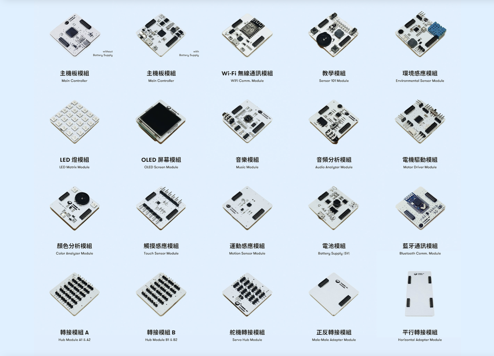

# CocoMod 電子模組

CocoMod 是一系列由 CocoRobo 研發的「即插即用式」的電子模組，目前已研發 15 余款，其中控制類模組 2 種，輸入類模組 7 種，輸出類模組 7 種，轉接類模組 6 種。CocoMod 可以讓你的作品能夠擁有感應、控制真實世界的能力，只要接上各種輸入/輸出模組或元件， 例如 LED 燈、摩打、開關、溫溼度傳感器、顯示裝置，或是接上無線通訊模組，就可以做出各式各樣的小發明。

用户利用這些模組，結合 3D 打印和編程可以輕鬆地完成各類項目，其擴展性較市面上其他多數 Arduino 套件更適合入門者學習電子及編程知識。同時，CocoRobo 鼓勵用戶通過配套的課程，來更好、更快的學習使用 CocoMod 電子模組。
