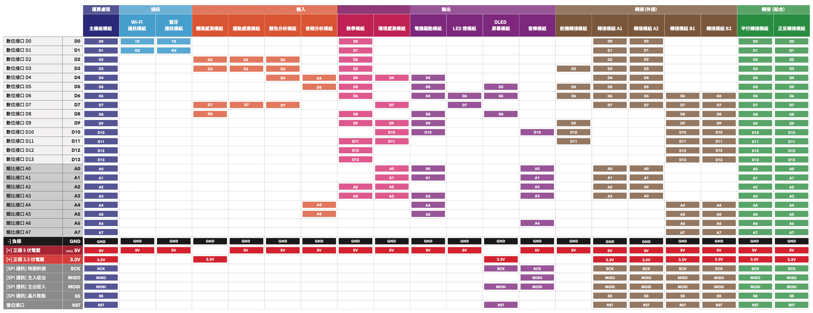

# CocoMod 電子模組

---

CocoMod 是一系列由 CocoRobo 研發的「即插即用式」的電子模組，目前已研發 20 餘款，控制類模組是 1 種，輸入類模組 6 種，輸出類模組 6 種，轉接模組 4 種（轉接模組 A／轉接模組 B／平行轉接模組／正反轉接模組），通訊模組 3 種（藍牙通訊模組、WiFi 通訊模組、NBIoT 通訊模組 )。CocoMod 可以讓你的作品能夠擁有感應、控制真實世界的能力，只要接上各種輸入/輸出模組或元件， 例如 LED 燈、馬達、開關、溫濕度感應器、顯示裝置，或是接上無線通訊模組，就可以做出各式各樣的小發明。

用戶利用這些模組，結合 3D 打印和編程可以輕鬆地完成各類項目，其擴展性較市面上其他多數 Arduino 套件更適合入門者學習電子及編程知識。同時，CocoRobo鼓勵用戶通過配套課程來更好、更快地學習使用 CocoMod 電子模組

### 接口使用

模組間會有接口使用衝突。無論是單獨使用一個模組還是組合使用，每個接口都只能被使用一次，若兩個模組同時使用時需要占用的接口相同，那麽這兩個模組就不能同時使用，在選擇模組組合之前請先查看兩個模組之間是否會產生接口衝突。

例如：教學模組不能直接和環境感應模組、運動感應模組、觸摸模組以及音樂模組拼接在一起使用，能夠和電機驅動模組及熒幕模組組合使用，但只有部分的按鍵和輸出部件能夠配合這兩個模組使用，其中與電機驅動模組組合的時候，按鍵只有 D12、D13 以及 A3 能夠使用，輸出部件只有 D0 ~ D3 以及 D11 能夠使用，而與熒幕模組組合的時候，除了 D5、D6、D8 外的按鍵和輸出部件都可以使用。

在CocoBlockly平臺上拖拽出一個積木后，可以在「積木對應原始碼參考區」看到這個模組當前所占用的接口，每使用多一個接口，就會同步更新在「積木對應原始碼參考區」中

**請注意參考下表的接口示意，再進行程式編寫：**

高解析度的版本可從[點擊此處](http://cocorobo.hk/downloads/cocorobo-modules-pinout-map_v2.pdf)查看。

接口使用衝突可以通過轉接接口的方法來解決，具體内容請前往[此頁面](/cocomod/pinout-map)查看

---
更新時間：2019年8月
