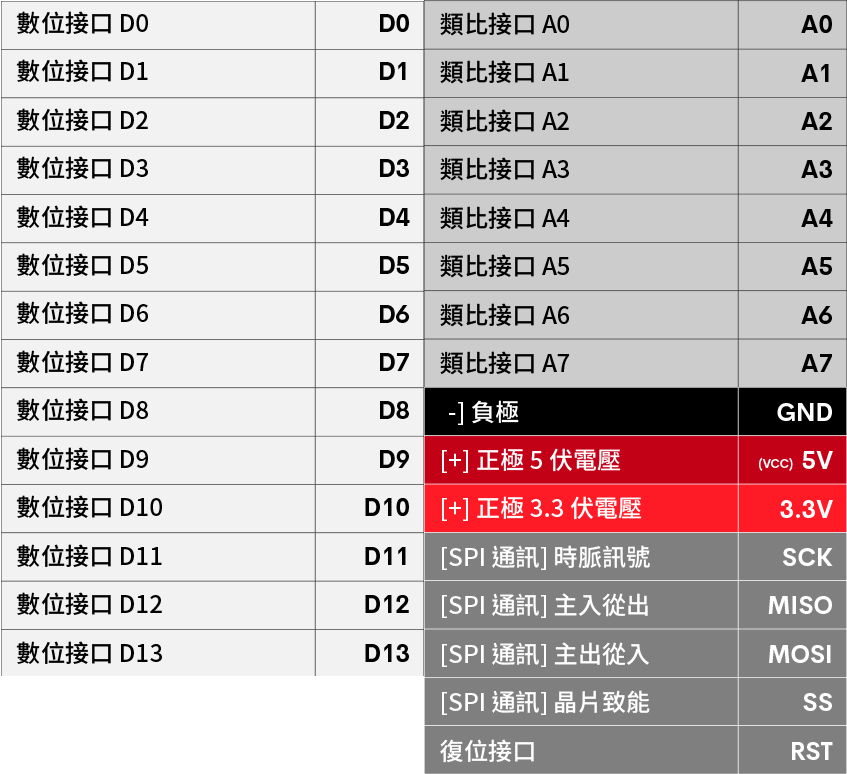
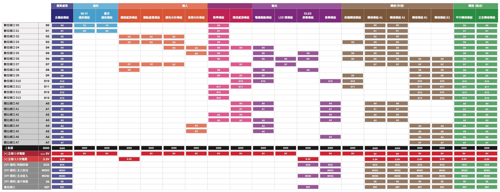
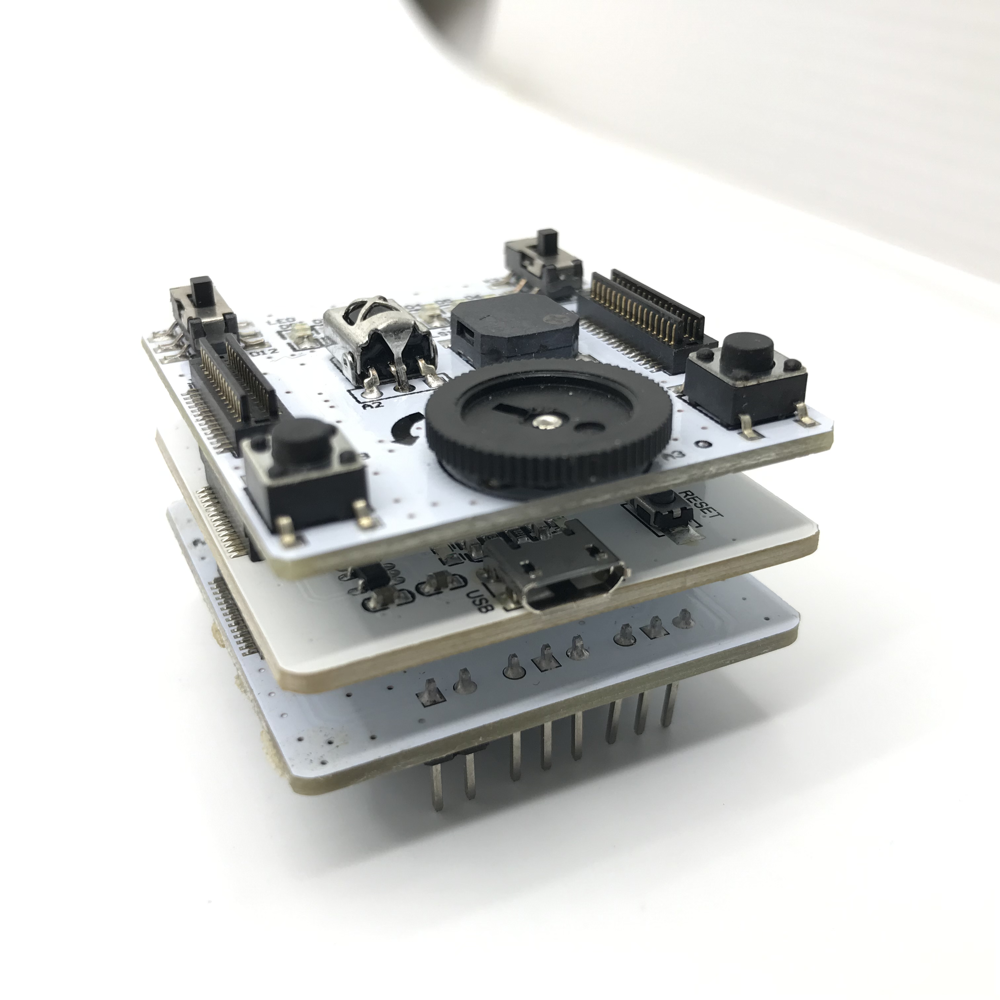
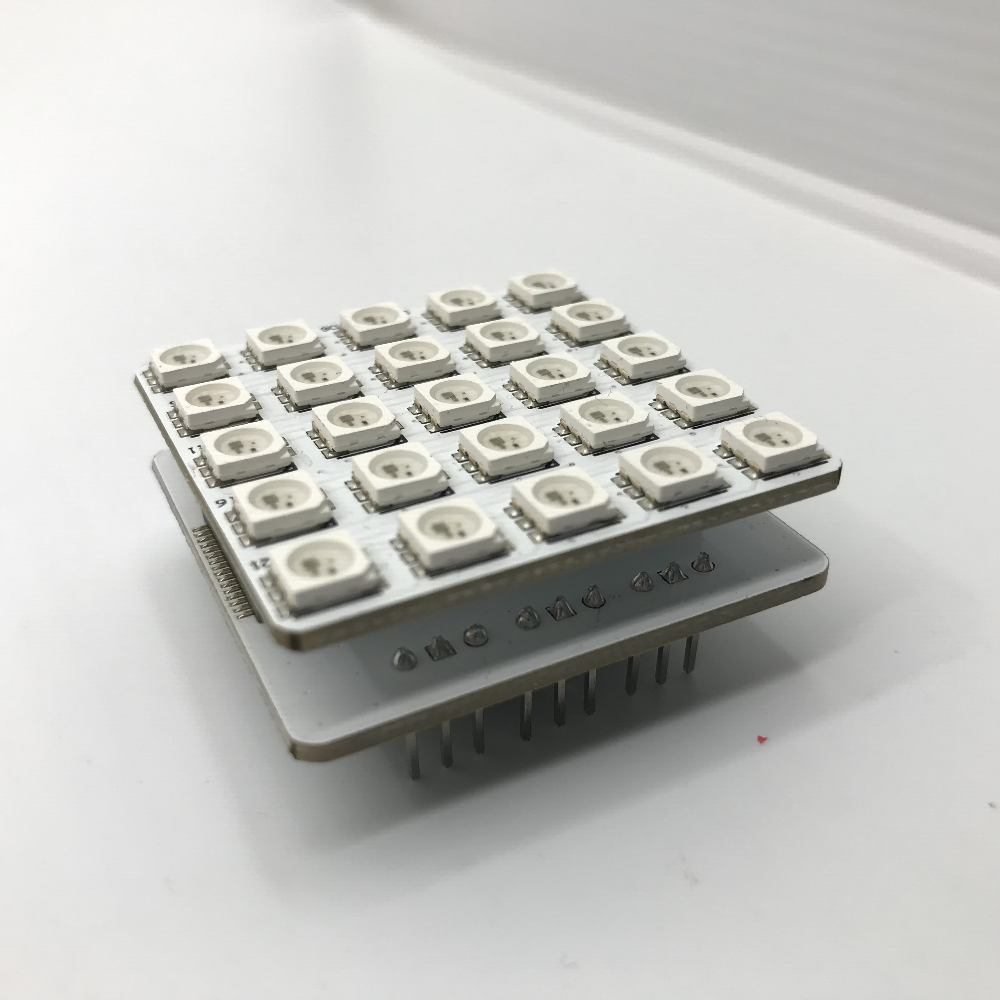
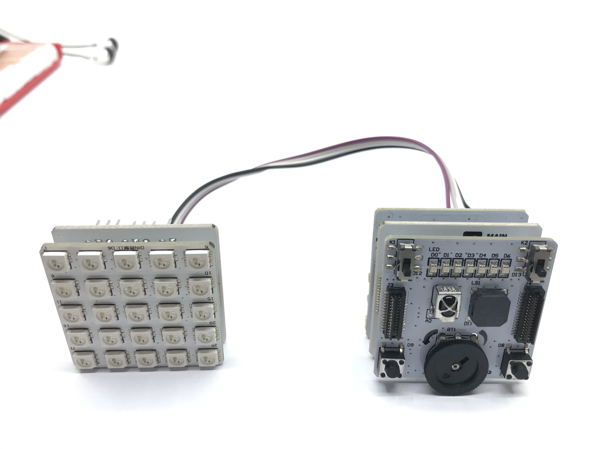
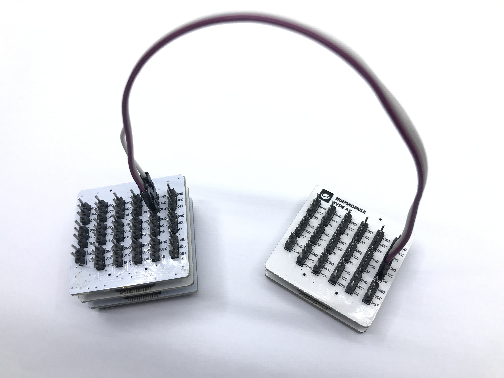
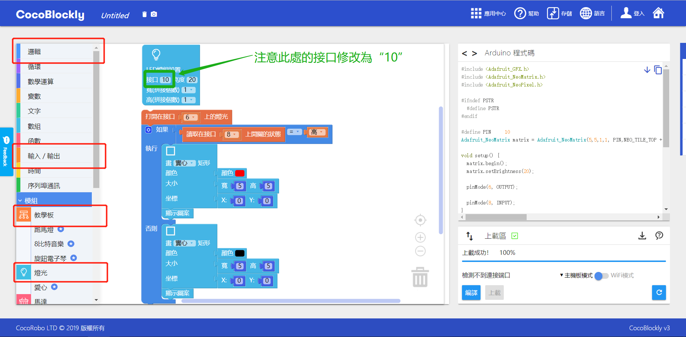

## 電子模組接口示意參考

因爲 CocoRobo 電子模組爲順序連接的組合，所以模組間在使用時可能會有接口使用衝突，請注意參考下表的接口示意，再進行程式編寫。

---

### 接口定義

1. __當模組間有接口衝突的時候，可以通過任意一個轉接模組外接使用：__
	* 比如：「馬達驅動模組」不可直接與「 LED 燈屏模組」使用，由於「 LED 燈屏模組」的默認接口爲 D6，我們可以將「 LED 燈屏模組」接在「轉接模組 A1 」的 D3 接口上，然後在 CocoBlockly 裏中將 LED 設定積木的接口從 D6 改成 D3，便可以與馬達驅動模組一起使用了；
2. __關於 SPI 或者 I²C 通訊方式的原理，可從下方鏈接進行了解__
	* <a href="http://magicjackting.pixnet.net/blog/post/164725144-spi-(serial-peripheral-interface)-串列-(序列)-周邊介" target="_blank">SPI (Serial Peripheral Interface) 串列 (序列) 周邊介面</a>
	* <a href="http://magicjackting.pixnet.net/blog/post/173061691-i2c-bus-簡介-%28inter-integrated-circuit-bus%29-" target="_blank">I2C bus 簡介 (Inter-Integrated Circuit Bus)</a>

---

### 各模組接口示意

 

高解析度的版本可從[點擊此處](https://cocorobo.hk/downloads/pinout.html)查看。

### 轉接接口

儅產生接口使用衝突時，可以通過轉接模組將其中的某一個模組的接口轉接到另一個接口，這樣就可以同時使用有接口衝突的兩個模組。此處以教學模組和 LED 燈屏模組爲例：教學模組使用 D6 接口作爲一粒 LED 燈，并且 LED 燈屏模組使用的接口也是 D6 ，這兩個模組同時使用就會產生接口衝突

#### 模組組裝

將教學模組、主機板模組及轉接模組 B1 拼接在一起，用杜邦綫連接在轉接模組 B1 的 D10 接口上

將 LED 燈屏模組及轉接模組 A2 拼接在一起，把杜邦綫的另一端連接在轉接模組 A2 的 D6 接口上

##### 模組拼接效果

用 USB 綫連接好主機板模組至電腦

#### 積木編程

在紅框提示処找出下圖中的積木

#### 最終效果

按下 D8 的按鈕可以控制 LED 燈屏亮紅色，不按時燈光滅，并且教學模組上 D6 接口処的 LED 燈可以正常發光

---
更新時間：2019年8月
