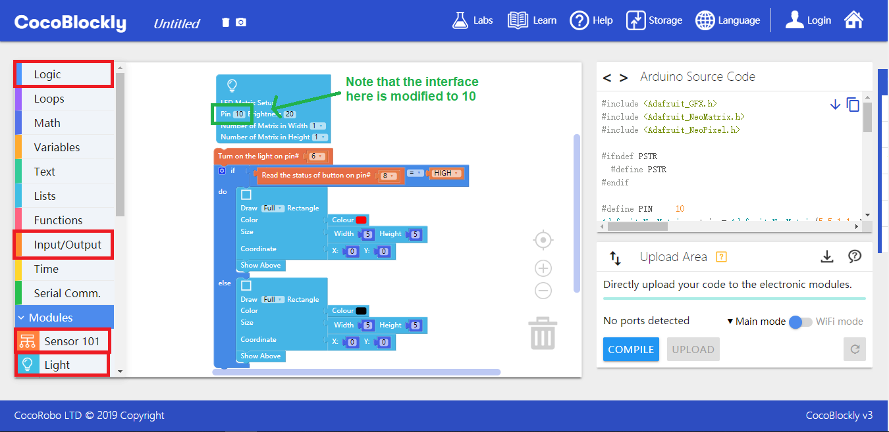

## Pinouts Electronic Modules

CocoRobo electronic modules are sequentially connected so there may be some pinout clashes between the modules. Please refer to the following table before writing programs.

---

### Definition of Pinouts

1. __When pinout clashes arise between different modules, you can turn to any of the hub modules to perform the external connection:__
	* For example, motor driver module cannot be used directly in combination with LED matrix module. LED matrix module uses Pinout D6 as pinout by default but it can be connected to the hub module A1 via the hub module's Pinout D3. Then change the LED setting block pinout from D6 to D3 in CocoBlockly and you can use motor driver module and LED matrix module together.
	* **Important Note:** Some modules cannot use hub module as adapter. They are touch analyzing module, motion sensing module, color analyzing module, screen module and music module.

2. __Please click the following link for knowledge on the principle of SPI or I²C communication.__
	* <a href="http://magicjackting.pixnet.net/blog/post/164725144-spi-(serial-peripheral-interface)-串列-(序列)-周邊介" target="_blank">SPI (Serial Peripheral Interface)</a>
	* <a href="http://magicjackting.pixnet.net/blog/post/173061691-i2c-bus-簡介-%28inter-integrated-circuit-bus%29-" target="_blank">I2C bus Introduction (Inter-Integrated Circuit Bus)</a>

---

### Pinouts of Each Module

 

Please click [here](https://cocorobo.hk/downloads/pinout.html) for high-definition version.

### Pinouts

Hub module can be used as adapter to connect the pinout of a particular module to that of another when pinout clash arises. Let’s take sensor 101 module and LED matrix module as example (The Pinout D6 of the sensor 101 module is used to connect to LED light, and LED matrix module also uses Pinout D6).

#### Assemble Modules

Put sensor 101 module, hub module B1 and the main controller together, and connect the Pinout D10 of hub module B1 to one end of a Dupont jumper wire.

Put an LED matrix module and a hub module A2 together, and connect the Pinout D6 of the hub module A2 to other end of the Dupont jumper wire.

##### Demonstration

Connect the main controller to a computer via a USB data cable.

#### Code by CocoBlockly
Follow the hints of the red boxes and find the block in the picture below.

#### Effects

Use Button D8 to control the lights on the LED matrix: the lights on the matrix will be turned on by pressing the button and the light on the Pinout D6 of the sensor 101 module is on.

---
Updated in August 2019
