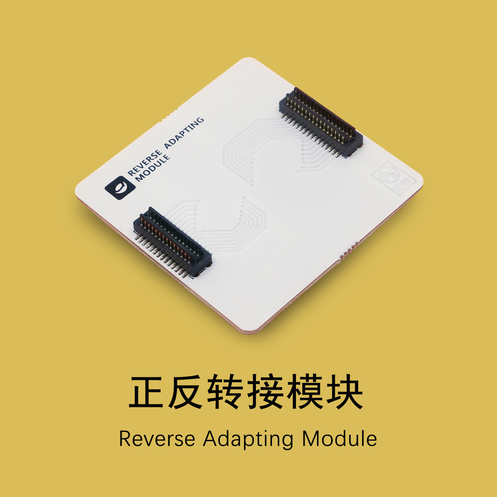
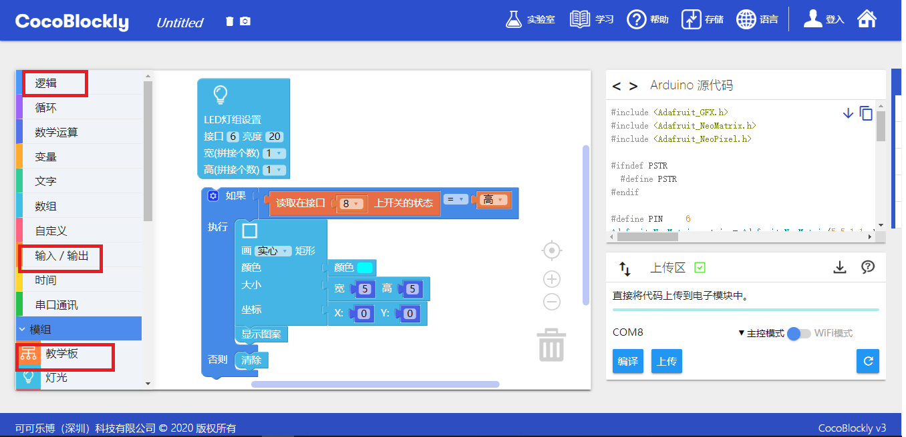

# 使用正反转接模块

---

## 模块简介

正反转接模块两边均为接出型插口，用于将模块按照相反接入。

## 模块主要部件

---

## 正反转接基础使用

### 转接LED模块和教学模块

#### 模块组装

将 4 块模块按照下图顺序组装起来（由后至前）：教学模块、主控模块、正反转接模块、LED灯屏模块，并将 USB 数据线连接主控模块和电脑：

#### 积木编程

#### 最终效果

程序上传后，将可以使用教学模块上位于 D8 的按钮来控制 LED 灯屏的灯的亮灭：

---
更新时间：2019年8月
