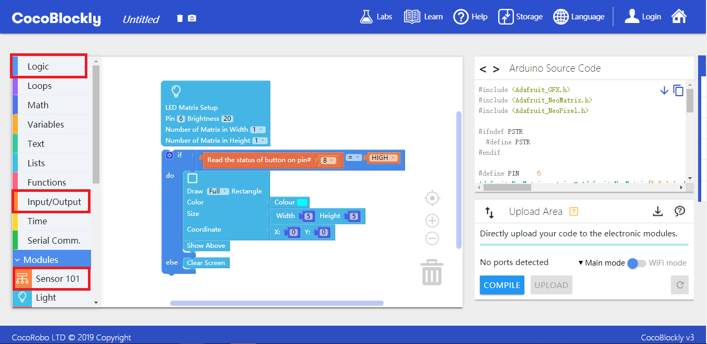

# Apply Reverse Adapting Module

---

## Introduction

The joints on the two sides of a reverse adapting module are all output pinouts, which are used to assemble modules reversely.

## Main Components

---

## Basic Application

### Reversely Assemble LED Matrix Module and Sensor 101 Module

#### Assemble Modules

Put the four modules together in the order shown in the following picture (from the last one to the first one): the sensor 101 module, the main controller, the reverse adapting module and the LED matrix module. And then connect the main controller to a computer via a USB data cable:

#### Code by CocoBlockly

#### Effects

After the program is uploaded successfully, you can use the Button D8 in the sensor 101 module to turn on or turn off the lights in the LED matrix module:

---
Updated in August 2019
