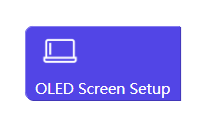
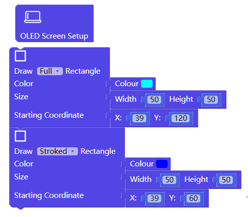
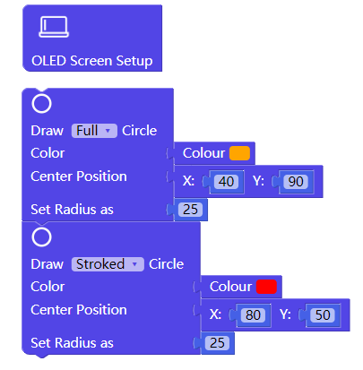
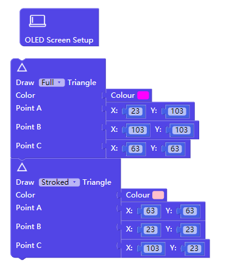
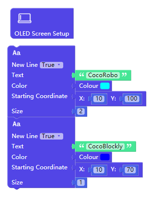
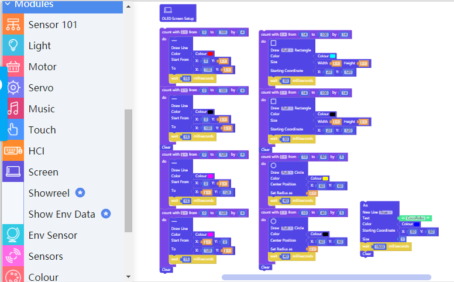
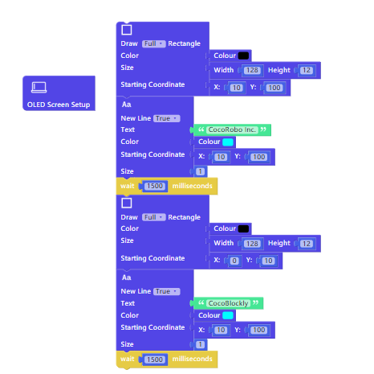

# Apply Screen Module

---

## Introduction

There is an OLED screen (128px X 128px) on the module. Pictures of various colors can be drawn on the screen.

## Main Components

<table style="margin-top:20px;">
	<tr>
		<td width="6%" style="font-weight: bold;">No.</td>
		<td width="20%" style="font-weight: bold;">Name</td>
		<td style="font-weight: bold;">Description</td>
	</tr>
	<tr>
		<td>1.</td>
		<td>OLED Screen</td>
		<td> The screen resolution is 128 x 128 PPI.</td>
	</tr>
</table>

#### Pinout

| Pinout Position | Pinout Description           |
| -------- | ------------------ |
| D5, D5   | used by screen processing chip |
| SCK, MOSI   | used by screen processing chip (SPI communication)  |

> To avoid pinout clashes between different kinds of modules, please refer to [cocorobo-modules-pinout-map](/cocomod/pinout-map).

---

## Instructions

1. Be careful of impacting screen;
2. When using the OLED screen module, you have to initialize the blocks. The "OLED Screen Setup block" is shown below:

---

## Basic Application

### Definition of Axes

1. The coordinate of the origin (starting point) at the lower left of the screen is defined as **(0, 0)**;
2. The horizontal axis is defined as X axis; the vertical one Y axis;
3. The maximum values of X axis and Y axis are all 128, namely the maximum value of the screen's width and length;
4. The position of a point in the screen is defined as  **(X, Y)**.

---

### Draw Basic Graphic

#### Assemble Modules

Put the screen module and the main controller together, and connect the main controller and a computer via a USB data cable:

<!-- #### drawing line

##### Code by CocoBlockly

##### Effects

-->

---

#### Draw a Rectangle

##### Code by CocoBlockly

> Note: The rectangle is drawn from the vertex at the upper left corner.

##### Effects

---

#### Draw a Circle

##### Code by CocoBlockly

> Note: The circle is drawn from the upper vertex.

##### Effects

---

#### Draw a Triangle

##### Code by CocoBlockly

##### Effects

---

#### Draw a Word

##### Code by CocoBlockly

> Note: The word of size 1 has a height of 7px; The word of size 2 has a height of 14px; and you can know the height of other words by analogy.

##### Effects

---

## Advanced Application

### Draw an Animated Graphic

#### Assemble Modules

Put the screen module and the main controller together, and connect the main controller and a computer via a USB data cable:

#### Code by CocoBlockly

#### Effects

After the program is uploaded successfully, a series of geometrical animated graphics will be presented:

---

### Replace a Word

#### Assemble Modules

Put the screen module and the main controller together, and connect the main controller and a computer via a USB data cable:

#### Code by CocoBlockly
**Focus:** Realize the change of words by using the black graphic to cover the previous words.

#### Effects
Present the "CocoRobo Inc.", overwrite it and then present "CocoRobo" again:

---
Updated in August 2019
