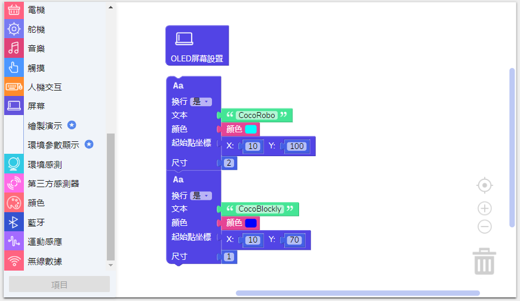
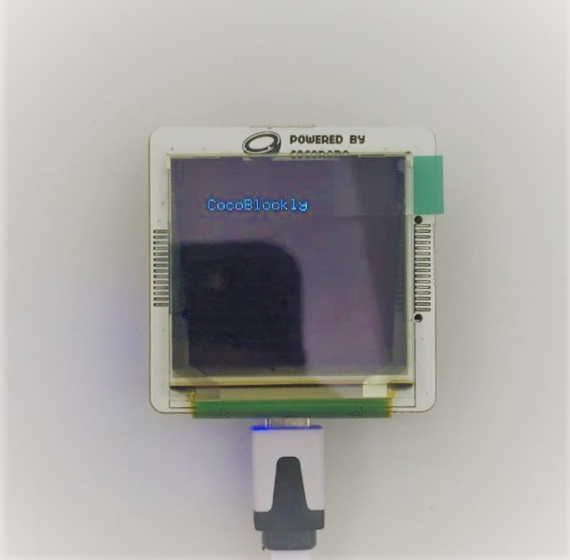

# 使用 OLED 熒幕模組

---

## 模組簡介

模組上連有一個OLED螢幕，接通之後可以繪製不同顏色的不同圖案，螢幕面積（長 x 寬）爲 128 x 128。

## 模組主要部件

<table style="margin-top:20px;">
	<tr>
		<td width="6%" style="font-weight: bold;">No.</td>
		<td width="20%" style="font-weight: bold;">部件名稱</td>
		<td style="font-weight: bold;">部件描述</td>
	</tr>
	<tr>
		<td>1.</td>
		<td>OLED 熒幕</td>
		<td> 螢幕的分辨率爲 128 x 128 px (像素)</td>
	</tr>
</table>

#### 模組接口示意

| 接口位置 | 接口描述           |
| -------- | ------------------ |
| D5, D5   | 屏幕處理芯片所使用到的接口 |
| SCK, MOSI   | 屏幕處理芯片所使用到的接口（使用 SPI 通訊）  |

> 爲了避免不同類型的電子模組在使用時有接口（Pin out）的衝突，請注意前往[此頁面](/cocomod/pinout-map)查看接口示意圖

---

## 模組使用說明

1. 碰撞熒幕容易導致熒幕損壞，需要小心使用。

---

##  OLED 熒幕模組基礎使用

### 座標軸定義

1. 我們定義熒幕的左上角爲熒幕的原點（起點），座標爲 **(0,0)**。
2. 水平方向爲 X 軸，垂直方向爲 Y。
3. X 和 Y 的最大數值爲128，既爲熒幕長和寬的最大數值。
4. 在熒幕的某一點的位置可以定位爲 **(X,Y)**。

---

### 基本圖形繪製

#### 模組組裝

#### 線

##### 積木編程

##### 最終效果

#### 矩形

##### 積木編程

##### 最終效果

#### 圓形

##### 積木編程

##### 最終效果

#### 三角形

##### 積木編程

##### 最終效果

---

### 繪製文字

#### 模組組裝

#### 積木編程

#### 最終效果

---

## 熒幕模組進階使用

### 製作動畫

#### 模組組裝

#### 積木編程

#### 最終效果

---

### 更換文字

#### 模組組裝

#### 積木編程

#### 最終效果

