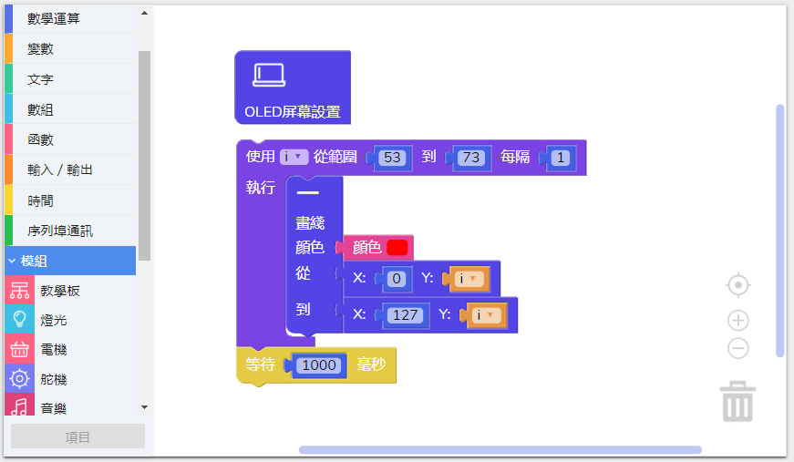

# 使用屏幕模块

---

## 模块简介

模块上连有一个 OLED 屏幕，接通之后可以绘制不同颜色的不同图案，屏幕面积（长 x 宽）为 128 x 128 px (像素)。

## 模块主要部件

<table style="margin-top:20px;">
	<tr>
		<td width="6%" style="font-weight: bold;">No.</td>
		<td width="20%" style="font-weight: bold;">部件名称</td>
		<td style="font-weight: bold;">部件描述</td>
	</tr>
	<tr>
		<td>1.</td>
		<td>OLED 屏幕</td>
		<td> 屏幕的分辨率为 128 x 128 px (像素)</td>
	</tr>
</table>

#### 模块接口示意

| 接口位置 | 接口描述           |
| -------- | ------------------ |
| D5, D6, D8, SCK, MOSI, RST  | 屏幕处理芯片所使用到的接口 |

> 为了避免不同类型的电子模块在使用时有接口（Pin out）的冲突，请注意前往[此页面](/cocomod/pinout-map)查看接口示意图

---

## 模块使用说明

1. 碰撞屏幕容易导致屏幕损坏，需要小心使用；
2. 使用 OLED 屏幕模块时需要先使用初始化设置 OLED 屏幕模块的积木，「 OLED 屏幕设置积木」如下图：

---

## 屏幕模块基础使用

### 坐标轴定义

1. 我们定义屏幕的左下角为屏幕的原点（起点），坐标为 **(0,0)**。
2. 水平方向为 X 轴，垂直方向为 Y。
3. X 和 Y 的最大数值为128，即为屏幕长和宽的最大数值。
4. 在屏幕的某一点的位置可以定位为 **(X,Y)**。

---

### 基本图形绘制

#### 模块组装

将主控模块和屏幕模块组合在一起，并让主控模块连接好 USB 数据线至电脑：

<!-- #### 绘制线

##### 积木编程

##### 最终效果

-->

---

#### 绘制矩形

##### 积木编程

> 注意：矩形绘制的起点为图案左上角的顶点

##### 最终效果

---

#### 绘制圆形

##### 积木编程

> 注意：圆形绘制的起点为图案最上方的顶点

##### 最终效果

---

#### 绘制三角形

##### 积木编程

##### 最终效果

---

#### 绘制文字

##### 积木编程

> 注意：尺寸为1的文字高度是 7 px ，尺寸为2的文字高度是 14 px ，以此类推

##### 最终效果

---

## 屏幕模块进阶使用

### 制作动画

#### 模块组装

将主控模块和屏幕模块组合在一起，并让主控模块连接好 USB 数据线至电脑：

#### 积木编程

#### 最终效果

程序上传完成后，将会呈现一系列几何图形动画：

---

### 更换文字

#### 模块组装

将主控模块和屏幕模块组合在一起，并让主控模块连接好 USB 数据线至电脑：

#### 积木编程
**关键点：** 使用黑色的图形对文字进行覆盖，达到更换文字的效果

#### 最终效果
先显示文字“CocoRobo Inc.”，覆盖文字后再显示“CocoRobo”

---
更新时间：2019年8月
