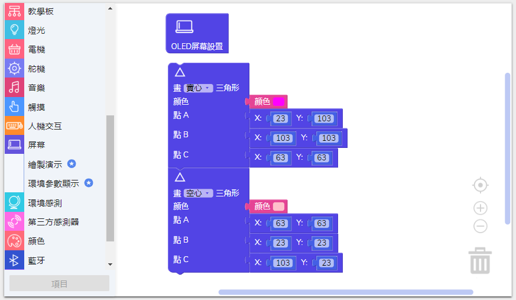
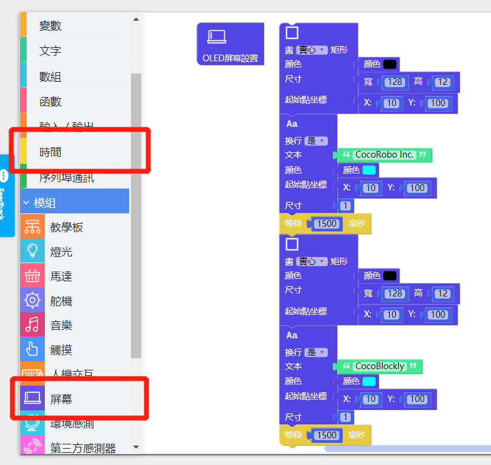

# 使用熒幕模組

---

## 模組簡介

模組上連有一個 OLED 熒幕，接通之後可以繪製不同顏色的不同圖案，熒幕面積（長 x 寬）爲 128 x 128 px (像素)。

## 模組主要部件

<table style="margin-top:20px;">
	<tr>
		<td width="6%" style="font-weight: bold;">No.</td>
		<td width="20%" style="font-weight: bold;">部件名稱</td>
		<td style="font-weight: bold;">部件描述</td>
	</tr>
	<tr>
		<td>1.</td>
		<td>OLED 熒幕</td>
		<td> 熒幕的分辨率爲 128 x 128 px (像素)</td>
	</tr>
</table>

#### 模組接口示意

| 接口位置 | 接口描述           |
| -------- | ------------------ |
| D5, D5   | 熒幕處理芯片所使用到的接口 |
| SCK, MOSI   | 熒幕處理芯片所使用到的接口（使用 SPI 通訊）  |

> 爲了避免不同類型的電子模組在使用時有接口（Pin out）的衝突，請注意前往[此頁面](/cocomod/pinout-map)查看接口示意圖

---

## 模組使用說明

1. 碰撞熒幕容易導致熒幕損壞，需要小心使用；
2. 使用 OLED 熒幕模組時需要先使用初始化設置 OLED 屏幕模組的積木，「 OLED 屏幕設置積木」如下圖：

---

## 熒幕模組基礎使用

### 坐標軸定義

1. 我們定義熒幕的左下角爲熒幕的原點（起點），坐標爲 **(0,0)**。
2. 水平方向爲 X 軸，垂直方向爲 Y。
3. X 和 Y 的最大數值爲128，即爲熒幕長和寬的最大數值。
4. 在熒幕的某一點的位置可以定位爲 **(X,Y)**。

---

### 基本圖形繪製

#### 模組組裝

將主機板模組和熒幕模組組合在一起，並讓主機板模組連接好 USB 數據線至電腦：

<!-- #### 繪製線

##### 積木編程

##### 最終效果

-->

---

#### 繪製矩形

##### 積木編程

> 注意：矩形繪製的起點為圖案左上角的頂點

##### 最終效果

---

#### 繪製圓形

##### 積木編程

> 注意：圓形繪製的起點為圖案最上方的頂點

##### 最終效果

---

#### 繪製三角形

##### 積木編程

##### 最終效果

---

#### 繪製文字

##### 積木編程

> 注意：尺寸為1的文字高度是 7 px ，尺寸為2的文字高度是 14 px ，以此類推

##### 最終效果

---

## 熒幕模組進階使用

### 製作動畫

#### 模組組裝

將主機板模組和熒幕模組組合在一起，並讓主機板模組連接好 USB 數據線至電腦：

#### 積木編程

#### 最終效果

程式上傳完成後，將會呈現一系列幾何圖形動畫：

---

### 更換文字

#### 模組組裝

將主機板模組和熒幕模組組合在一起，並讓主機板模組連接好 USB 數據線至電腦：

#### 積木編程
**關鍵點：** 使用黑色的圖形對文字進行覆蓋，達到更換文字的效果

#### 最終效果
先顯示文字“CocoRobo Inc.”，覆蓋文字后再顯示“CocoRobo”

---
更新時間：2019年8月
