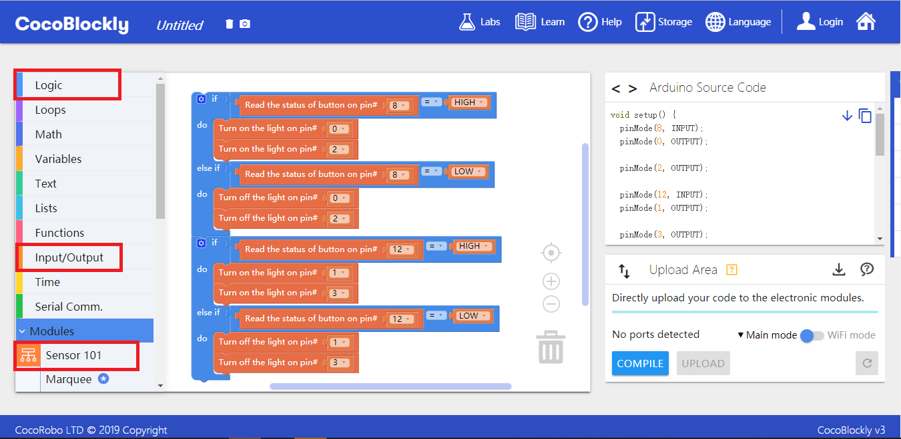
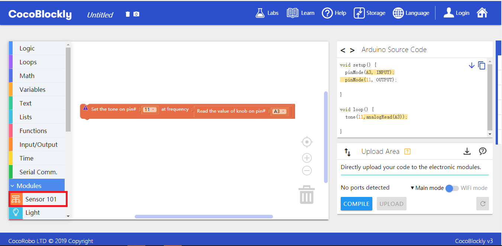

# Apply Sensor 101 Module

---

## Introduction
Sensor 101 module, an input/output module of the CocoMod, can facilitate students in learning the basic knowledge of electronics and Arduino.

## Main Components
 

| Number | Pinout Position | Pinout Description           |
| ---- | -------- | ------------------ |
| 1.   | (digital signals) D0 to D6    | LED Light       |
| 2.   | (analog signal) A3    | Potentiometer, also known as Rotary Knob |
| 3.   | (digital signals) D8, D9     | Button       |
| 4.   | (digital signals) D12、D13  | Switch     |
| 5.   | (digital signals) D11   | Buzzer          |
| 6.   | (analog signal) A2 | Infrared Signal Receiver           |

> To avoid pinout clashes between different kinds of modules, please refer to [cocorobo-modules-pinout-map](/cocomod/pinout-map).

## Instructions

1. The 7 unicolor LED lights (D0 to D6) can take on different brightnesses ranging from 0 to 255; the bigger the number, the higher the brightness.
2. The potentiometer (A3) is used as an analog input with a control range of 0~1023.
3. The two buttons (D8 and D9) and two switches (D12 and D13) are used to toggle between two states.
4. The Buzzer (D11) can emit sounds of any frequency (Hz).
5. The infrared signal receiver (A2) can receive infrared signals.

---

## Basic Application

### Use Buttons and Switches to Control LED lights

#### Assemble Modules

Put the sensor 101 module and the main controller together, and connect the main controller and a computer via a USB data cable. The method is as follows:
* Look carefully at the two sides of the modules. There are two different interfaces in the modules. Some modules have the two interfaces on two sides; some have them on only one side. The two interfaces have different lengths. One of them is male; the other is female. You have to put two interfaces of equal length together.

#### Code by CocoBlockly

**Tip:** Click the「if......do......」button on the upper left corner of the block, and add the「else if」block and the「else」block

#### Effects

After the program is uploaded successfully, you can see the following effects：
* Press the button D8, you can turn on the LED lights D0 and D2;
* Turn on the switch D12, you can control the brightness of the LED lights D1 and D2.

---

### Use Potentiometer to Control the Buzzer

#### Assemble Modules

#### Code by CocoBlockly

#### Effects

With the turning of the potentiometer, the buzzer will emit sounds of different frequencies.

---

## Advanced Application

### Use Sensor 101 Module to Receive Infrared Signals

#### Assemble Modules

#### Code by CocoBlockly

#### Effects

After the program is uploaded successfully, you can turn on the LED lights D0, D1 and D2 by pressing the button “2” in the infrared remote and turn off the LED lights D0, D1 and D2 by pressing the button “1” in the infrared remote:

---
Updated in August 2019
