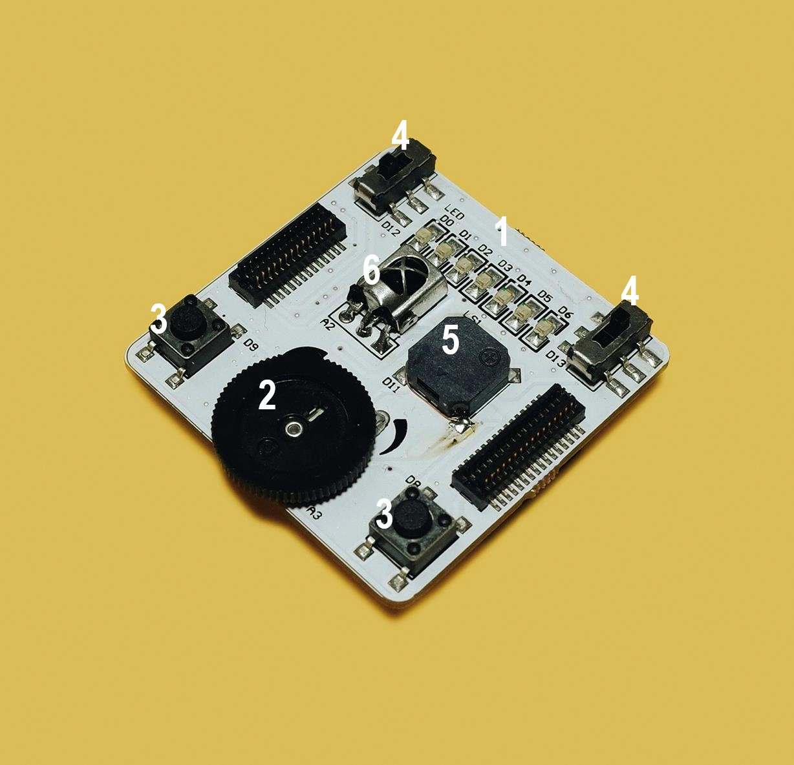
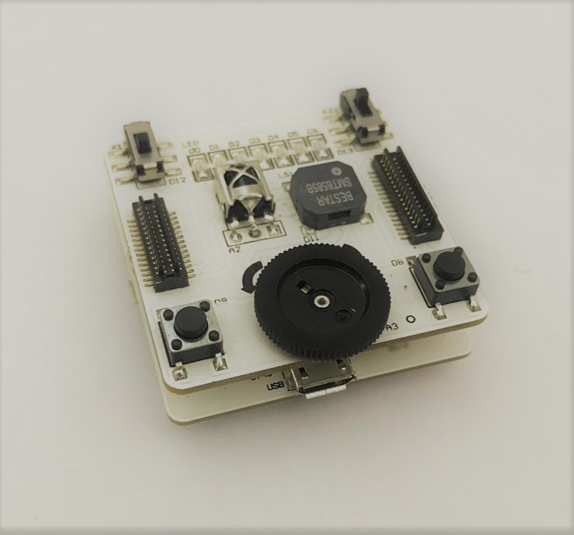
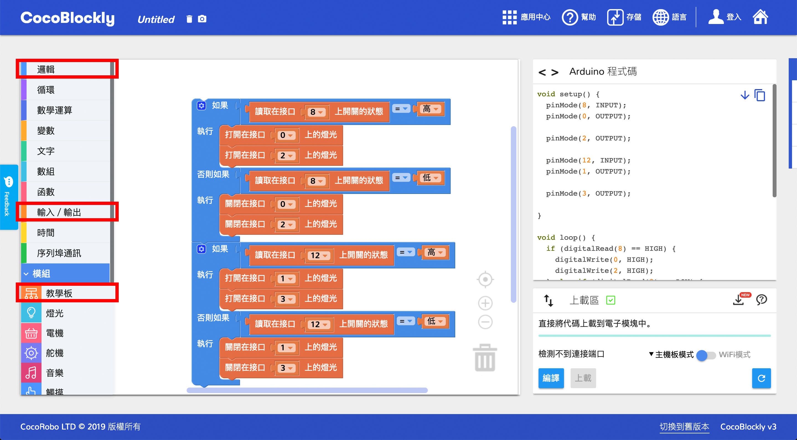
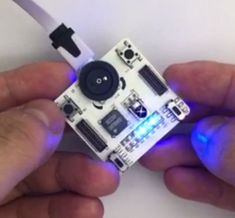
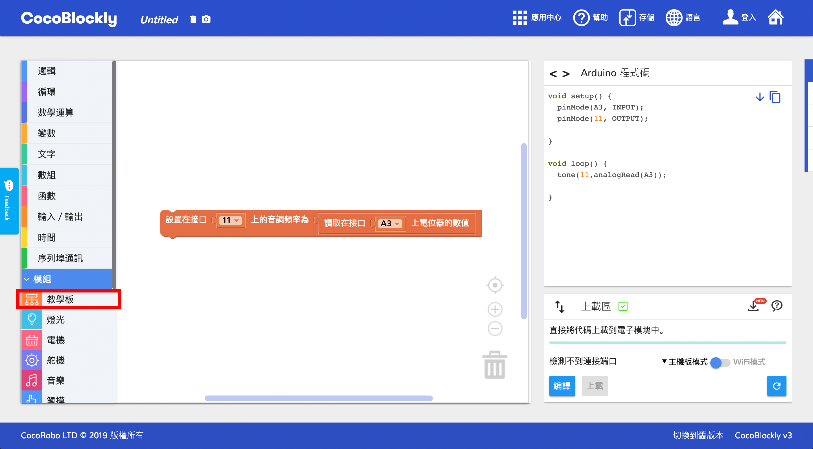
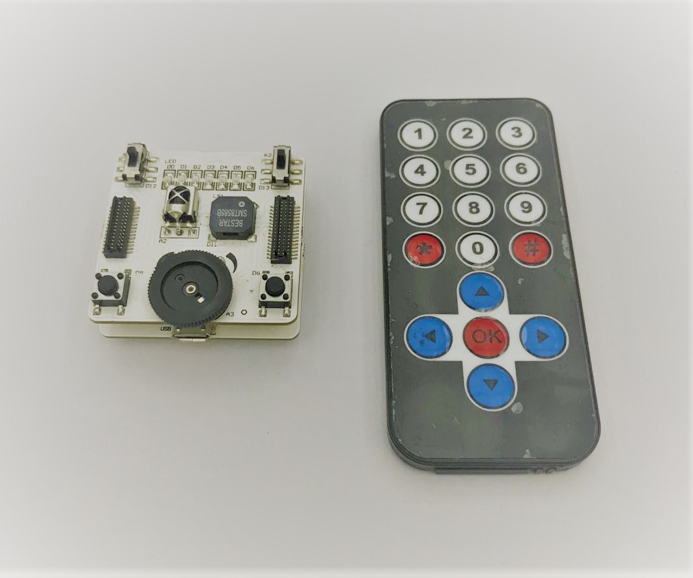
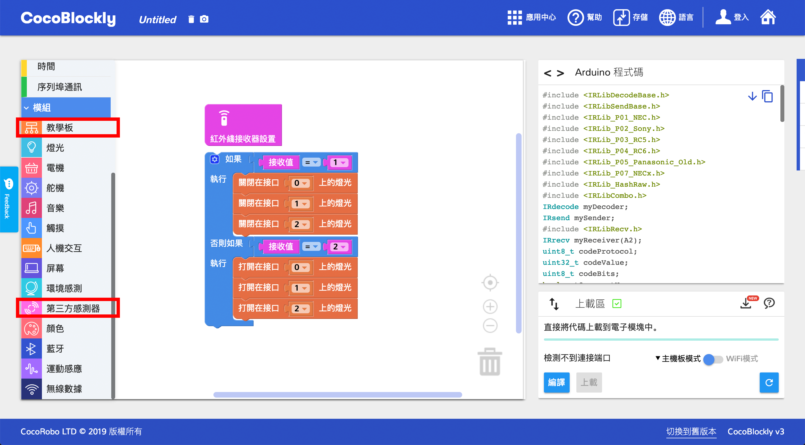
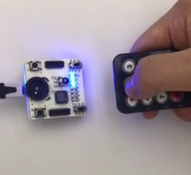

# 使用教學模組

---

## 模組簡介
教學模組是 CocoMod 中一套輸入/輸出模組，利於學生使用該模組學習電子和 Arduino 的基礎知識。

## 模組主要部件
 

| 編號 | 部件名稱 | 部件描述           |
| ---- | -------- | ------------------ |
| 1.   | LED 燈   | 接口為 D0~D6       |
| 2.   | 電位器   | 又稱旋鈕，接口為A3 |
| 3.   | 按鈕     | 接口為D8、D9       |
| 4.   | 切換開關 | 接口為D12、D13     |
| 5.   | 蜂鳴器   | 接口為D11          |
| 6.   | 紅外信號 | 接口為A2           |

> 為了不同類型的電子模組在使用時有接口（Pinout）的衝突，請前往[此頁面](/cocomod/pinout-map)查看接口示意圖後再確定如何進行程式的編寫。

## 模組使用說明
1. 教學模組上有 7 粒單色 LED 燈（D0 至 D6），可以呈現從 0 至 255 的亮度，數值越大，亮度越強。
2. 教學模組上有 1 個電位器（A3），作為模擬輸入有 0~1023 控制範圍。
3. 教學模組上分別有 2 組切換開關(switch)與按鈕(button)，可用來在兩種狀態間切換。
4. 教學模組上有 1 個蜂鳴器（D11），可以發出任意頻率（Hz）的聲響。

---

## 教學模組基礎使用
### 用按鈕與切換開光控制 LED 燈
#### 模組組裝

#### 積木編程

#### 最終效果

---

### 用電位器控制蜂鳴器
#### 模組組裝

#### 積木編程

#### 最終效果
隨著電位器的旋轉，蜂鳴器會發出不同音調的聲音。

---

## 教學模組進階使用
### 用教學模組接受紅外訊號
#### 模組組裝

#### 積木編程

#### 最終效果
