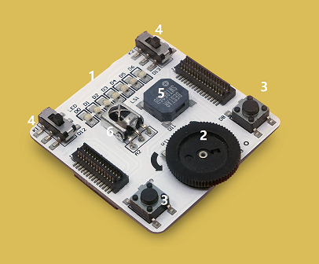
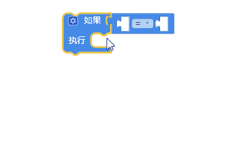
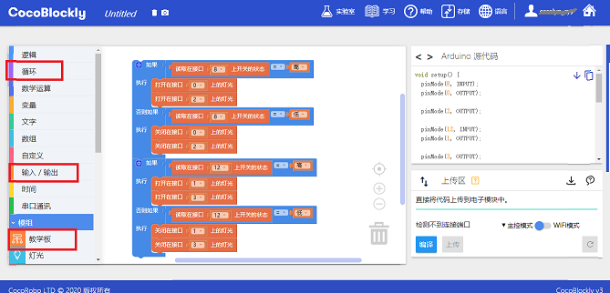
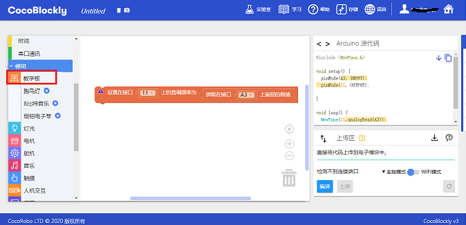
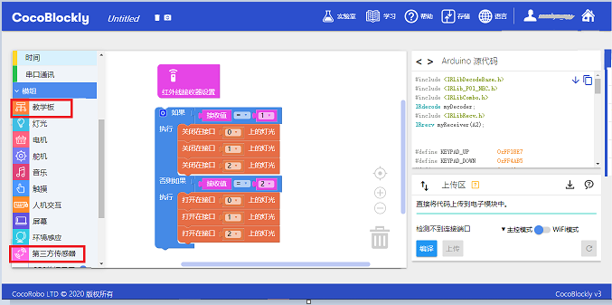

# 使用教学模块

---

## 模块简介
教学模块是 CocoMod 中一套输入/输出模块，利于学生使用该模块学习电子和 Arduino 的基础知识。

## 模块主要部件
 

| 编号 | 接口位置 | 接口描述           |
| ---- | -------- | ------------------ |
| 1.   | (数字信号) D0 至 D6    | LED 灯       |
| 2.   | (模拟信号) A3    | 电位器，又称旋钮 |
| 3.   | (数字信号) D8、D9     | 按钮       |
| 4.   | (数字信号) D12、D13  | 切换开关     |
| 5.   | (数字信号) D11   | 蜂鸣器          |
| 6.   | (模拟信号) A2 | 红外信号           |

> 为了避免不同类型的电子模块在使用时有接口（Pin out）的冲突，请注意前往[此页面](/cocomod/pinout-map)查看接口示意图

## 模块使用说明

1. 教学模块上有 7 粒单色 LED 灯（D0 至 D6），可以呈现从 0 至 255 的亮度，数值越大，亮度越强。
2. 教学模块上有 1 个电位器（A3），作为模拟输入有 0~1023 控制范围。
3. 教学模块上分别有 2 组切换开关(switch)与按钮(button)，可用来在两种状态间切换。
4. 教学模块上有 1 个蜂鸣器（D11），可以发出任意频率（Hz）的声响。
5. 教学模块上有 1 个红外信号接收器，可以接收红外缐信号。

---

## 教学模块基础使用

### 用按钮与切换开光控制 LED 灯

#### 模块组装

将教学模块与主控模块组装起来，并让主控模块用 USB 数据线和电脑连接起来，模块组装的方法如下：
* 仔细观察模块正反两面,分别有两种不同的接口（部分模块只有一面有接口），而且接口的长短不一。正反两面的一种接口为「公」接口，另一种为「母」接口。模块之间的组装方法则是将长短一致的两种接口紧密结合。

#### 积木编程

( **提示：** 点击「如果......执行......」积木左上角的蓝色小齿轮按钮，可添加「否则如果」和「否则」积木 ）

#### 最终效果

将程序上传后：
* 按下位于 D8 的按钮，将会点亮位于 D0 和 D2 的 LED 灯；
* 拨动位于 D12 的开关，将可以控制位于 D1 和 D3 的 LED 灯的亮和灭

---

### 用电位器控制蜂鸣器

#### 模块组装

#### 积木编程

#### 最终效果

随著电位器的旋转，蜂鸣器会发出不同音调的声音。

---

## 教学模块进阶使用

### 用教学模块接受红外信号

#### 模块组装

#### 积木编程

#### 最终效果

将程序上传后，使用如图的红外遥控器，按下数字 2 后将会让位于 D0、D1、D2 的 LED 灯全部亮起来，按下数字 1 后将会让位于 D0、D1、D2 的 LED 灯全部灭掉：

---
更新时间：2019年8月
