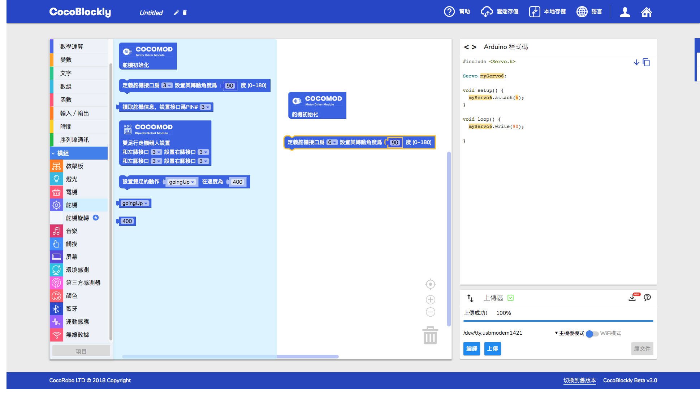

# 使用舵機轉接模組

## 模組簡介

舵機轉接模組能夠同時控制六個舵機，提供兩種供電方式，分別是主機板供電和外接電源控制。

## 模組主要部件

|編號 |部件名稱 | 部件描述  |
|-  |-  |-  |
|1. |外接電源接口  | 5V 2A|
|2. |D3 Pin |D3, VCC, GND （外接電源用）|
|3. |D5 Pin |D5, VCC, GND （外接電源用）|
|4. |D6 Pin |D6, VCC, GND （外接電源用）|
|5. |D9 Pin |D9, VCC, GND （外接電源用）|
|6. |D10 Pin |D10, VCC, GND （外接電源用）|
|7. |D11 Pin |D11, VCC, GND （外接電源用）|
|8. |D3 Pin |D3, VCC, GND （主控供電）|
|9. |D5 Pin |D5, VCC, GND （主控供電）|
|10. |D6 Pin |D6, VCC, GND （主控供電）|
|11. |D9 Pin |D9, VCC, GND （主控供電）|
|12. |D10 Pin |D10, VCC, GND （主控供電）|
|13. |D11 Pin |D11, VCC, GND （主控供電）|

## 注意事項

1.當主機板控制 3 個舵機時，會產生電流過高的現象，需要外置電源才可穩定的控制

## 舵機轉接模組基礎使用

### 調整舵機角度

#### 所需模組與材料

#### 組裝

#### 積木編程

#### 最終效果

---
