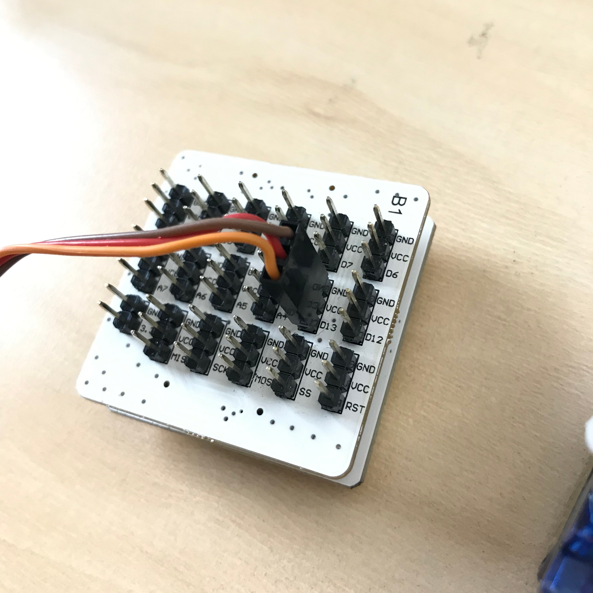

# 使用伺服电机转接模块

## 模块简介

伺服电机转接模块能够同时控制六个伺服电机，提供两种供电方式，分别是主控供电和外接电源控制。

## 模块主要部件

|编号 |部件名称 | 部件描述  |
|-  |-  |-  |
|1. |外接电源接口  | 5V/2A 输入|
|2. |D3 Pin |D3, VCC, GND （外接电源用）|
|3. |D5 Pin |D5, VCC, GND （外接电源用）|
|4. |D6 Pin |D6, VCC, GND （外接电源用）|
|5. |D9 Pin |D9, VCC, GND （外接电源用）|
|6. |D10 Pin |D10, VCC, GND （外接电源用）|
|7. |D11 Pin |D11, VCC, GND （外接电源用）|
|8. |D3 Pin |D3, VCC, GND （主控供电）|
|9. |D5 Pin |D5, VCC, GND （主控供电）|
|10. |D6 Pin |D6, VCC, GND （主控供电）|
|11. |D9 Pin |D9, VCC, GND （主控供电）|
|12. |D10 Pin |D10, VCC, GND （主控供电）|
|13. |D11 Pin |D11, VCC, GND （主控供电）|

> 为了避免不同类型的电子模块在使用时有接口（Pin out）的冲突，请注意前往[此页面](/cocomod/pinout-map)查看接口示意图

---

## 注意事项

1. 当主控控制 3 个伺服电机时，会产生电流过高的现象，需要外置电源才来稳定控制

2. 主控上的 D13 接口默认用于控制主控上的内置 LED 灯，所以舵机转接模块上不含有 D13 接口，但如果希望用 D13 接口控制伺服电机，请使用转接模块，将舵机连接到转接模块的 D13 接口処，并定义舵机接口积木将 D13 接口设置为控制伺服电机模式

>注意：相应地，当使用 D13 接口控制伺服电机时，此时就不能使用 D13 接口来控制主控模块的内置 LED 灯

---

## 伺服电机转接模块基础使用

### 调整伺服电机角度

#### 所需模块与材料

主控模块、伺服电机转接模块和伺服电机

#### 模块组装

首先将伺服电机转接模块和主控模块拼接在一起，然后再将伺服电机连接到伺服电机转接模块上。
连著伺服电机的有 3 根线，依次为「橙/红/棕咖」，即「信号／正极／负极」对应地，将伺服电机连接至伺服电机转接模块上，如下图所示：

#### 积木编程

#### 最终效果

---

更新时间：2019年8月
