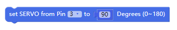
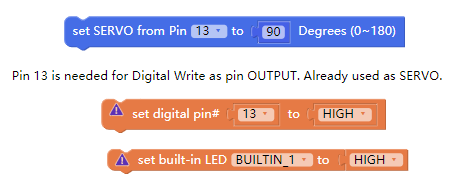
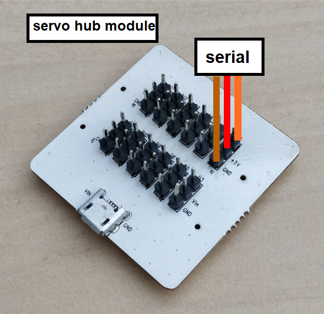
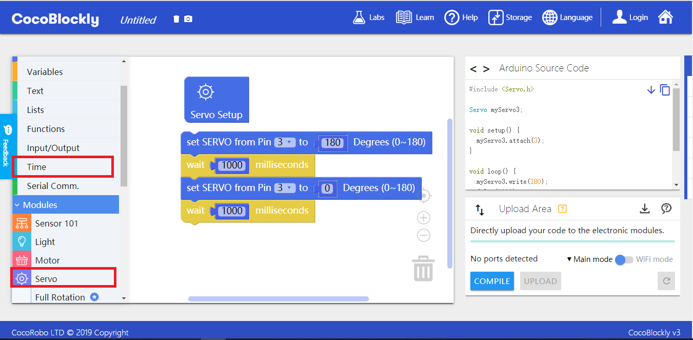

# Apply Servo Hub Module

## Introduction

Servo hub module can control six servo motors simultaneously. It has two ways of supplying power: supply power through main controller and supply power through external power.

## Main Components

|No. |Name | Description  |
|-  |-  |-  |
|1. |External Power Interface | 5V/2A input|
|2. |D3 Pin |D3, VCC, GND (used by external power)|
|3. |D5 Pin |D5, VCC, GND (used by external power)|
|4. |D6 Pin |D6, VCC, GND (used by external power)|
|5. |D9 Pin |D9, VCC, GND (used by external power)|
|6. |D10 Pin |D10, VCC, GND (used by external power)|
|7. |D11 Pin |D11, VCC, GND (used by external power)|
|8. |D3 Pin |D3, VCC, GND (used by main controller)|
|9. |D5 Pin |D5, VCC, GND (used by main controller)|
|10. |D6 Pin |D6, VCC, GND (used by main controller)|
|11. |D9 Pin |D9, VCC, GND (used by main controller)|
|12. |D10 Pin |D10, VCC, GND (used by main controller)|
|13. |D11 Pin |D11, VCC, GND (used by main controller)|

> To avoid pinout clashes between different kinds of modules, please refer to [cocorobo-modules-pinout-map](/cocomod/pinout-map).

---

## Notes

1. When the main controller controls 3 servo motors simultaneously, there will be excessive current. External power is needed to stabilize the power supply.

2. Pinout D13 is by default used for controlling the built-in LED light on the main controller. So there is not Pinout D13 in the servo hub module. If you still want to use Pinout D13 to control servo motors, you can connect steering engine to the Pinout D13 of the hub module and set the Pinout D13 to the mode of controlling servo motors.

>Note: If Pinout D13 is used to control servo motor, it cannot be used to control the built-in LED light on the main controller.

---

## Basic Application

### Adjust the Angle of Servo Motors

#### Moudules and Components

mian controller, servo hub module and servo motors

#### Assemble Modules

Put the main controller and the servo hub module together first, and then connect the servo motors to the servo hub module.
There are 3 cables connecting to the servo motors: the orange, red and brown ones. They are linked to the signal, the positive electrode and the negative electrode respectively.

#### Code by CocoBlockly

#### Effects

---

Updated in August 2019
