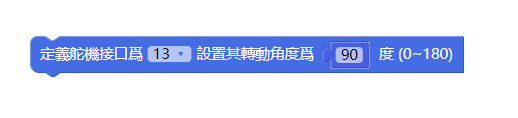
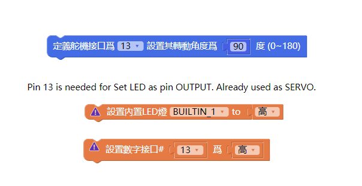
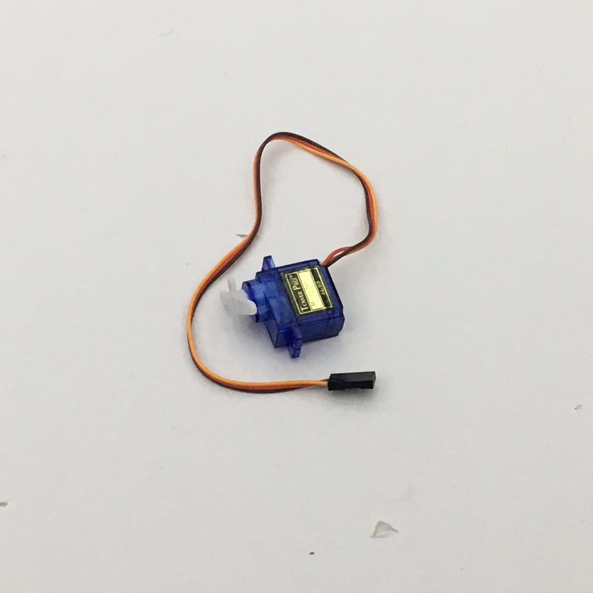
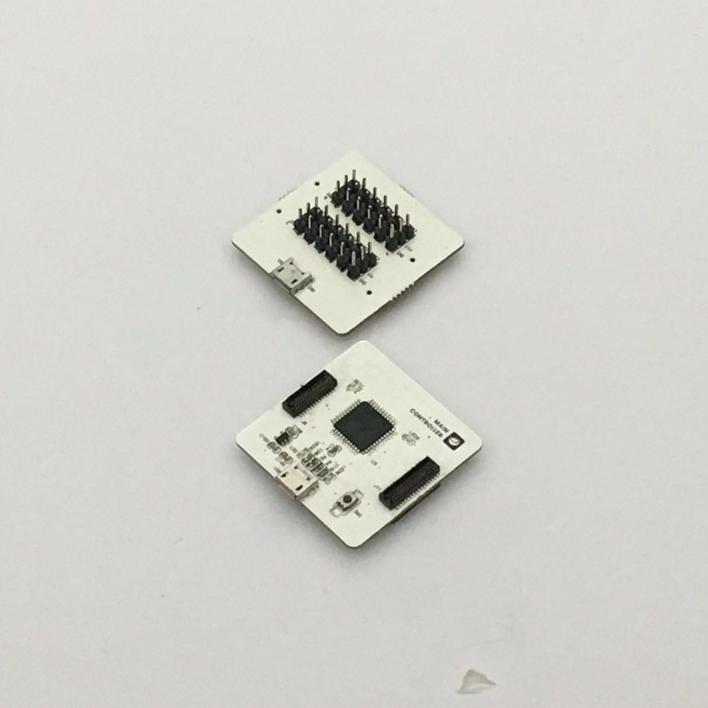
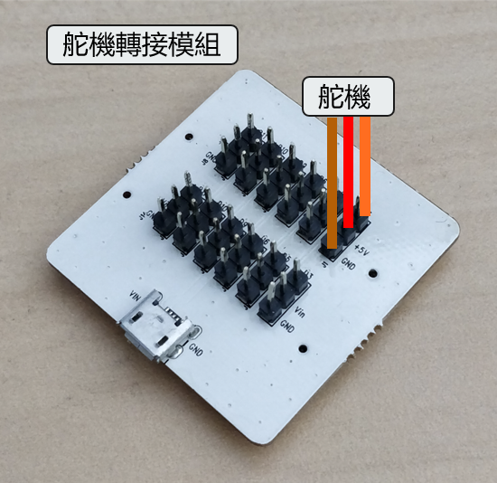
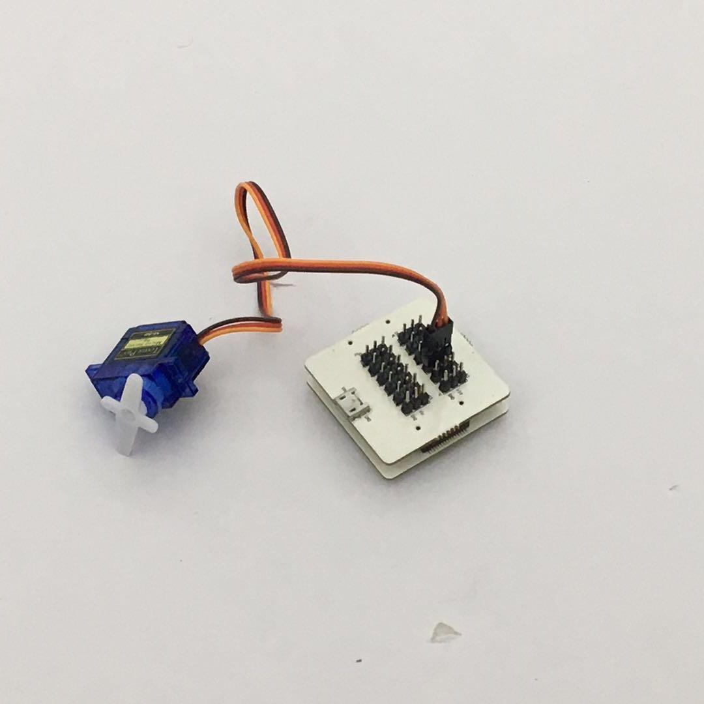
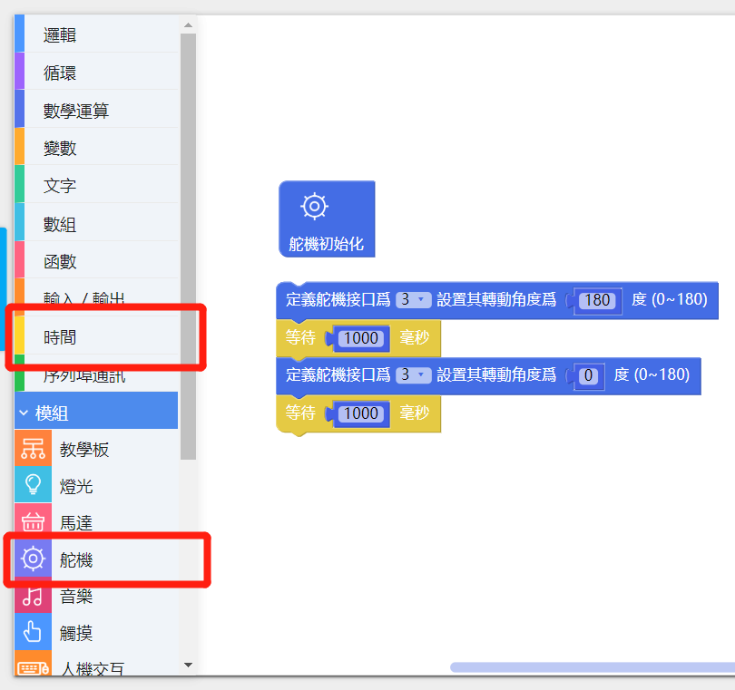
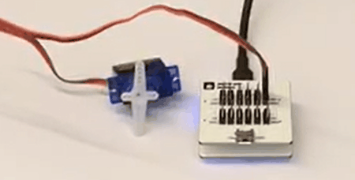

# 使用伺服馬達轉接模組

## 模組簡介

伺服馬達轉接模組能夠同時控制六個伺服馬達，提供兩種供電方式，分別是主機板供電和外接電源控制。

## 模組主要部件

|編號 |部件名稱 | 部件描述  |
|-  |-  |-  |
|1. |外接電源接口  | 5V/2A 輸入|
|2. |D3 Pin |D3, VCC, GND （外接電源用）|
|3. |D5 Pin |D5, VCC, GND （外接電源用）|
|4. |D6 Pin |D6, VCC, GND （外接電源用）|
|5. |D9 Pin |D9, VCC, GND （外接電源用）|
|6. |D10 Pin |D10, VCC, GND （外接電源用）|
|7. |D11 Pin |D11, VCC, GND （外接電源用）|
|8. |D3 Pin |D3, VCC, GND （主機板供電）|
|9. |D5 Pin |D5, VCC, GND （主機板供電）|
|10. |D6 Pin |D6, VCC, GND （主機板供電）|
|11. |D9 Pin |D9, VCC, GND （主機板供電）|
|12. |D10 Pin |D10, VCC, GND （主機板供電）|
|13. |D11 Pin |D11, VCC, GND （主機板供電）|

> 爲了避免不同類型的電子模組在使用時有接口（Pin out）的衝突，請注意前往[此頁面](/cocomod/pinout-map)查看接口示意圖

---

## 注意事項

當主機板控制 3 個伺服馬達時，會產生電流過高的現象，需要外置電源纔來穩定控制

主機板上的D13接口默認用於控制主機板上的内置LED燈，所以不能直接用D13接口控制伺服馬達

如果希望用D13接口控制伺服馬達，請使用定義舵機接口積木將D13接口設置爲控制伺服馬達模式

相應地，當使用D13接口控制伺服馬達時，不能使用D13接口來控制内置LED燈

---

## 伺服馬達轉接模組基礎使用

### 調整伺服馬達角度

#### 所需模組與材料

主機板模組、伺服馬達轉接模組和伺服馬達

#### 模組組裝

首先將伺服馬達轉接模組和主機板模組拼接在一起，然後再將伺服馬達連接到伺服馬達轉接模組上。
連著伺服馬達的有 3 根線，依次為「橙/紅/棕咖」，即「訊號／正極／負極」對應地，將伺服馬達連接至伺服馬達轉接模組上，如下圖所示：

#### 積木編程

#### 最終效果

---

更新時間：2019年8月
