# 使用ThingSpeak

### 關於ThingSpeak

ThingSpeak(https://thingspeak.com) 是由 MathWorks 開發的一款雲端資料整合器的平臺，只需要透過簡單 RESTful API 請求，用戶可以使用自己的智慧產品向 ThinkSpeak 進行數據傳輸，同時 ThingSpeak 提供足夠強大的數據分析和處理能力，比如在線編輯／調校數據，或者結合 MATLAB 進行數據可視化，是目前比較流行的在線數據分析／可視化工具之一。可擴展CocoBlockly的數據可視化能力，是CocoBlockly提升學生對大數據學科的理解能力的輔助工具之一。

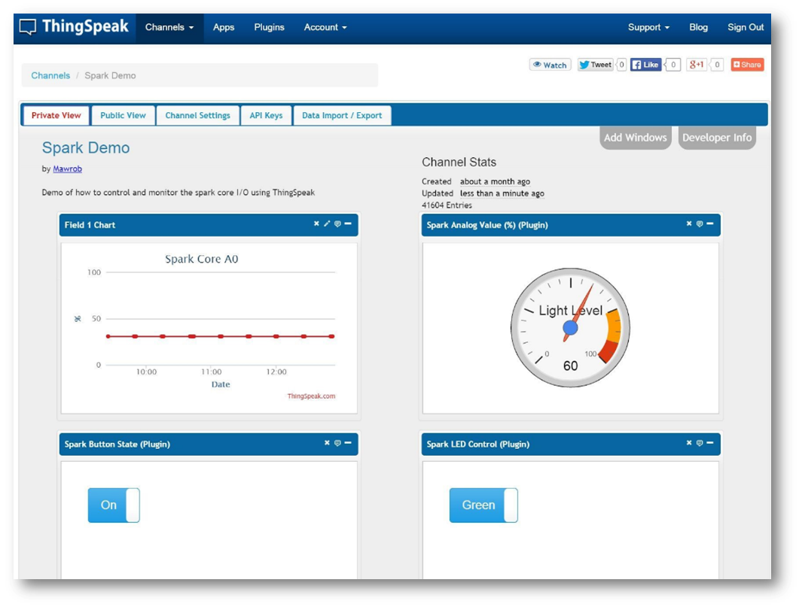

### 注冊&登陸ThingSpeak

輸入網址：https://thingspeak.com/

使用email創建賬戶:

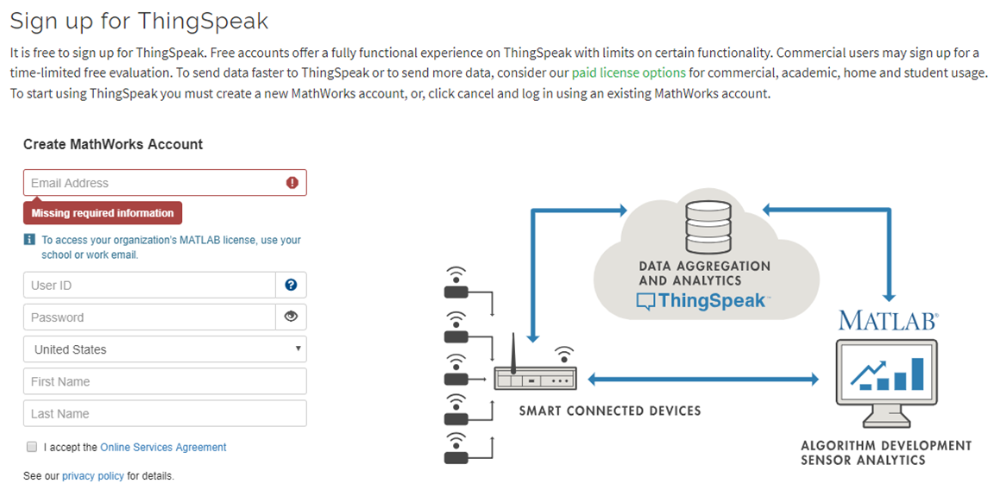

登陸ThingSpeak:

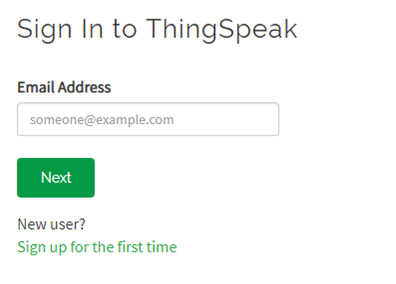

### 創建Channel

點擊Channels > Mychannels 

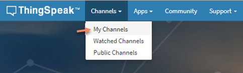

在Channels面板中點擊NEW Channel 

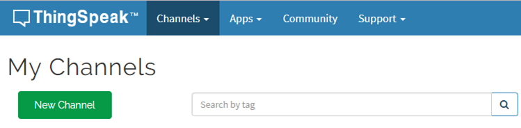

進入New Channel面板，點擊Field後面的勾選框，設定Channels的數據域 

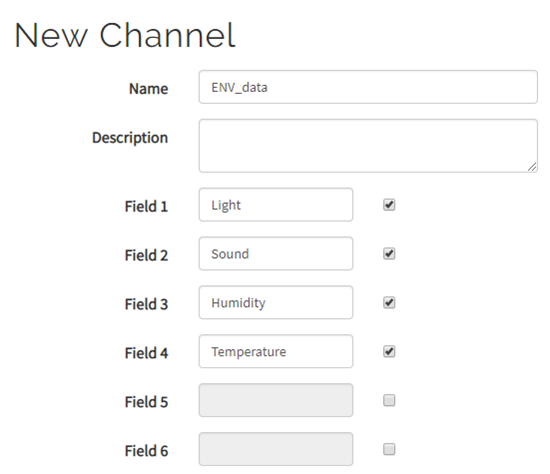

點擊底部的 Save Channel ,完成Channel創建

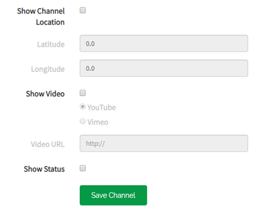

完成創建Channel后, 可查看關於Channel的屬性

### 查看Channel數據

點擊Private View, 可以看到前面創建的Field域

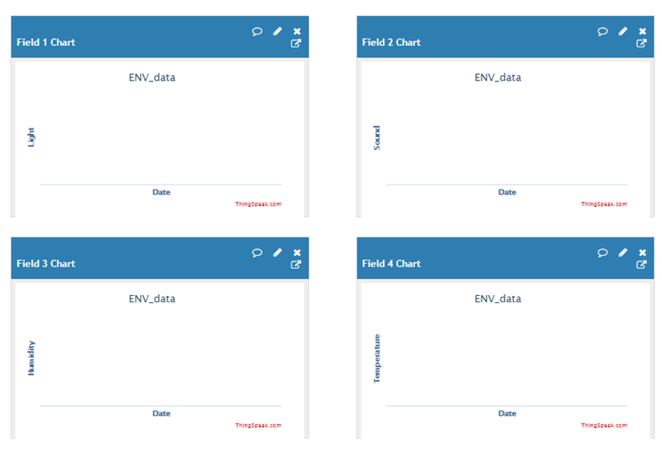

### 清除Channel數據

點擊Channel Setting進入到Channel設置面板

* Clear Channel : 清除每個Field的數據

* Delete Channel : 刪除整個Channel 

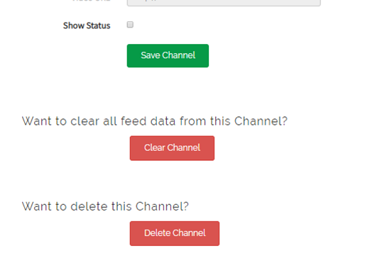

### 關於API Keys

點擊API Keys, 其中Write API Key 的值是用来填入CocoBlockly中關於ThingSpeak的程式积木，用來聲明將數據發送往ThingSpeak中該Channel事件中

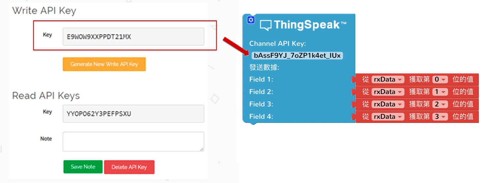

### 案例

項目: 獲取環境開發板的數據，向ThingSpeak發送並進行監測

主機板模式:

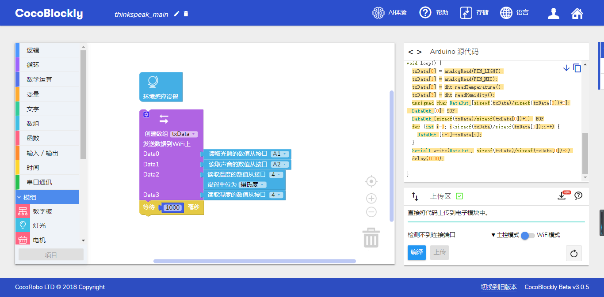

WiFi模式:

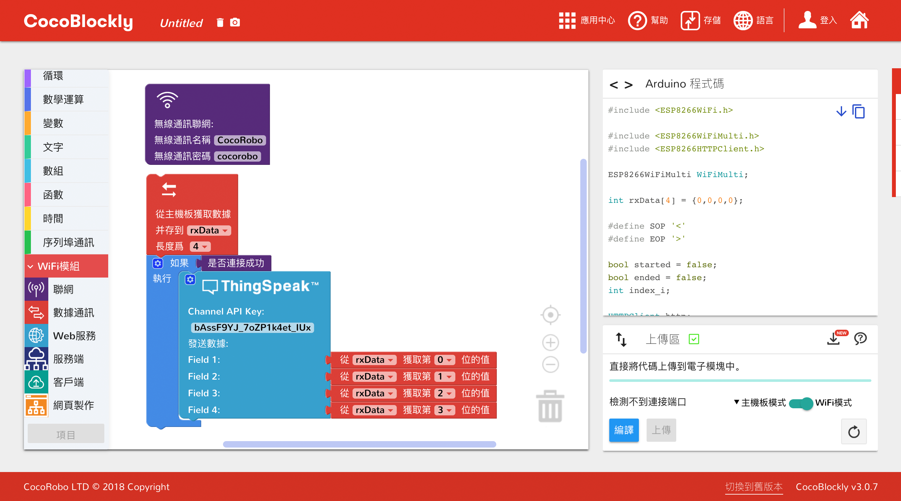

ThingSpeak數據收集結果 :

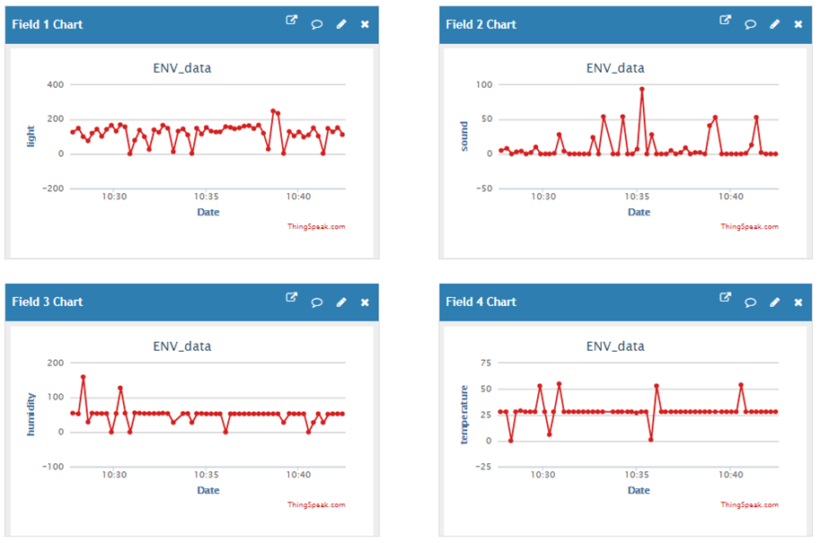

