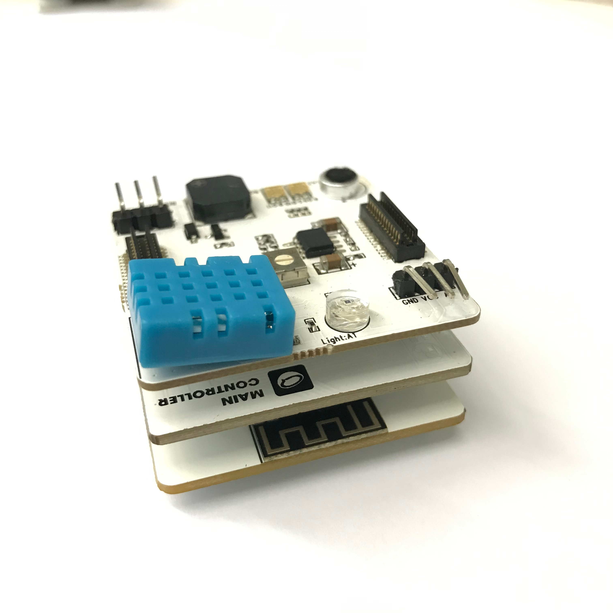

# Apply ThingSpeak

### Introduction

ThingSpeak (https://thingspeak.com), developed by MathWorks, is a cloud integrator platform. You can use your smart products to transmit data to ThinkSpeak through a simple RESTful API request. In addition, ThingSpeak provides you with a powerful capacity of data analysis and processing, such as online editing/data proofreading and data visualization (realized by working in combination with MATLAB). It is a popular online data analysis and visualization tool that expands CocoBlockly’s capacity of data visualization. It is one of CocoBlockly’s assistant tools that improve students’ ability of understanding big data.

### Sign up for and Log into ThingSpeak

Enter the website: https://thingspeak.com/

Use your email account to create a ThingSpeak account:

Log into ThingSpeak:

### Create Channel

Click "Channels" > "My channels"

Click "NEW Channel" in the Channels panel

Enter New Channel panel, click the boxes Field in the following picture and set the data domain name of the Channels.

Click the "Save Channel" at the bottom of the picture to complete Channel creation.

You can view the attributes of Channel after the completion of Channel creation.

### Check Channel Data

Click "Private View", then you can see the Field data domain established previously.

### Clear Channel Data

Click "Channel Setting" to enter setting panel of the "Channel".

* Clear Channel: Clear the data of every Field.

* Delete Channel: Delete the whole Channel.

### API Keys

Click API Keys. The value of "Write API Key" is to be entered into the ThingSpeak program blocks of the CocoBlockly so as to show that the data is sent to the Channel event of ThingSpeak.

### Example

Project: Get the data of the environmental sensing module. Send the data to ThingSpeak and monitor the data.

#### Assemble Modules

Put the main controller, WiFi communication module and environmental sensing module together.

> Note: You need to upload programs to the main controller and the WiFi communication module in their respective modes before putting them together.

  
  

#### Code by CocoBlockly

##### Main Controller Mode:

##### WiFi Mode:

> Note: When writing programs please change the WiFi name and password of the network block to that of yours.

##### Effects

After the program is successfully uploaded, you can go to ThingSpeak to see the collected data:

---
Updated in August 2019
