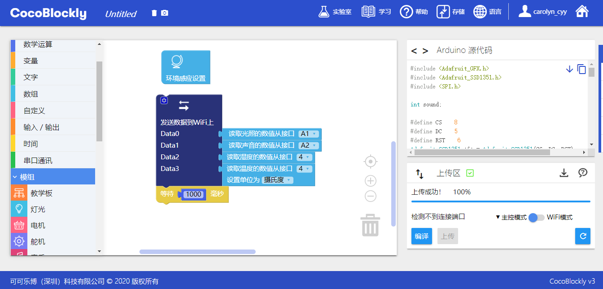

# 使用ThingSpeak

### 关于ThingSpeak

ThingSpeak(https://thingspeak.com) 是由 MathWorks 开发的一款云端资料整合器的平台，只需要通过简单 RESTful API 请求，用户可以使用自己的智慧产品向 ThinkSpeak 进行数据传输，同时 ThingSpeak 提供足够强大的数据分析和处理能力，比如在线编辑／调校数据，或者结合 MATLAB 进行数据可视化，是目前比较流行的在线数据分析／可视化工具之一。可扩展 CocoBlockly 的数据可视化能力，是 CocoBlockly 提升学生对大数据学科的理解能力的辅助工具之一。

### 注册&登录ThingSpeak

输入网址：https://thingspeak.com/

使用email创建账户:

登录ThingSpeak:

### 创建Channel

点击 「Channels」 > 「My channels」

在 Channels 面板中点击 「NEW Channel」

进入 New Channel 面板，点击 Field 后面的勾选框，设定 Channels 的数据域名称

点击底部的 「Save Channel」 ,完成 Channel 创建

完成创建 Channel 后, 可查看关于 Channel 的属性

### 查看Channel数据

点击 Private View, 可以看到前面创建的 Field 数据域

### 清除Channel数据

点击 「Channel Setting」 进入到 「Channel」 设置面板

* Clear Channel : 清除每个 Field 的数据

* Delete Channel : 删除整个 Channel

### 关于API Keys

点击 API Keys , 其中 「Write API Key」 的值是用来填入 CocoBlockly 中关于 ThingSpeak 的程序积木，用来声明将数据发送往 ThingSpea k中该 Channel 事件中

### 案例

项目: 获取环境传感模块的数据，向 ThingSpeak 发送并进行监测

#### 模块组装

将主控模块、WiFi 通信模块以及环境传感模块拼接在一起

> 注：必须先对主控模块和 WiFi 通信模块分别上传对应模式下的积木程序后，再将这些模块拼接在一起

  
  

#### 积木编程

##### 主控模式:

##### WiFi模式:

> 注：编写程序时，请注意将联网积木中的 WiFi 名称和密码改成你自己要连接的

##### 最终效果

程序上传完成后，前往 ThingSpeak 查看收集到的数据结果:

---
更新时间：2019年8月
