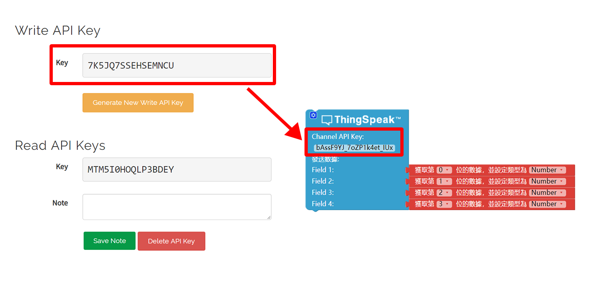

# 使用ThingSpeak

### 關於ThingSpeak

ThingSpeak(https://thingspeak.com) 是由 MathWorks 開發的一款雲端資料整合器的平臺，只需要透過簡單 RESTful API 請求，用戶可以使用自己的智慧產品向 ThinkSpeak 進行數據傳輸，同時 ThingSpeak 提供足夠強大的數據分析和處理能力，比如在線編輯／調校數據，或者結合 MATLAB 進行數據可視化，是目前比較流行的在線數據分析／可視化工具之一。可擴展 CocoBlockly 的數據可視化能力，是 CocoBlockly 提升學生對大數據學科的理解能力的輔助工具之一。

### 注冊&登錄ThingSpeak

輸入網址：https://thingspeak.com/

使用email創建賬戶:

登錄ThingSpeak:

### 創建Channel

點擊 「Channels」 > 「My channels」

在 Channels 面板中點擊 「NEW Channel」

進入 New Channel 面板，點擊 Field 後面的勾選框，設定 Channels 的數據域名稱

點擊底部的 「Save Channel」 ,完成 Channel 創建

完成創建 Channel 后, 可查看關於 Channel 的屬性

### 查看Channel數據

點擊 Private View, 可以看到前面創建的 Field 數據域

### 清除Channel數據

點擊 「Channel Setting」 進入到 「Channel」 設置面板

* Clear Channel : 清除每個 Field 的數據

* Delete Channel : 刪除整個 Channel

### 關於API Keys

點擊 API Keys , 其中 「Write API Key」 的值是用来填入 CocoBlockly 中關於 ThingSpeak 的程式積木，用來聲明將數據發送往 ThingSpea k中該 Channel 事件中

### 案例

項目: 獲取環境感應模組的數據，向 ThingSpeak 發送並進行監測

#### 模組組裝

將主機板模組、WiFi 通訊模組以及環境感應模組拼接在一起

> 注：必須先對主機板模組和 WiFi 通訊模組分別上傳對應模式下的積木程式后，再將這些模組拼接在一起

  
  

#### 積木編程

##### 主機板模式:

##### WiFi模式:

> 注：編寫程式時，請注意將聯網積木中的 WiFi 名稱和密碼改成你自己要連接的

##### 最終效果

程式上傳完成後，前往 ThingSpeak 查看收集到的數據結果:

---
更新時間：2019年8月
