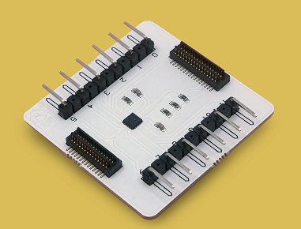
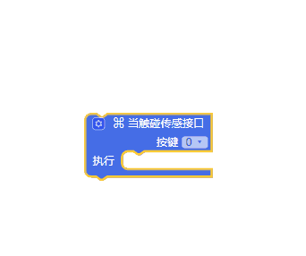
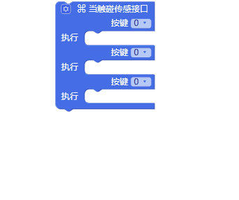
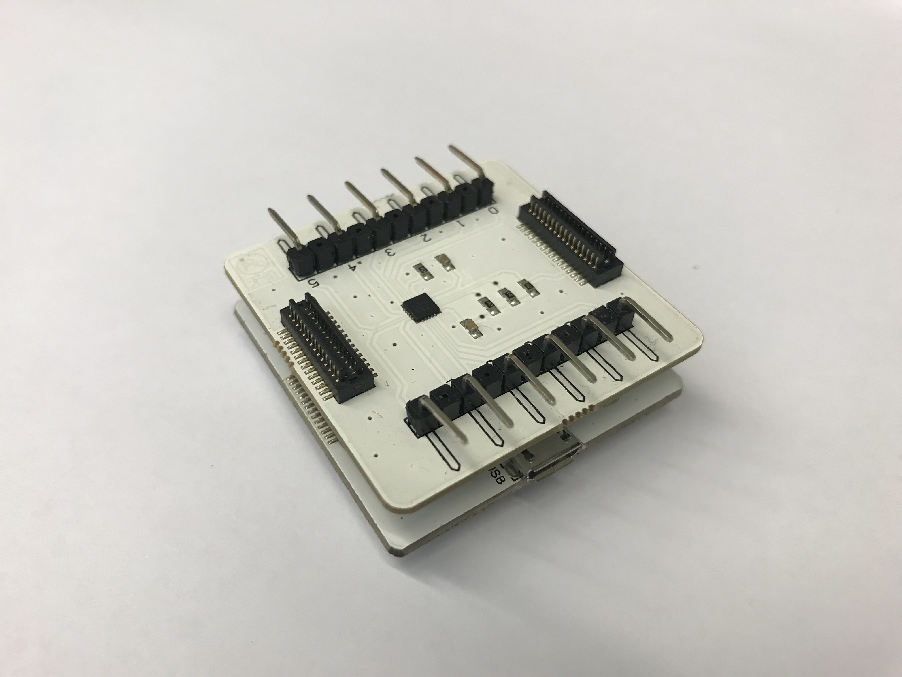
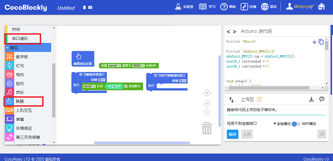
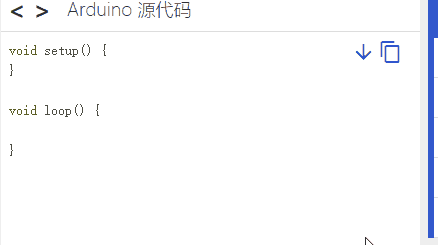
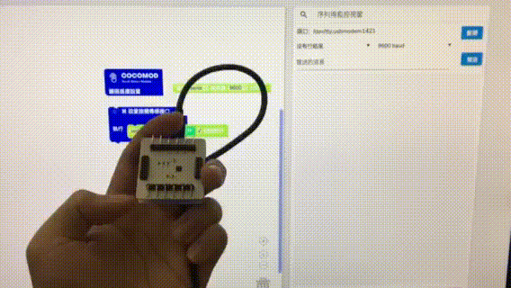

# 使用触摸传感模块

---
## 模块简介

触摸传感模块通常与导电纸同用，可以通过触摸接口或者与接口相连的导电纸来向模块发送一个电位信号，这样的电信号就可以表示触摸的位置。

---

## 模块主要部件

<table style="margin-top:20px;">
	<tr>
		<td width="6%" style="font-weight: bold;">No.</td>
		<td width="20%" style="font-weight: bold;">部件名称</td>
		<td style="font-weight: bold;">部件描述</td>
	</tr>
	<tr>
		<td>1.</td>
		<td>触摸接口0至11</td>
		<td>通过使用导电的物体触碰接口，可以将信号发送给主控模块，有触摸和放开两种状态</td>
	</tr>
</table>

#### 模块接口示意

| 接口位置 | 接口描述           |
| -------- | ------------------ |
| D2, D3, D7, D8   | 触摸处理芯片所使用到的接口       |

> 为了避免不同类型的电子模块在使用时有接口（Pin out）的冲突，请注意前往[此页面](/cocomod/pinout-map)查看接口示意图

---

## 模块使用说明

1. 常见的导电物体包括：杜邦线、手指、导电纸、螺丝刀、锁匙等。
2. 如果使用杜邦线或导电纸与触摸传感模块的接口相连之后，需要给触摸传感模块重新通电才能正常使用。
3.为「当触碰传感接口」积木或「当松开被触碰的接口」积木添加按键接口可参考下图提示：

---

##  触摸传感模块基础使用

### 触摸传感

#### 模块组装

将主控模块和触摸传感模块组合在一起，并让主控模块连接好 USB 数据线至电脑：

#### 积木编程

#### 最终效果

程序上传成功后，请点击右侧工具栏的串口窗口来查看触摸传感的数据输出：

---
更新时间：2019年8月
