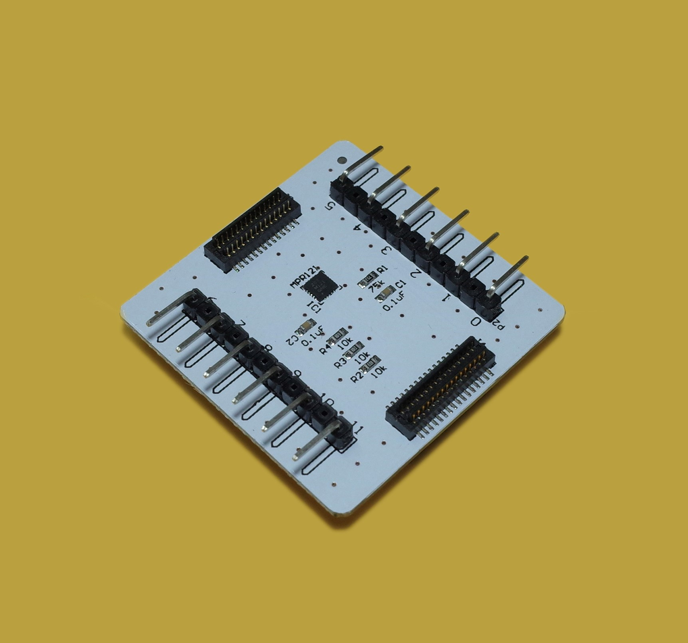
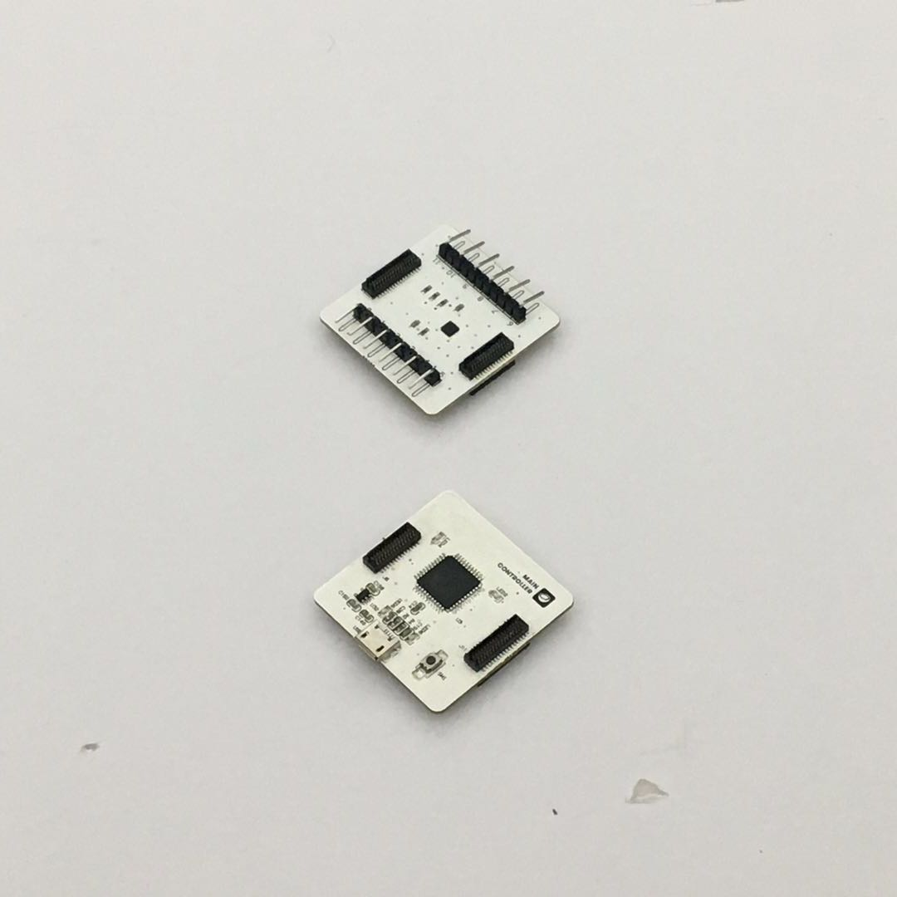
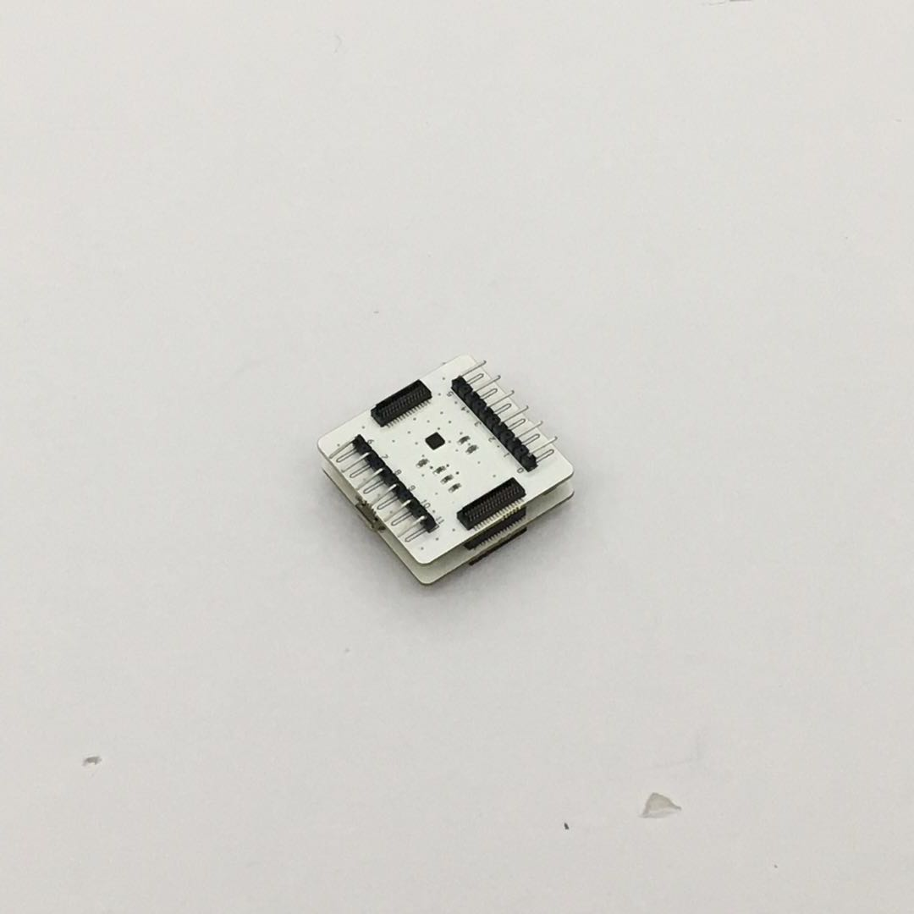
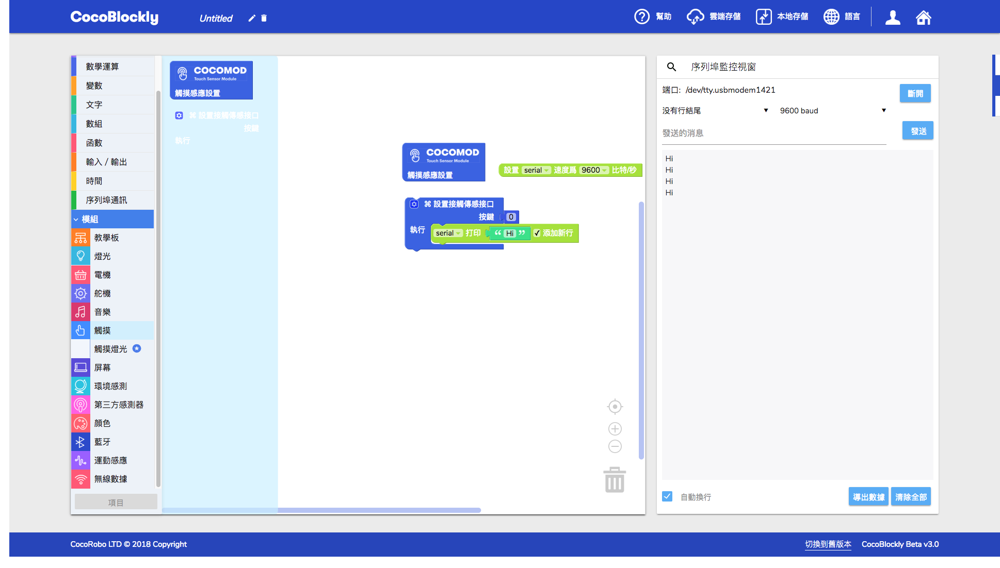

# 使用觸摸感應模組

---
## 模組簡介

觸摸感應模組通常與導電紙同用，與兩邊接口相連，通過觸摸接口或者相連的導電紙，向模組發送一個電位訊號，表示觸摸位置。

---

## 模組主要部件

<table style="margin-top:20px;">
	<tr>
		<td width="6%" style="font-weight: bold;">No.</td>
		<td width="20%" style="font-weight: bold;">部件名稱</td>
		<td style="font-weight: bold;">部件描述</td>
	</tr>
	<tr>
		<td>1.</td>
		<td>觸摸接口0至11</td>
		<td>通過使用導電的物體觸碰接口，可以將訊號發送給主機板模組，有觸摸和放開兩種狀態</td>
	</tr>
</table>

#### 模組接口示意

| 接口位置 | 接口描述           |
| -------- | ------------------ |
| D2, D3, D7, D8   | 觸摸處理芯片所使用到的接口       |

> 爲了避免不同類型的電子模組在使用時有接口（Pin out）的衝突，請注意前往[此頁面](/cocomod/pinout-map)查看接口示意圖

---

## 模組使用說明

1. 常見的導電物體包括：杜邦線、手指、導電紙、螺絲刀、鎖匙等。
2. 如果使用杜邦線或導電紙與觸摸感應模組的接口相連之後，需要給觸摸感應模組重新通電才能正常使用。

##  觸摸感應模組基礎使用

### 觸摸感應

#### 所需模組

#### 模組組裝

#### 積木編程

#### 最終效果

