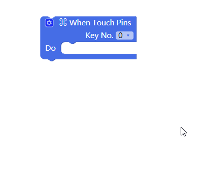
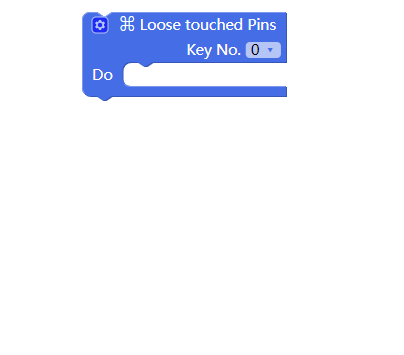

# Apply Touch Analyzing Module

---
## Introduction

Touch analyzing module is usually used in combination with conductive paper. The conductive paper is connected to the pins on the module via Dupont jumper wire. After connecting the conductive paper to the pins, you can send a potential signal to the module by either touching the pins or the conductive paper. The position of the potential signal is where you touch.

---

## Main Components

<table style="margin-top:20px;">
	<tr>
		<td width="6%" style="font-weight: bold;">No.</td>
		<td width="20%" style="font-weight: bold;">Name</td>
		<td style="font-weight: bold;">Description</td>
	</tr>
	<tr>
		<td>1.</td>
		<td>Touch Pin 0 to 11</td>
		<td>Signals can be sent to the main controller by touching the pins with conductors. There are two states: "When Touch Pins" and "Loose Touched Pins"</td>
	</tr>
</table>

#### Pinout

| Pinout Position | Pinout Description           |
| -------- | ------------------ |
| D2, D3, D7, D8   | used by touch processing chip       |

> To avoid pinout clashes between different kinds of modules, please refer to [cocorobo-modules-pinout-map](/cocomod/pinout-map).

---

## Instructions

1. Common conductors include: Dupont jumper wire, finger, conductive paper, screwdriver and keys.
2. After touch analyzing module is connected to Dupont jumper wire or conductive paper, you need to electrify the module again.
3. When adding keys to the "When Touch Pins" block or "Loose Touched Pins" block, you can refer to the picture below:

---

##  Basic Application

### Touch Analyzing

#### Assemble Modules

Put the touch analyzing module and the main controller together, and connect the main controller and a computer via a USB data cable.

#### Code by CocoBlockly

#### Effects

After the program is uploaded successfully, please click serial port window of the toolbar at the right side to check the output data of the module:

---
Updated in August 2019
