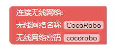
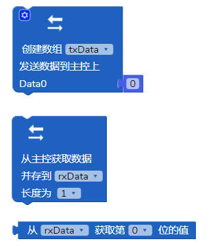
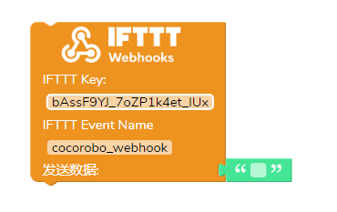
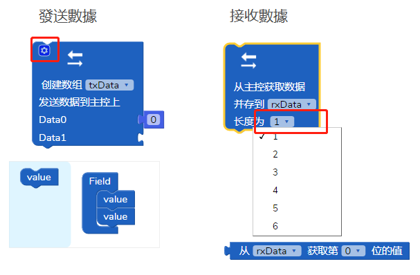
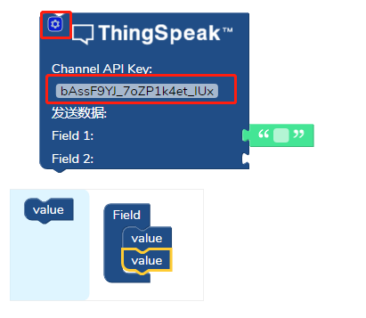
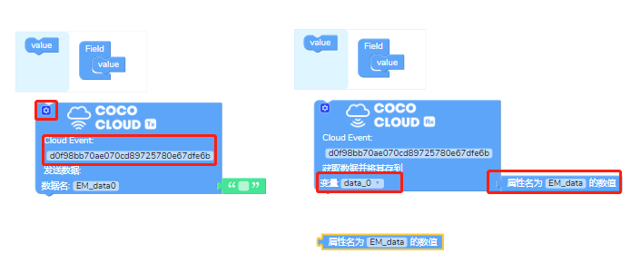
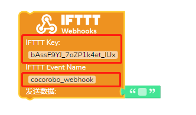
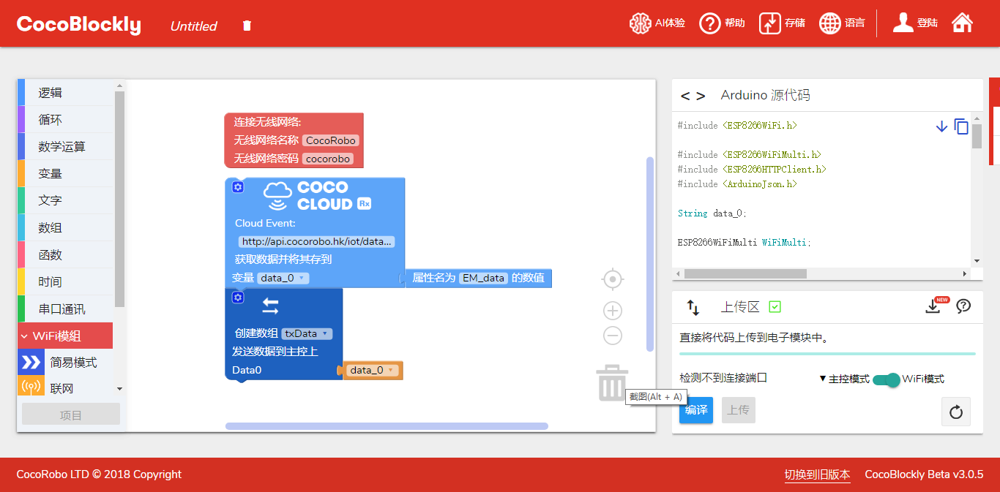

# 使用 WiFi 的簡易模式

### 關於EasyMode

EasyMode即簡易模式，是針對零基礎的學生，CocoRobo公司研發的基礎物聯網積木，相對原有的WiFi積木，EasyMode更加注重理解的容易度，操作的簡易性，以及樣式的簡潔美觀性。

---

### 積木樣式

簡易模式涵蓋五個類別物聯網積木:

 1. 聯網積木

   

 2. 數據通訊積木

   

 3. ThingSpeak積木

   

 4. CocoCloud積木

   

 5. IFTTT積木

   

---

## 使用説明 

#### 聯網積木

* 填入無綫網絡的名稱和密碼即可

 

#### 數據通訊積木

  * 發送數據積木: 點擊左上方齒輪可彈出編輯框,拖動value選項來增加傳輸數據個數
  * 接收數據積木：接收數據的長度最大為6，且必須與主控的發送數據個數一致，獲取的數據會存到rxData數組中
  * 通訊類型目前限定為數字，以數組的方式進行通訊，即無法傳輸字符串類型

  

#### ThingSpeak積木

  *  點擊左上方齒輪可彈出編輯框,拖動value選項來增加傳輸數據個數
  *  Channel API Key :填寫數據傳輸到ThingSpeak的CHannel項目的聲明

  

#### CocoCloud積木

  * 發送數據積木: 
    * 點擊左上方齒輪可彈出編輯框,拖動value選項來增加傳輸數據個數，
    * Cloud Event指CocoCloud的數據的内容
    * 對應每個數據需要給定好屬性名（數據名）
  * 接收數據積木：
    * Cloud Event指CocoCloud的數據的内容
    * 通過屬性名獲得Cloud取回來對應的數據，并且存儲到自定義變量中

 

#### IFTTT積木

  * IFTTT Key: 用戶的IFTTT賬戶對應的Key
  * IFTTT Event Name: 項目名稱，用於將數據傳輸到對應項目中

 

## 案例

項目：WiFi模塊從雲端（Cloud）獲取屬性名為EM_data的數據傳輸到主機板模塊上

  

