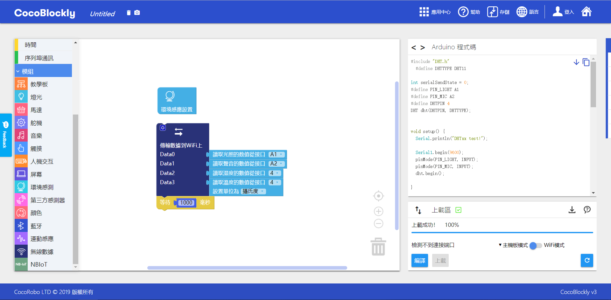
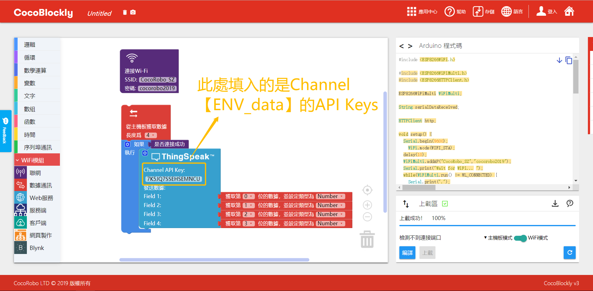

# 使用EasyMode

## 关于EasyMode
EasyMode即简易模式，是针对零基础的学生，CocoRobo公司研发的基础物联网积木，相对原有的WiFi积木，EasyMode更加注重理解的容易度，操作的简易性，以及样式的简洁美观性。

## 积木样式
 简易模式涵盖五个类别物联网积木:

 | 积木名称 | 积木样式         |
| -------- | ------------------ |
| 联网积木    |  |
|  数据通信积木   |   |
| ThingSpeak积木 |  |
|CocoCloud积木  |  |
| IFTTT积木 |  |

## 使用说明
1. 联网积木
  * 填入无线网络的名称和密码即可

 

2. 数据通信积木
  * 发送数据积木: 点击左上方齿轮可弹出编辑框,拖动value选项来增加传输数据个数
  * 接收数据积木：接收数据的长度最大为6，且必须与主控的发送数据个数一致，获取的数据会存到rxData数组中
  * 通信类型目前限定为数字，以数组的方式进行通信，即无法传输字符串类型

  

3. ThingSpeak积木
  *  点击左上方齿轮可弹出编辑框,拖动value选项来增加传输数据个数
  *  Channel API Key :填写数据传输到ThingSpeak的CHannel项目的声明

  

4. CocoCloud积木
  * 发送数据积木:
    * 点击左上方齿轮可弹出编辑框,拖动value选项来增加传输数据个数，
    * Cloud Event指CocoCloud事件的API-Key，用于指定事件对象
    * 对应每个数据需要给定好属性名（数据名）
  * 接收数据积木：
    * Cloud Event指CocoCloud事件的API-Key，用于指定事件对象
    * 通过属性名获得Cloud取回来对应的数据，并且存储到自定义变量中

 

5. IFTTT积木
  * IFTTT Key: 用户的IFTTT账户对应的Key
  * IFTTT Event Name: 项目名称，用于将数据传输到对应项目中

 

##案例一

 项目：从主控获取环境传感板资料,传送到WiFi上去,通过CocoCloud积木发送到Coco cloud上。

 #### 创建Cloud云端项目

 进入CocoCloud网站，选择创建新的Event
  

 #### cloud云端项目示意图

  

 #### 主控模块积木拼接
 主控程序下载: <a href="../xml/Cococloud_ENV_main.xml" download>Cococloud_ENV_main.xml</a>
 **注意：** 请单独给主机模块上传程序
  

 ####  WiFi通信模块积木拼接

 WiFi通信程序下载: <a href="../xml/Cococloud_ENV_wifi.xml" download>Cococloud_ENV_wifi.xml</a>
 **注意：** 请单独给WiFi通信模块上传程序

  

 ####  更换API-KEY

 获取对应Cloud Event的API-Key替换积木对应Cloud Event位置

  

#### 效果示意图

 当主控模块和WiFi通信模块单独上传程序后，将模块都拼合在一起，通电后一段时间，会发现环境传感模块的声音、光照、适度和温度的数值分别传到了CocoCloud上，数值会实时变化，如下图所示：

  

## 案例二

项目: 获取环境开发板的数据，向ThingSpeak发送并进行监测。ThingSpeak的配置方法，请查阅： [使用ThingSpeak](/thingspeak.md)

#### 主控模式:

 主控程序下载: <a href="../xml/Thingspeak_ENV_main.xml" download>ThingSpeak_ENV_main.xml</a>
 **注意：** 请单独给主机模块上传程序

#### WiFi通信模式:
 WiFi通信程序下载: <a href="../xml/Thingspeak_ENV_wifi.xml" download>ThingSpeak_ENV_wifi.xml</a>
 **注意：** 请单独给WiFi通信模块上传程序

#### ThingSpeak数据收集结果 :

当主控模块和WiFi通信模块单独上传程序后，将模块都拼合在一起，通电后一段时间，会发现环境传感模块的声音、光照、适度和温度的数值分别传到了ThingSpeak上，数值会实时变化，如下图所示：

---
更新时间：2019年8月
