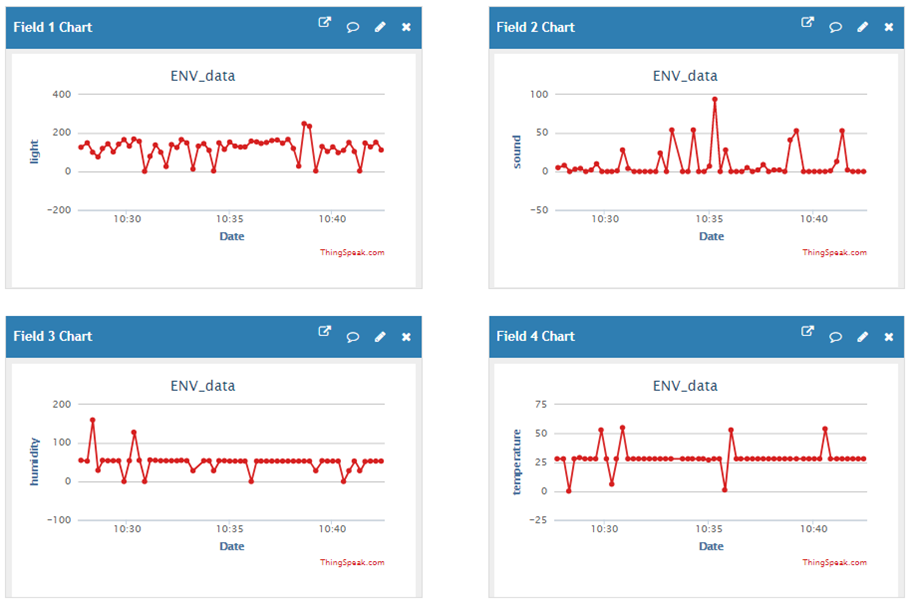

# 使用EasyMode

## 關於EasyMode
EasyMode即簡易模式，是針對零基礎的學生，CocoRobo公司研發的基礎物聯網積木，相對原有的WiFi積木，EasyMode更加注重理解的容易度，操作的簡易性，以及樣式的簡潔美觀性。

## 積木樣式
 簡易模式涵蓋五個類別物聯網積木:

 | 積木名稱 | 積木樣式         |
| -------- | ------------------ |
| 聯網積木    |  |
|  數據通訊積木   |   |
| ThingSpeak積木 |  |
|CocoCloud積木  |  |
| IFTTT積木 |  |

## 使用説明
1. 聯網積木
  * 填入無綫網絡的名稱和密碼即可

 

  

2. 數據通訊積木
  * 發送數據積木: 點擊左上方齒輪可彈出編輯框,拖動value選項來增加傳輸數據個數
  * 接收數據積木：接收數據的長度最大為6，且必須與主控的發送數據個數一致，獲取的數據會存到rxData數組中
  * 通訊類型目前限定為數字，以數組的方式進行通訊，即無法傳輸字符串類型

  

3. ThingSpeak積木
  *  點擊左上方齒輪可彈出編輯框,拖動value選項來增加傳輸數據個數
  *  Channel API Key :填寫數據傳輸到ThingSpeak的CHannel項目的聲明

  

4. CocoCloud積木
  * 發送數據積木: 
    * 點擊左上方齒輪可彈出編輯框,拖動value選項來增加傳輸數據個數，
    * Cloud Event指CocoCloud事件的API-Key，用于指定事件对象
    * 對應每個數據需要給定好屬性名（數據名）
  * 接收數據積木：
    * Cloud Event指CocoCloud事件的API-Key，用于指定事件对象
    * 通過屬性名獲得Cloud取回來對應的數據，并且存儲到自定義變量中

 

5. IFTTT積木
  * IFTTT Key: 用戶的IFTTT賬戶對應的Key
  * IFTTT Event Name: 項目名稱，用於將數據傳輸到對應項目中

 

##案例一

 項目：從主控獲取環境感應板資料,傳送到WiFi上去,通過CocoCloud積木發送到Coco cloud上。
 
 #### 創建Cloud雲端項目

 進入CocoCloud網站，選擇創建新的Event
  

 #### cloud雲端項目示意圖

  

 #### 主機板模組積木拼接
 主機板程式下載: <a href="../xml/Cococloud_ENV_main.xml" download>Cococloud_ENV_main.xml</a>
 **注意：** 請單獨給主機模組上傳程式
  
 

 ####  WiFi通訊模組積木拼接
 
 WiFi通訊程式下載: <a href="../xml/Cococloud_ENV_wifi.xml" download>Cococloud_ENV_wifi.xml</a>
 **注意：** 請單獨給WiFi通訊模組上傳程式 

  

 ####  更換API-KEY

 獲取對應Cloud Event的API-Key替換積木對應Cloud Event位置

  
 

#### 效果示意圖
 
 當主機板模組和WiFi通訊模組單獨上傳程式后，將模組都拼合在一起，通電後一段時間，會發現環境感測模組的聲音、光照、適度和溫度的數值分別傳到了CocoCloud上，數值會實時變化，如下圖所示：

  

## 案例二

項目: 獲取環境開發板的數據，向ThingSpeak發送並進行監測。ThingSpeak的配置方法，請查閲： [使用ThingSpeak](/thingspeak.md)

#### 主機板模式:

 主機板程式下載: <a href="../xml/Thingspeak_ENV_main.xml" download>ThingSpeak_ENV_main.xml</a>
 **注意：** 請單獨給主機模組上傳程式

#### WiFi通訊模式:
 WiFi通訊程式下載: <a href="../xml/Thingspeak_ENV_wifi.xml" download>ThingSpeak_ENV_wifi.xml</a>
 **注意：** 請單獨給WiFi通訊模組上傳程式

#### ThingSpeak數據收集結果 :

當主機板模組和WiFi通訊模組單獨上傳程式后，將模組都拼合在一起，通電後一段時間，會發現環境感測模組的聲音、光照、適度和溫度的數值分別傳到了ThingSpeak上，數值會實時變化，如下圖所示：
