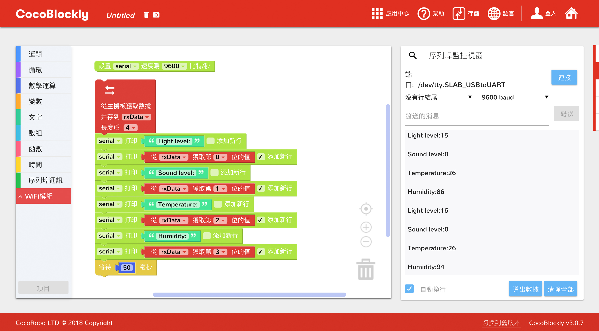

# 使用 WiFi 通訊模組
---

### 模組簡介

Wi-Fi 通訊模組負責進行數據的無線傳輸，支持 HTTP/WebSocket/MQTT 通訊協議，有了它，結合 CocoBlockly 的 WiFi 模式，用戶可以非常直觀地搭建屬於自己的智慧家居小應用。同時，用戶還可以選擇接入 CocoCloud，或者 IFTTT、Thingspeak 這些第三方服務，來實現更廣泛的物聯網項目。

#### WiFi 模式積木示意圖

 |積木類型 | 積木圖示  | 簡介  |
|-  |-  |-  |
|  |   |  a.聯網積木: 設置連接的熱點名字與密碼   b.連接判斷積木: 判斷是否連接成功   c.本地IP積木:獲取連接無線網絡的WIFI的IP地址 |
|  | | a.熱點積木: 設置自身熱點名稱與密碼(密碼不小於八位)  |
| | | a.發送積木: 與主控通訊積木，向主機板發送包含數據的數字數組(注意：單個數據取值範圍為0~255)  |
| |  | a.接收積木:與主控通訊積木，接收主機板傳輸過來的數據，需設置長度   b.取值積木: 與接收積木同用，獲取主機板傳輸過來的單個數據，以0為起始位數 |
| | | a. ThingSpeak積木: 向ThingSpeak項目發送數據，需從ThingSpeak項目獲取API-Key |
| | | a. IFTTT積木: 向IFTTT項目發送數據，需從IFTTT項目獲取API-Key；Webhood類型：選擇獲取數據或者發送數據，發送的數據最多為三個|
| | | a.CocoCloud發送積木:向CocoCloud發送數據，需要設置項目API-key以及發送數據的屬性名 |
| | |a.CocoCloud獲取積木: 從CocoCloud獲取項目數據   b.按屬性名獲取數據合集中的數據 |
|| | a.服務器初始化積木: 設置服務器 |
|| | a.設置主頁積木: 設置主頁積木，主頁進入網址"http://192.168.4.1" (注意:需要連接服務器所在WiFi板設置的熱點,才能進入主頁) |
||  | a. 服務器路由設置積木:設置不同路徑與對應響應事件 |
|| |a.服務器發送積木: 向請求服務器設定路徑的客戶端發送對應指定數據 |
|| | a.服務器接收積木: 接收客戶端向指定路徑發送的數據   b.數據獲取積木: 從接收到的數據合集中獲取指定下標的數據|
||| a.客戶端初始化積木： 初始化客戶端|
|||a. 客戶端GET請求積木: 設置路徑，向服務端發起對應HTTP請求，并獲得數據(注意: 路徑與服務端路由路徑格式一致)   b.數據獲取積木: 從接收到的數據合集中獲取指定下標的數據|
|||a.客戶端POST請求積木: 設置路徑，向服務端發起對應HTTP請求，并發送數據(注意: 路徑與服務端路由路徑格式一致) |
 || | a. 網頁構建Label積木：可構建一個網頁，顯示對應Label與設定數據，網頁網址為"http://192.168.4.1"|
  || |a.網頁構建Button積木：可構建一個網頁，顯示對應命名的按鈕，點擊按鈕觸發HTTP請求事件，向設定的服務器路徑發送按鈕命名。網頁網址為"http://192.168.4.1" |

 ---

## 模組主要部件

<table style="margin-top:20px;">
	<tr>
		<td width="6%" style="font-weight: bold;">No.</td>
		<td width="20%" style="font-weight: bold;">部件名稱</td>
		<td style="font-weight: bold;">部件描述</td>
	</tr>
	<tr>
		<td>1.</td>
		<td>USB 接口</td>
		<td>用於WiFi程式上傳/供電</td>
	</tr>
	<tr>
		<td>2.</td>
		<td>ESP8266</td>
		<td><a href='https://www.kloppenborg.net/images/blog/esp8266/esp8266-esp12e-specs.pdf' target='_blank'>ESP-12E</a></td>
	</tr>
	<tr>
		<td>3.</td>
		<td>重置按鍵</td>
		<td>點擊重置按鍵後將會讓 WiFi 模組重啓</td>
	</tr>
	<tr>
		<td>4.</td>
		<td>Flash 按鍵</td>
		<td>/</td>
	</tr>
</table>

#### 模組接口示意

| 接口位置 | 接口描述           |
| -------- | ------------------ |
| (數位訊號) D0: 主機板 Rx    | Tx: WiFi模組端 (UART 通訊)       |
| (數位訊號) D1: 主機板 Tx   | Rx: WiFi模組端 (UART 通訊) |

> 爲了避免不同類型的電子模組在使用時有接口（Pin out）的衝突，請注意前往[此頁面](/cocomod/pinout-map)查看接口示意圖

---

## 模組使用說明

給 WiFi 通訊模組進行編程時，我們需要在 CocoBlockly 的界面右下角「程式上傳區」中，點擊紅色框中的切換按鈕，切換爲 Wi-Fi 模式。

當我們製作一個與外接通訊的 IoT 項目時，需要給項目中的主機板模組和 WiFi 模組都上傳程式。下圖示範了製作一個 IoT 項目所需要的程式開發流程。

**注**：
1. 切換模式時，因爲兩個模式工作空間的積木都會同時保存，所以當用戶再切換回去時，之前的編寫的積木程式不會丟失；
2. 切勿使用超過 5V/2A 的供電方式給模組供電；
3. 當 ESP8266模組上的 LED 燈持續閃爍時，意味著模組正處於重置狀態，該狀態會持續到上傳結束；

---

<h2 style="background-color:#2653d4;padding:15px 20px;color:#fff;border-radius:4px;border-top:5px solid #1f48ba;">主機板與 WiFi 模組間數據通訊</h2>

目的：主機板模組將環境收據收集，並發送至 WiFi 模組，此部分是將來完成完整的 IoT 項目所必備的步驟之一。

#### 模組組裝

#### 主機板發給 WiFi 與 WiFi 接收主機板

##### 積木編程

##### 最終效果

--- 

<h4 style="background-color:#f7591a;padding:12px 16px;color:#fff;border-radius:4px;">未完待續，以下教程將會持續更新：</h4>

1. 主機板模組傳輸環境數據，並更新至 Coco Cloud 的雲端事件中；
2. 從 Coco Cloud 獲取雲端事件最新數據，並讓主機板模組的 LED 燈模組顯示出對應的圖案；