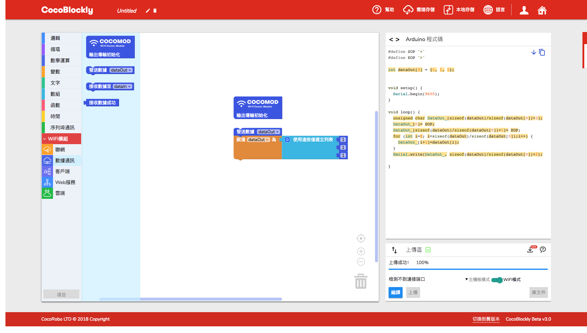
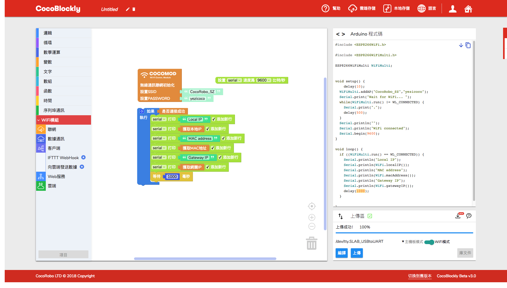

# 使用 WiFi 通訊模組
---

## 模組簡介

Wi-Fi 通訊模組負責進行數據的無線傳輸，支持 HTTP/WebSocket/MQTT 通訊協議，有了它，結合 CocoBlockly 的 WiFi 模式，用戶可以非常直觀地搭建屬於自己的智慧家居小應用。

## 模組主要部件

|編號 |部件名稱 | 部件描述  |
|-  |-  |-  |
|1. |USB 接口  |5V 2A 供電 |
|2. |ESP8266  | <a href='https://www.kloppenborg.net/images/blog/esp8266/esp8266-esp12e-specs.pdf' target='_blank'>ESP-12E</a>|
|3. |Reset 按鍵  |S2  |
|4. |Flash 按鍵  |S1  |

> 為了避免不同類型的電子模組在使用時有接口（Pin out）的衝突，請注意前往[此頁面](/cocomod/pinout-map)查看接口示意圖

## 模組使用說明

1. 切勿使用超過 5V/2A 的電源供電
2. 當 ESP8266模組上的 LED 燈持續閃爍時，意味著模組正處於重置狀態，該狀態會持續到上傳結束；

---

## 主機板模組基礎使用

### 主控數據通信

#### 模組組裝

---

## 主機板模式與 WiFi 模式
### 什麼是 WiFi 模組

### 什麼是 WiFi 模式
給 WiFi 通訊模組進行編程時，我們需要在 CocoBlockly 的界面右下角「程式上傳區」中，點擊紅色框中的切換按鈕，切換為 Wi-Fi 模式。

當我們製作一個與外接通訊的 IoT 項目時，需要給項目中的主機板模組和 WiFi 模組都上傳程式。下圖示範了製作一個 IoT 項目所需要的程式開發流程。

**註**：切換模式時，因為兩個模式工作空間的積木都會同時保存，所以當用戶再切換回去時，之前的編寫的積木程式不會丟失。
目前的 CocoBlockly Wi-Fi 模式支持以下兩種傳送模式：
1. 將數據傳送至遠端；
2. 從遠端獲取數據；
<!-- pagebreak -->
同時，用戶還可以選擇接入 CocoCloud，或者 IFTTT、Thingspeak 這些第三方服務，來完成左邊兩種操作模式。

---
#### 主控發給 WiFi 与 WiFi 接收主控
##### 積木編程

##### 最終效果

---

#### WiFi 發給主控 与 主控接收 WiFi
##### 積木編程

##### 最終效果

---

### WiFi 連接網絡並獲取基本信息
##### 積木編程

##### 最終效果

---

### WiFi 發送基本請求
##### 積木編程

##### 最終效果

