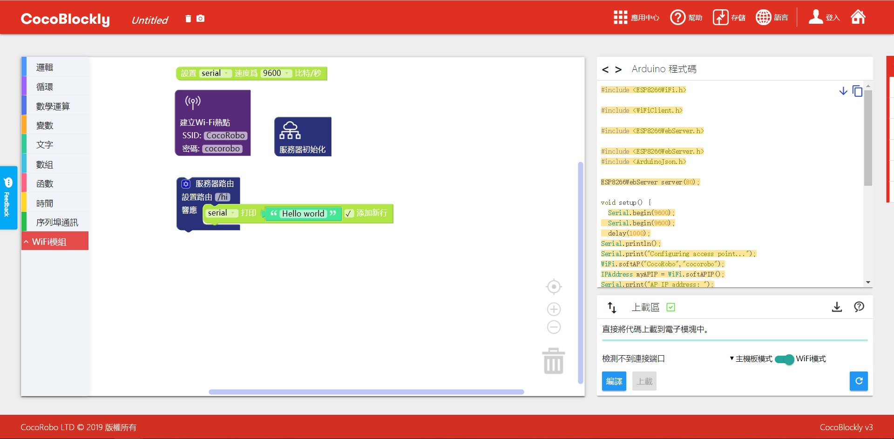
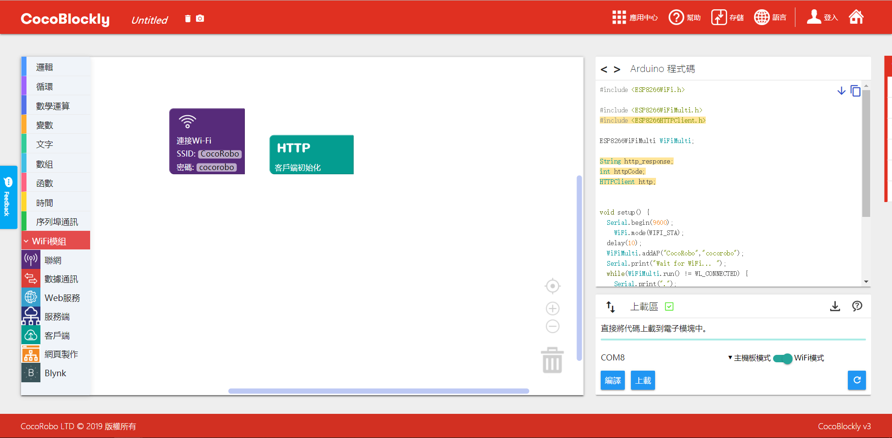
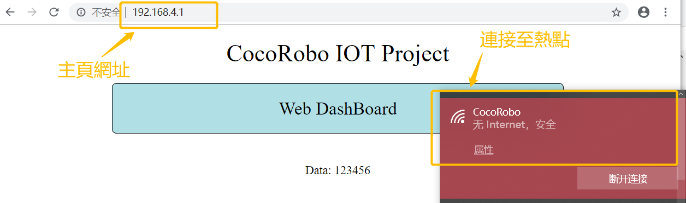
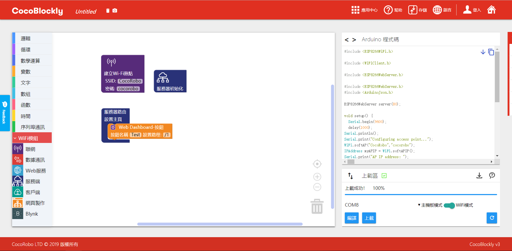
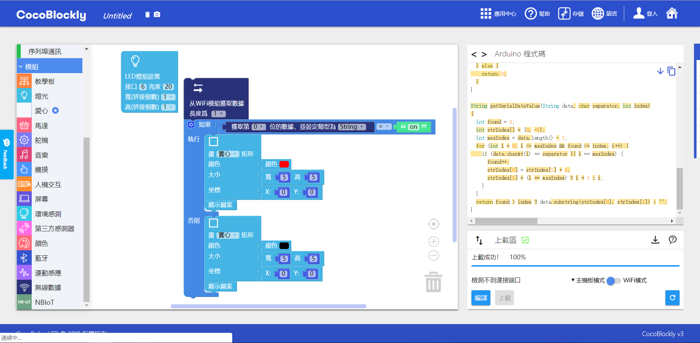

# 使用 WiFi 通信模块
---

## 模块简介

Wi-Fi 通信模块负责进行数据的无线传输，支持 HTTP/WebSocket/MQTT 通信协议，有了它，结合 CocoBlockly 的 WiFi 模式，用户可以非常直观地搭建属于自己的智能家居小应用。

## 模块主要部件

<table style="margin-top:20px;">
	<tr>
		<td width="6%" style="font-weight: bold;">No.</td>
		<td width="20%" style="font-weight: bold;">部件名称</td>
		<td style="font-weight: bold;">部件描述</td>
	</tr>
	<tr>
		<td>1.</td>
		<td>USB 接口</td>
		<td>用于WiFi程序上传/供电</td>
	</tr>
	<tr>
		<td>2.</td>
		<td>ESP8266</td>
		<td>一款集成WIFI功能（2.4GHz）的控制器</td>
	</tr>
	<tr>
		<td>3.</td>
		<td>重置按键</td>
		<td>点击重置按键后将会让 WiFi 通信模块重启</td>
	</tr>
	<tr>
		<td>4.</td>
		<td>Flash 按键</td>
		<td>/</td>
	</tr>
</table>

#### 模块接口示意

| 接口位置 | 接口描述           |
| -------- | ------------------ |
| (数字信号) D0: 主控 Rx    | Tx:  WiFi 通信模块端 (UART 通信)       |
| (数字信号) D1: 主控 Tx   | Rx:  WiFi 通信模块端 (UART 通信) |

> 为了避免不同类型的电子模块在使用时有接口（Pin out）的冲突，请注意前往[此页面](/cocomod/pinout-map)查看接口示意图

---

## 模块使用说明

1. 切勿使用超过 5V/2A 的电源供电
2. 当 ESP8266模块上的 LED 灯持续闪烁时，意味著模块正处于重置状态，该状态会持续到上传结束；

---

## WiFi 通信模块基础使用

### 与主控模块进行数据通信

#### 模块组装

将 WiFi 通信模块和主控模块拼接在一起

---

## 主控模式与 WiFi 模式

### 什么是 WiFi 通信模块

### 什么是 WiFi 模式

给 WiFi 通信模块进行编程时，我们需要在 CocoBlockly 的界面右下角「程序上传区」中，点击红色框中的切换按钮，切换为 WiFi 模式。

**当我们制作一个与外接通信的 IoT （物联网） 项目时，需要给项目中的主控模块和 WiFi 通信模块分别上传对应模式下所编写的程序，上传程序成功后再将主控模块与 WiFi 通信模块拼接在一起。**下图示范了制作一个 IoT 项目所需要的程序开发流程。

**注**：切换模式时，因为两个模式工作空间的积木都会同时保存，所以当用户再切换回去时，之前的编写的积木程序不会丢失。

目前的 CocoBlockly Wi-Fi 模式支持以下两种传送模式：

1. 将数据传送至远端；
2. 从远端获取数据；

<!-- pagebreak -->

同时，用户还可以选择接入 CocoCloud，或者 IFTTT、Thingspeak 这些第三方服务，来完成左边两种操作模式。

---

### WiFi积木示意图

<table width="800">
  <tr>
    <th>积木图示</th>
    <th>简介</th>
  </tr>
  <tr  >
    <td>  </td>
    <td> a.联网积木: 设置连接的热点名称与密码   b.连接判断积木: 判断是否连接成功   c.本地IP积木:获取连接无线网络的WIFI的IP地址</td>
  </tr>
  <tr>
    <td>  </td>
    <td> a.热点积木: 设置自身热点名称与密码(密码不小于八位) </td>
  </tr>
  <tr>
    <td>  </td>
    <td> a.发送积木: 与主控通信积木，向主控发送包含数据的数字数组(注意：单个数据取值范围为0~255) </td>
  </tr>
    <tr>
    <td>  </td>
    <td> a.接收积木:与主控通信积木，接收主控传输过来的数据，需设置长度   b.取值积木: 与接收积木同用，获取主控传输过来的单个数据，以0为起始位数   c. 可设定接受到的字符串类型：字符串（String）、整数数值（Number）、带小数点的数值（Float）</td>
  </tr>
  <tr>
    <td>  </td>
    <td> a. ThingSpeak积木: 向ThingSpeak项目发送数据，需从ThingSpeak项目获取API-Key </td>
  </tr>
  <tr>
    <td>  </td>
    <td> a. IFTTT积木: 向IFTTT项目发送数据，需从IFTTT项目获取API-Key；Webhood类型：选择获取数据或者发送数据，发送的数据最多为三个</td>
  </tr>
  <tr>
    <td>  </td>
    <td> a.CocoCloud发送积木:向CocoCloud发送数据，需要设置项目API-key以及发送数据的属性名</td>
  </tr>
  <tr>
    <td>  </td>
    <td> a.CocoCloud获取积木: 从CocoCloud获取项目数据   b.按属性名获取数据合集中的数据</td>
  </tr>
  <tr>
    <td>  </td>
    <td> a.服务器初始化积木: 设置服务器</td>
  </tr>
  <tr>
    <td>  </td>
    <td> a.设置主页积木: 设置主页积木，主页进入网址"http://192.168.4.1" (注意:需要连接服务器所在WiFi板设置的热点,才能进入主页)</td>
  </tr>
  <tr>
    <td>  </td>
    <td> a. 服务器路由设置积木:设置不同路径与对应响应事件</td>
  </tr>
  <tr>
    <td>  </td>
    <td> a.服务器发送积木: 向请求服务器设定路径的客户端发送对应指定数据</td>
  </tr>
  <tr>
    <td>  </td>
    <td> a.服务器接收积木: 接收客户端向指定路径发送的数据   b.数据获取积木: 从接收到的数据合集中获取指定下标的数据</td>
  </tr>
  <tr>
    <td>  </td>
    <td> a.客户端初始化积木： 初始化客户端</td>
  </tr>
  <tr>
    <td>  </td>
    <td> a. 客户端GET请求积木: 设置路径，向服务端发起对应HTTP请求，并获得数据(注意: 路径与服务端路由路径格式一致)   b.数据获取积木: 从接收到的数据合集中获取指定下标的数据</td>
  </tr>
  <tr>
    <td>  </td>
    <td> a.客户端POST请求积木: 设置路径，向服务端发起对应HTTP请求，并发送数据(注意: 路径与服务端路由路径格式一致)</td>
  </tr>
  <tr>
    <td>  </td>
    <td> a. 网页构建Label积木：可构建一个网页，显示对应Label与设定数据，网页网址为"http://192.168.4.1"</td>
  </tr>
  <tr>
    <td>  </td>
    <td> a.网页构建Button积木：可构建一个网页，显示对应命名的按钮，点击按钮触发HTTP请求事件，向设定的服务器路径发送按钮命名。网页网址为"http://192.168.4.1"</td>
  </tr>
</table>

***

### WiFi积木介绍

#### 联网积木单元

##### 单元简介

 WiFi 通信模块可以通过这类积木接入现有网络，或者建立本地网络(AP模式)。

##### 积木简介

1. 连网积木 : 设置连接的网络名称与密码

* 连接网络 : 网络连接成功，串口会在第一时间打印“WiFi connected”, 但如果未能观察到该提示也属正常情况，具体看打开串口通信的时间是否及时。

* 连接网络失败 : 串口会持续打印 “ . ”, 表示在尝试网络连接

2. 热点积木 : 设置热点网络名称和密码，并建立本地网络

* 建立热点

* 密码设置应大于8位, 否则无法建立热点

3. 连接判断积木 : 判断网络是否连接

4. 获取IP积木 : 连接网络成功后, 可获取 WiFi 通信模块在该网络中的IP地址

* 连接网络，打印IP地址

---

#### 通信积木单元

##### 单元简介

 WiFi 通信模块与主控模块进行数据通信使用,即是可以向主控模块发送数据或者从主控模块接收数据

##### 积木简介

1. 发送积木 : 与主控通信积木，向主控发送包含数据的数字数组(*注意：单个数据取值范围为0~255*)
* 提示：为发送积木的数组增加长度的方式参见下图：

*  发送数据数组[1,"cocorobo"]至主控模块

上传程序成功后，用 USB 线连接好主控模块至电脑，然后打开串口监控视窗点击「连接」

*注意：*
* 使用 WiFi 通信模块时需要先分别给项目中的主控模块和 WiFi 通信模块上传对应模式下所编写的程序，上传程序成功后再将主控模块与 WiFi 通信模块拼接在一起；
* 数据除了可以使用基础类型的数字积木来直接赋值，也可以使用变量积木来间接赋值（变量是计算机语言中能储存计算结果或能表示值的抽象概念）。

2. 接收积木 : 与主控模块进行通信的积木，接收主控传输过来的数据，需要设置接收数据的数组长度

* 传输失败 : 接收主控模块传输的数据出错。通常是 WiFi 通信模块未与主控模块拼接在一起时出现

3. 取值积木 : 与接收积木一起使用，获取主控传输过来的单个数据，以0为所获取数组的起始位

* 提示：为传输数据积木的数组增加长度的方式参见下图：

*  WiFi 通信模块接收主控模块传输的数组数据[100,"cocorobo"]，并且打印到串口

---

#### WEB服务积木单元

##### 单元简介

WEB服务包含IFTTT，Thingspeak，CocoCloud相关积木，允许模块与这三类网络服务交互，该单元积木的使用需要配合「连接网络积木」才能成功连接到网络服务。

##### 积木简介

1. Thingspeak积木 : ThingSpeak是一个数据可视化网站，能将模块收集的数据传输到该网站以图表的方式显示规范时间内数据变化情况。详情可见 [Thingspeak使用介绍](/cocomod/thingspeak)

* 积木显示

2. IFTTT积木 : IFTTT是一个多功能网络服务平台，可通过收集的模块信息设置特定的其他网络服务反馈，如发送Email。详情可见 [IFTTT使用介绍](/cocomod/ifttt)

* 积木显示 : 获取数据选项,向IFTTT特定项目获取信息

* 积木显示 : 发送数据选项，向IFTTT特定项目发送数据，可发送的数据个数为三个

3. CocoCloud发送积木 : Cococloud是cocorobo自主研发的云端平台，可用于存储模块收集的信息与可视化。详情可见 [CocoCloud使用介绍](/cocomod/coco-cloud)

* 发送数据设置:向特定云端项目发送数据{属性名为“EM_data0”，值为 0}

4. CocoCloud获取积木 :

* 获取云端数据设置:从特定云端项目获取数据，并存到rxCloud中

5. CocoCloud取值积木 :

* 根据属性取值:从rxCloud中获取属性名为“EM_data0”,并且类型为Text的数据

---

#### 服务端积木单元

##### 单元简介

服务端积木用于 WiFi 通信模块建立本地服务器。通过设置服务器的指定路径，以及指定行为方式来搭建一个能够响应的简易的本地服务器。通常是需要与「建立热点积木」一起使用

##### 积木简介

1. 服务器初始化积木 :

* 积木显示

1. 设置主页积木 :

* 设置一个简单的网站 :使用电脑连接至服务器对应热点，在浏览器输入主页网址：“192.168.4.1”即可进去主页。

> 关于网页制作的积木介绍请参见 [网页制作积木单元](#网页制作积木单元)

3.设置路径积木 :

* 设置简单的路径: 设置路径“/hi”, 当客户端在浏览器访问该路径（192.168.4.1/hi）时，该服务端 WiFi 通信模块在串口打印 “Hello world”。 *注意电脑要先连接热点"CocoRobo"*

最终结果：

4.服务器发送数据积木 :

* 服务器响应发送数据 “1”: 设置路径“/hi”, 当客户端访问该路径（192.168.4.1/hi）时，该服务端 WiFi 通信模块服务器向客户端发送数据 “1”

最终结果：

5.服务器接收数据积木 :

* 服务器响应接收数据:设置路径“/hi”, 当客户端通过该路径（192.168.4.1/hi）向该 WiFi 通信模块服务器发送数据的时候，服务器端接收数据，并存到命名为Data_receive的数组中

6.服务器接收数据的取值积木 :

* 从服务器接收的数据中取值积木：从数组Data_receive中获取第一位类型为数字的值。与「服务器接收数据积木」一起使用

---

#### 客户端积木单元

##### 单元简介

客户端积木用于 WiFi 通信模块与已经建立起的本地服务器进行通信的积木。向对应本地服务器发起请求，完成发送数据或者接收数据的操作。通常是需要与「连接网络积木」一起使用，并且需要连接至本地服务器对应热点网络中。

##### 积木简介

1. 客户端初始化积木 :

* 积木显示

2. 客户端接收数据积木 : GET请求积木

* 向服务器请求获取数据: 向服务器路径为“/hi”的地址（即192.168.4.1/hi）请求数据，并存到客户端 WiFi 通信模块的Data_receive数组中

* 从获取的数据中取第一位类型为数字的值：从数组Data_receive中获取第一位类型为数字的值

3. 客户端发送数据积木  : POST请求积木

* 向服务器发送数据： 向服务器路径为“/hi”的地址（即192.168.4.1/hi）发送数据[12]

---

#### 网页制作积木单元

##### 单元简介

网页制作积木，用于构建简单的网页显示，通常是与「服务器设置主页积木」一起使用

##### 积木简介  

1. 设置网址-LABEL显示积木 :可以设置网页上显示的内容标签名称和对应的数据（字符串）

* 设置一个网站，内容标签为“Data”，对应数据为“123456”的字符串 :

* 提示：为「设置网址-LABEL显示积木」增加 LABEL 的方法如下图：

**注意：「设置网址-LABEL显示积木」只允许使用一次，不可以将多个此类积木拼接在一起，想要添加多个 LABEL 可参见上图；此外，也不可以与「设置网址-Button设置积木」拼接在一起**

2. 设置网址-Button设置积木 : 每一个按钮有对应一个名称设置，和一个路径设置。路径设置的是反馈路径。指当点击网址中显示的该按钮时候，触发一个HTTP请求发送，请求对应路径为设置的反馈路径。发送的数据内容为当前按钮名称的字符串。

* 设置按钮名称为 “Test”，路径为 “/1” :应当配合使用「服务器设置主页积木」，并且设置「Wed Dashboard-按钮积木」的路径为 “/1”,作为响应处理

* 提示：为「设置网址-Button设置积木」增加 Button 的方法如下图：

**注意：「设置网址-Button设置积木」只允许使用一次，不可以将多个此类积木拼接在一起，想要添加多个 Button 可参见上图；此外，也不可以与「设置网址-LABEL显示积木」拼接在一起**

***

### 项目目录

| 项目类型 | 项目内容 | 备注 |
| :------ | :------ | :------: |
| (本地)AP模式 | 教学模块控制 LED 灯屏模块 | [查看此处](#项目一) |
| (本地)AP模式 | 网页呈现环境模块数据 | [查看此处](#项目二) |
| (本地)AP模式 | 网页控制LED开关 | [查看此处](#项目三)  |
|(联网) CocoCloud | 云端呈现环境模块数据 | [查看此处](/cocomod/coco-cloud?id=项目一)  |
|(联网) Thingspeak | 环境模块数据上传与可视化 | [查看此处](/cocomod/thingspeak?id=案例)  |
|(联网) IFTTT| 电位器触发email提醒 | [查看此处](/cocomod/ifttt?id=案例)  |

<!--|(联网) CocoCloud | 云端控制LED亮暗 | [查看此处](/cocomod/coco-cloud?id=项目二)  |
|(联网) IFTTT| 环境数据触发google助手 | 查看此处  |-->

***

### 项目

#### 项目一

#####  项目简介 : 教学模块控制 LED 灯屏模块（ WiFi 对 WiFi ）

教学模块控制 LED 灯屏模块：使用的是AP模式,即是通过两个 WiFi 通信模块进行数据传输，达到远程控制的效果。两个 WiFi 通信模块，其中一个作为服务端，另一个作为客户端。
此项目以与教学模块拼接的 WiFi 通信模块为服务端，与 LED 灯屏模块拼接的 WiFi 通信模块为客户端。此项目选用教学模块上的 pin 12 开关，通过拨动教学模块上 pin 12 的开关，来远程决定 LED 灯的闭合。

| 服务端 | 客户端 |
| :------ | :------ |
| 教学模块 |  LED 灯屏模块 |
| 主控模块 | 主控模块 |
|  WiFi 通信模块 |  WiFi 通信模块 |

##### 服务端程序预览

* 主控模式 - 传输教学模块 pin 12 开关的数据至 WiFi 通信模块
  程序下载： <a href="../xml/project1/BASIC_main.xml" download >BASIC_main.xml</a>

* WiFi模式 - 设置热点，设置本地服务器，接收主控传输过来的数据，设置响应路径
  程序下载： <a href="../xml/project1/BASIC_wifi.xml" download >BASIC_wifi.xml</a>

##### 客户端程序预览

* 主控模式 - 接收在此客户端上的 WiFi 通信模块传输过来的数据，根据数据对应内容设置 LED 灯
  程序下载： <a href="../xml/project1/LED_main.xml" download >LED_main.xml</a>

* WiFi模式 - 设置连网，设置客户端发起请求，请求从服务端获取数据，并把发送请求到的数据再传输到主控
  程序下载： <a href="../xml/project1/LED_wifi.xml" download >LED_wifi.xml</a>

> 注意：此处获取服务器端传过来的数值需要先赋值给变量才可以正常使用

##### 最终结果

拨动教学模块上 pin 12 的开关，可以远程决定 LED 灯的闭合

***

#### 项目二

#####  项目简介 : 网页呈现环境模块数据

网页呈现环境模块数据：使用的是AP模式,即是通过 WiFi 通信模块设置服务器，设置主页，在网页上显示环境数据。

| 服务端 | 客户端 |
| :------ | :------ |
| 环境模块 | 浏览器 |
| 主控模块 |  |
|  WiFi 通信模块 | |

##### 服务端程序预览

* 主控模式 - 传输环境模块读取的数据至 WiFi 通信模块
  程序下载： <a href="../xml/project2/ENV_dashboard_main.xml" download >Env_dashboard_main.xml</a>

* WiFi模式 - 设置热点，设置本地服务器，接收主控传输的数据，设置主页
  程序下载： <a href="../xml/project2/ENV_dashboard_wifi.xml" download >Env_dashboard_wifi.xml</a>

##### 效果展示（客户端）

电脑先连接至服务端建立的热点，然后在浏览器地址栏输入 192.168.4.1 即可看到读取的四个环境参数

***

#### 项目三

#####  项目简介 : 网页控制LED开关

网页呈现环境模块数据：使用的是AP模式，即是通过WiFi设置主页，通过主页上面按钮点击效果，达到远程控制与 WiFi 通信模块连接的 LED 灯的亮暗。

| 服务端 | 客户端 |
| :------ |:------ |
|  LED 灯屏模块 | 浏览器 |
| 主控模块 |  |
|  WiFi 通信模块 |  |

##### 服务端程序预览

* 主控模式 - 接收从 WiFi 通信模块传输过来的数据，设置 LED 灯
  程序下载： <a href="../xml/project3/LIGHT_dashboard_main.xml" download >LIGHT_dashboard_main.xml</a>

* WiFi模式 - 设置热点，设置本地服务器，设置主页，设置响应路径，传输数据至主控模块
  程序下载： <a href="../xml/project1/LIGHT_dashboard_wifi.xml" download >LIGHT_dashboard_wifi.xml</a>

> 注意：此处获取服务器端传过来的数值需要先赋值给变量才可以正常使用

##### 效果展示（客户端）

***

更新时间：2019年8月
