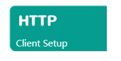
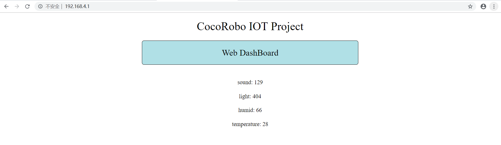

# Apply WiFi Communication Module
---

## Introduction

WiFi communication module is used for transmitting data wirelessly. It supports HTTP/WebSocket/MQTT communication protocol. You can build your own smart home Apps easily with this module and the WiFi mode of the the CocoBlockly.

## Main Components

<table style="margin-top:20px;">
	<tr>
		<td width="6%" style="font-weight: bold;">No.</td>
		<td width="20%" style="font-weight: bold;">Name</td>
		<td style="font-weight: bold;">Description</td>
	</tr>
	<tr>
		<td>1.</td>
		<td>USB interface</td>
		<td>Used for uploading WiFi programs and supplying power</td>
	</tr>
	<tr>
		<td>2.</td>
		<td>ESP8266</td>
		<td><a href='https://www.kloppenborg.net/images/blog/esp8266/esp8266-esp12e-specs.pdf' target='_blank'>ESP-12E</a></td>
	</tr>
	<tr>
		<td>3.</td>
		<td>Resetting button</td>
		<td>The module can be restarted by pressing this button</td>
	</tr>
	<tr>
		<td>4.</td>
		<td>Flash button</td>
		<td>/</td>
	</tr>
</table>

#### Pinout

| Pinout Position | Pinout Description           |
| -------- | ------------------ |
| (digital signal) D0: main controller Rx    | Tx:  WiFi communication module terminal (UART communication)       |
| (digital signal) D1: main controller Tx   | Rx:  WiFi communication module terminal (UART communication) |

> To avoid pinout clashes between different kinds of modules, please refer to [cocorobo-modules-pinout-map](/cocomod/pinout-map).

---

## Instructions

1. Do not use any power supply greater than 5V/2A.
2. If the LED light on the ESP8266 module keeps blinking, the module is in the state of being reset. And the state will last until the program is uploaded completely.

---

## Basic Application of Main Controller

### Data Communication

#### Assemble Modules

Put the WiFi communication module and the main controller together.

---

## Main Controller Mode and WiFi Mode

### What is WiFi communication module?

### What is WiFi mode?

When uploading programs for WiFi communication module, we need to click the button in the red box of the "Upload Area" of the CocoBlockly (at right lower corner) to switch to WiFi mode.

**When making an IoT (Internet of Things) project that communicates externally, you need to upload programs (written in corresponding modes) for the WiFi communication module and the main controller respectively. Put the WiFi communication module and the main controller together after successful uploading.** The picture below demonstrates the development process of making an IoT project.

**Note**：In the process of switching mode, the blocks of the two modes will be saved alike. Therefore, when you switch back, the previous programs will not be lost.

At present, two kinds of transmissions are supported in the CocoBlockly Wi-Fi mode:

1. Transmit data to far end.
2. Receive data from far end.

<!-- pagebreak -->

Meanwhile, you can also choose to connect to CocoCloud or third-party services such as IFTTT and Thingspeak to complete the above two transmissions.

---

### WiFi Blocks

<table width="800">
  <tr>
    <th>Blocks</th>
    <th>Description</th>
  </tr>
  <tr  >
    <td>  </td>
    <td> a. Network block: set name and password for the hotspot connected.   b. Confirmation block: see if the wifi communication module is successfully connected to the network.   c. Local IP block: get the WiFi IP address.</td>
  </tr>
  <tr>
    <td>  </td>
    <td> a. Hotspot block: set name and password (at least 8 characters) for itself. </td>
  </tr>
  <tr>
    <td>  </td>
    <td> a. Sending block: work with the main communication block to send data (single number ranges from 0 to 255) to the main controller. </td>
  </tr>
    <tr>
    <td>  </td>
    <td> a. Receiving block: work with the main communication block to receive data (length needs to be set) from the main controller.   b. Value block: work with the receiving block to get from the main controller single data with an initial digit of "0".   c. Set the type of the receivable string: String, Number and Float. </td>
  </tr>
  <tr>
    <td>  </td>
    <td> a. ThingSpeak block: to send data to ThingSpeak project; API-Key needs to be obtained from ThingSpeak project. </td>
  </tr>
  <tr>
    <td>  </td>
    <td> a. IFTTT block: to send data to IFTTT project; API-Key needs to be obtained from IFTTT project; Webhood type: choose to receive or send data (a maximum of 3 data can be sent).</td>
  </tr>
  <tr>
    <td>  </td>
    <td> a. CocoCloud sending block: send data to CocoCloud; the API-key of the project and the property name of the data need to be set.</td>
  </tr>
  <tr>
    <td>  </td>
    <td> a. CocoCloud receiving block: get the data of the project from CocoCloud.   b. Get the data according to the property name.</td>
  </tr>
  <tr>
    <td>  </td>
    <td> a. Server setup block: set up the server.</td>
  </tr>
  <tr>
    <td>  </td>
    <td> a. Homepage setting block: the website of homepage is "http://192.168.4.1" (Note: the hotspot set by the wifi communication module (where the server is located) has to be connected before the homepage is open)</td>
  </tr>
  <tr>
    <td>  </td>
    <td> a. Server router setting block: set different paths and their corresponding events.</td>
  </tr>
  <tr>
    <td>  </td>
    <td> a. Server sending block: send specified data to clients via the path set by the request server.</td>
  </tr>
  <tr>
    <td>  </td>
    <td> a. Server receiving block: receive data from clients via the path set by clients.   b. Data getting block: get the data with subscript from the received data array.</td>
  </tr>
  <tr>
    <td>  </td>
    <td> a. Client setup block: set up the client.</td>
  </tr>
  <tr>
    <td>  </td>
    <td> a. Client GET request block: set up a path and send corresponding HTTP requests to the server and get data (Note: the path must be consistent with the server router path.)   b. Data getting block: get the data with subscript from the received data array.</td>
  </tr>
  <tr>
    <td>  </td>
    <td> a. Client POST request block: set up a path and send corresponding HTTP requests to the server and send the data (Note: the path must be consistent with the server router path.)</td>
  </tr>
  <tr>
    <td>  </td>
    <td> a. Web page creating Label block: a web page can be created showing corresponding Label and setup data. The website is "http://192.168.4.1"</td>
  </tr>
  <tr>
    <td>  </td>
    <td> a. Web page creating Button block: a web page can be created showing corresponding button. Click the button to activate the HTTP request event and send the button name via the path set by the server. The website is "http://192.168.4.1"</td>
  </tr>
</table>

***

### WiFi Blocks

#### Network Block Unit

##### Introduction

 WiFi communication module can connect to the Internet or establish a local network (AP mode) via the blocks in this unit.

##### The Blocks

1. Connection block: set name and password for the Internet.

*
Connect to the Internet: If the Internet is successfully connected, "WiFi connected" will be printed instantly in the serial port. But it is still normal if you do not see this hint. The reason may be that you do not open the serial port in time.

* If the Internet is not successfully connected, " . " will be printed repeatedly, indicating that it is trying to connect to the Internet.

2. Hotspot block: set name and password for the hotspot and establish a local network.

* Establish hotspot

* Password must be at least 8 characters or the hotspot cannot be connected.

3. Connection confirmation block: see if the Internet is successfully connected.

4. Get IP block: After the Internet is successfully connected, the IP address of the WiFi module can be obtained.

* Connect to the Internet and print IP address.

---

#### Data Transfer Block Unit

##### Introduction

 The unit is used for transferring data between the main controller and the WiFi communication module, namely send data to the main controller or receive data from the main controller.

##### The Blocks

1. Sending block: work with main communication block to send data (single number ranges from 0 to 255) to the main controller.
* Tip: you can refer to the following picture for increasing the array length of the sending block:

*  Send the array [1,"cocorobo"] to the main controller

**Note:**
1. When using WiFi communication module, you need to first upload programs (written in corresponding modes) for the WiFi communication module and the main controller respectively. And put the them together after successful uploading.
2. The data can be assigned both directly by basic type number block, and indirectly by variable block (variable refers to the computing result that can be stored by computer language or the abstract concept that can show value).

After the program is successfully uploaded, connect the main controller to a computer via a USB data cable. Then open the serial port monitor window and click "connect".

2. Receiving block: used for receiving data from the main controller; the length of the data array to be received should be set.

* Transfer failure: error in receiving the data from the main controller; the problem usually lies in that the WiFi communication module is not connected to the main controller.

3. Value block: work with receiving block to get single data (with "0" as the start bit of the array) from the main controller.

* Tip: you can refer to the following picture for increasing the array length of the sending block:

*  WiFi communication module receives 100,"cocorobo" from the main controller and prints it on the serial port.

---

#### WEB Services Block Unit

##### Introduction

This unit includes IFTTT block, Thingspeak block and CocoCloud blocks. It enables the module to communicate with the three web services. And to connect to the Internet, the blocks of this unit have to work with "network blocks".

##### The Blocks

1. Thingspeak block: ThingSpeak is a data visualization website. It can receive the data collected by the module and show in diagram the change of the data within a particular time. Please refer to [Instructions of Thingspeak](/cocomod/thingspeak) for more information.

* Block Demonstration

2. IFTTT block: IFTTT is a multifunctional network service platform. It can set other fixed network service feedback such as sending email by collecting the information of the module. Please refer to [Instructions of IFTTT](/cocomod/ifttt) for more information.

* Block Demonstration: get data options and collect information from particular projects of the IFTTT.

* Block Demonstration: send data options and send data (three data at most) to particular projects of the IFTTT.

3. CocoCloud sending block: Cococloud is the cloud platform researched and developed by CocoRobo. It can be used to store the information collected by the module and can realize visualization. Please refer to [Instructions of CocoCloud](/cocomod/coco-cloud) for more information.

* Sending data settings: send data to particular cloud projects {the property name is "EM_data0" and the value is "0"}

4. CocoCloud receiving block:

* Getting cloud data settings: get data from particular cloud projects and store them in rxCloud.

5. CocoCloud value block:

* On the basis of property value: get the data whose property name is "EM_data0" and type is "Text".

---

#### Server Side Block Unit

##### Introduction

This unit is used to establish a local server for the WiFi communication module. It makes a simple and responsive server by specifying paths and behaviors. And the unit is usually used together with "hotspot block".

##### The Blocks

1. Server setup block

* Block Demonstration

2. Set homepage block

* Set up a simple website: connect a computer to the hotspot of the server, enter the website of the homepage (192.168.4.1), then you can go to the homepage.

> For more information about web blocks, please refer to [Web block unit](#網頁製作積木單元).

3. Set path block

* Set a simple path: set the path of "/hi"; the serial port of the WiFi communication module prints "Hello world", when a client visits the path (192.168.4.1/hi) on the browser. *The computer should connect to the hotspot "CocoRobo" in advance.*

Effects:

4. Server send data block

* The server responds and sends "1": set the path of "/hi"; the server side of the WiFi communication module sends "1" to the client when a client visits the path (192.168.4.1/hi).

Effects:

5. Server receive data block

* The server responds and receives data: set the path of "/hi"; when the client sends data to the WiFi communication module via the path (192.168.4.1/hi), the receiving side of the server receives the data and stores them in the array named "Data_receive".

6. Server received data value block

* The block is used together with the server receive data block to get the value of the first number in the array “Data_receive”.

---

#### Client Side Block Unit

##### Introduction

This unit is used to establish communication between WiFi communication module and local server: send requests to local server and implement operations of sending or receiving data. It is usually used in combination with “network module” and needs to connect to the hotspot of local server.

##### The Blocks

1. Client setup block

* Block Demonstration

2. Get data block: GET request block

* Request to the server for data: request data from the server whose path is "/hi" (namely, 192.168.4.1/hi) and store the data in the array "Data_receive" of the WiFi communication module.

* The block is used to get the value of the first number in the array "Data_receive".

3. Send data block: POST request block

* Send data to the server: send "12" to the server via the path "/hi" (namely, 192.168.4.1/hi).

---

#### Web Block Unit

##### Introduction

This unit is used together with "Set homepage block" to make simple webpage displays.

##### The Blocks

1. Set website-LABEL display block: The block can be used to set the label name and the data (string) of the contents displayed on the website.

* Set a website whose contents are labeled "Data" and have a string of "123456":

* Tip: Please refer to the following picture to know more about how to add LABEL to the block:

**Note: "Set website-LABEL display block" can only be used once and cannot be used with other such blocks; In addition, it cannot be used together with "Set website-set button block" either**

2. Set website-set button block: Every button has its own name setting and path setting. The path is a feedback path, which means that when you click a button displayed in a website, a HTTP request will be sent; and the request path is the feedback path. And the contents of the sent data is the name string of the button.

* Set button name as "Test" and path as "/1": The block should be used together with "server set homepage block"; the path of "Wed Dashboard-button block" should be set as "/1".

* Tip: Please refer to the following picture to know more about how to add Button to the block:

**Note: "Set website-set button block" can only be used once and cannot be used with other such blocks; In addition, it cannot be used together with "Set website-LABEL display block" either.**

***

### Catalogue of the Projects

| Tyoe | Contents | Notes |
| :------ | :------ | :------: |
| (local) AP mode | Sensor 101 module controls LED matrix module. | [click here](#項目一) |
| (local) AP mode | Display the data of the environmental sensing module on webpage. | [click here](#項目二) |
| (local) AP mode | Webpage controls LED switch. | [click here](#項目三)  |
|(online) CocoCloud | Display the data of the environmental sensing module on the Cloud. | [click here](/cocomod/coco-cloud?id=項目一)  |
|(online) Thingspeak | Upload and visualize the data of the environmental sensing module. | [click here](/cocomod/thingspeak?id=案例)  |
|(online) IFTTT| Potentiometer activates email reminder. | [click here](/cocomod/ifttt?id=案例)  |

<!--|(online) CocoCloud | 雲端控制LED亮暗 | [click here](/cocomod/coco-cloud?id=項目二)  |
|(online) IFTTT| 環境數據觸發google助手 | click here  |-->

***

### Project

#### Project 1

#####  Introduction: Sensor 101 module controls LED matrix module (WiFi to WiFi)

Sensor 101 module controls LED matrix module: The operation is carried out in AP mode. Two WiFi communication modules (a server and a client) are involved in the data transmission to realize remote control.
In this project, the WiFi communication module connected with the sensor 101 module is the server and that connected with the LED matrix module is client. Pin 12 in the sensor 101 module is selected as the switch to remotely control the LED light.

| Server | Client |
| :------ | :------ |
| Sensor 101 module |  LED matrix module |
| Main controller | Main controller |
|  WiFi communication module |  WiFi communication module |

##### Server Program Preview

* Main controller mode - Transmit the data of the pin 12 in the sensor 101 module to the WiFi communication module.
   Download program: <a href="../xml/project1/BASIC_main.xml" download >BASIC_main.xml</a>

* WiFi mode - set hotspot and local server, receive data from the main controller and set responding path.
  Download program: <a href="../xml/project1/BASIC_wifi.xml" download >BASIC_wifi.xml</a>

##### Client Program Preview

* Main controller mode - receive the data from the WiFi communication module to the client and set LED light on the basis of the data contents.
  Download program: <a href="../xml/project1/LED_main.xml" download >LED_main.xml</a>

* WiFi mode - set network connection and client request, request data from the server and send the data to the main controller.
  Download program: <a href="../xml/project1/LED_wifi.xml" download >LED_wifi.xml</a>

> Note: Before using the number got from the server, you need to assign values to the variables.

##### Effects:

The LED light can be controlled by toggling the Pin 12 switch in the sensor 101 module.

***

#### Project 2

#####  Introduction: Display the data of the environmental sensing module on webpage

Display the data of the environmental sensing module on webpage: The operation is carried out in AP mode. Set the server and the homepage via WiFi communication module, then display the data of the environmental sensing module on webpage.

| Server | Client |
| :------ | :------ |
| Environmental sensing module | Browser |
| Main controller |  |
|  WiFi communication module | |

##### Server Program Preview

* Main controller mode - transmit the data of the environmental sensing module to the WiFi communication module.
  Download program: <a href="../xml/project2/ENV_dashboard_main.xml" download >Env_dashboard_main.xml</a>

* WiFi mode - set hotspot and local server, receive the data from the main controller and set the homepage.
  Download program: <a href="../xml/project2/ENV_dashboard_wifi.xml" download >Env_dashboard_wifi.xml</a>

##### Effects (Client)

Connect the computer to the hotspot of the server, enter "192.168.4.1" to the address bar of the browser and then you can see the four environmental parameters.

***

#### Project 3

#####  Introduction: Webpage controls LED switch

Webpage controls LED switch: The operation is carried out in AP mode. Set homepage via WiFi communication module, click the button on the homepage to remotely control the brightness of the LED lights.

| Server | Client |
| :------ |:------ |
|  LED matrix module | Browser |
| Main controller |  |
|  WiFi communication module |  |

##### Server Program Preview

* Main controller mode - receive the data from the WiFi communication module and set LED light.
  Download program: <a href="../xml/project3/LIGHT_dashboard_main.xml" download >LIGHT_dashboard_main.xml</a>

* WiFi mode - Set hotspot, local server, homepage and responding path, and transmit data to the main controller.
  Download program: <a href="../xml/project1/LIGHT_dashboard_wifi.xml" download >LIGHT_dashboard_wifi.xml</a>

> Note: Before using the number got from the server, you need to assign values to the variables.

##### Effects (Client)

***

Updated in August 2019
