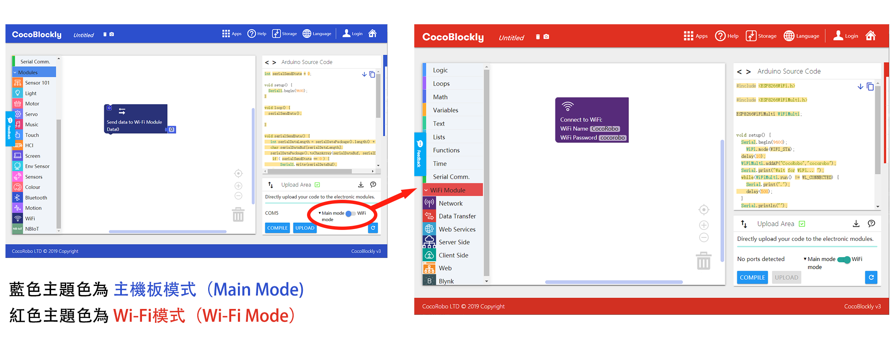
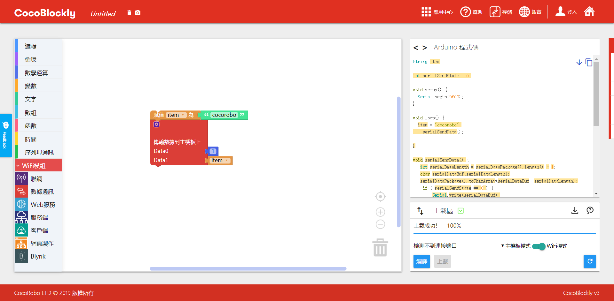
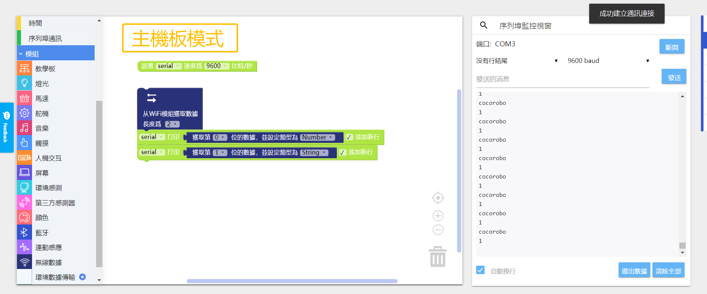
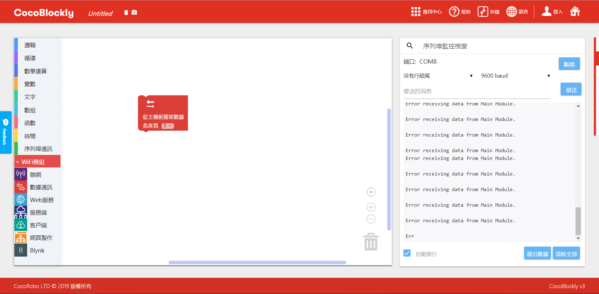
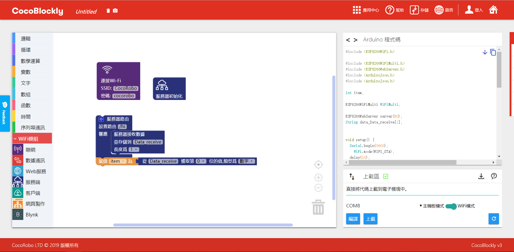
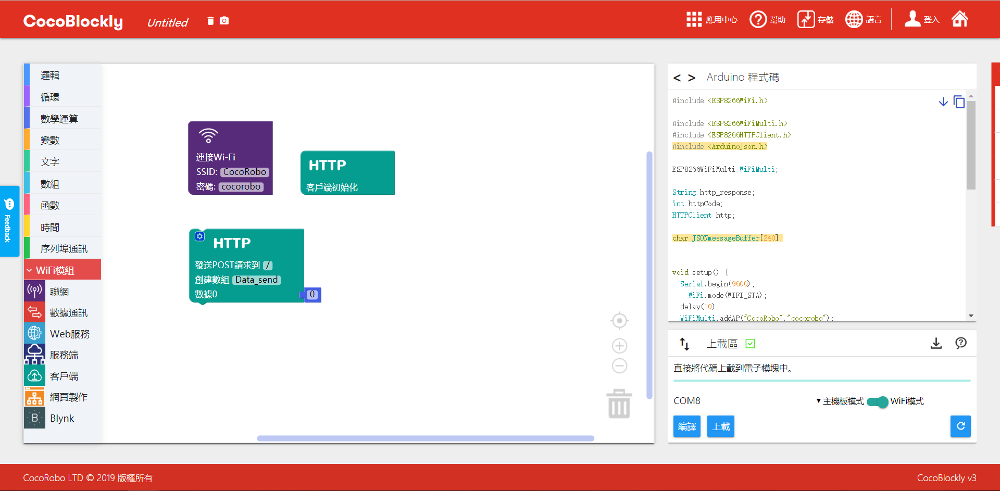
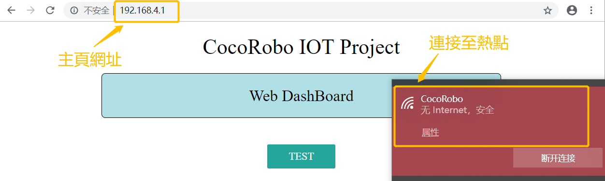

# 使用 WiFi 通訊模組
---

## 模組簡介

Wi-Fi 通訊模組負責進行數據的無線傳輸，支持 HTTP/WebSocket/MQTT 通訊協議，有了它，結合 CocoBlockly 的 WiFi 模式，用戶可以非常直觀地搭建屬於自己的智慧家居小應用。

## 模組主要部件

<table style="margin-top:20px;">
	<tr>
		<td width="6%" style="font-weight: bold;">No.</td>
		<td width="20%" style="font-weight: bold;">部件名稱</td>
		<td style="font-weight: bold;">部件描述</td>
	</tr>
	<tr>
		<td>1.</td>
		<td>USB 接口</td>
		<td>用於WiFi程式上傳/供電</td>
	</tr>
	<tr>
		<td>2.</td>
		<td>ESP8266</td>
		<td>一款集成WIFI功能（2.4GHz）的控制器</td>
	</tr>
	<tr>
		<td>3.</td>
		<td>重置按鍵</td>
		<td>點擊重置按鍵後將會讓 WiFi 通訊模組重啓</td>
	</tr>
	<tr>
		<td>4.</td>
		<td>Flash 按鍵</td>
		<td>/</td>
	</tr>
</table>

#### 模組接口示意

| 接口位置 | 接口描述           |
| -------- | ------------------ |
| (數位訊號) D0: 主機板 Rx    | Tx:  WiFi 通訊模組端 (UART 通訊)       |
| (數位訊號) D1: 主機板 Tx   | Rx:  WiFi 通訊模組端 (UART 通訊) |

> 爲了避免不同類型的電子模組在使用時有接口（Pin out）的衝突，請注意前往[此頁面](/cocomod/pinout-map)查看接口示意圖

---

## 模組使用說明

1. 切勿使用超過 5V/2A 的電源供電
2. 當 ESP8266模組上的 LED 燈持續閃爍時，意味著模組正處於重置狀態，該狀態會持續到上傳結束；

---

## WiFi 通訊模組基礎使用

### 与主機板模组进行數據通訊

#### 模組組裝

將 WiFi 通訊模組和主機板模組拼接在一起

---

## 主機板模式與 WiFi 模式

### 什麼是 WiFi 通訊模組

### 什麼是 WiFi 模式

給 WiFi 通訊模組進行編程時，我們需要在 CocoBlockly 的界面右下角「程式上傳區」中，點擊紅色框中的切換按鈕，切換爲 WiFi 模式。

**當我們製作一個與外接通訊的 IoT （物聯網） 項目時，需要給項目中的主機板模組和 WiFi 通訊模組分別上傳對應模式下所編寫的程式，上傳程式成功后再將主機板模組與 WiFi 通訊模組拼接在一起。**下圖示範了製作一個 IoT 項目所需要的程式開發流程。

**注**：切換模式時，因爲兩個模式工作空間的積木都會同時保存，所以當用戶再切換回去時，之前的編寫的積木程式不會丟失。

目前的 CocoBlockly Wi-Fi 模式支持以下兩種傳送模式：

1. 將數據傳送至遠端；
2. 從遠端獲取數據；

<!-- pagebreak -->

同時，用戶還可以選擇接入 CocoCloud，或者 IFTTT、Thingspeak 這些第三方服務，來完成左邊兩種操作模式。

---

### WiFi積木示意圖

<table width="800">
  <tr>
    <th>積木圖示</th>
    <th>簡介</th>
  </tr>
  <tr  >
    <td>  </td>
    <td> a.聯網積木: 設置連接的熱點名稱與密碼   b.連接判斷積木: 判斷是否連接成功   c.本地IP積木:獲取連接無線網絡的WIFI的IP地址</td>
  </tr>
  <tr>
    <td>  </td>
    <td> a.熱點積木: 設置自身熱點名稱與密碼(密碼不小於八位) </td>
  </tr>
  <tr>
    <td>  </td>
    <td> a.發送積木: 與主控通訊積木，向主機板發送包含數據的數字數組(注意：單個數據取值範圍為0~255) </td>
  </tr>
    <tr>
    <td>  </td>
    <td> a.接收積木:與主控通訊積木，接收主機板傳輸過來的數據，需設置長度   b.取值積木: 與接收積木同用，獲取主機板傳輸過來的單個數據，以0為起始位數   c. 可設定接受到的字符串類型：字符串（String）、整數數值（Number）、帶小數點的數值（Float）</td>
  </tr>
  <tr>
    <td>  </td>
    <td> a. ThingSpeak積木: 向ThingSpeak項目發送數據，需從ThingSpeak項目獲取API-Key </td>
  </tr>
  <tr>
    <td>  </td>
    <td> a. IFTTT積木: 向IFTTT項目發送數據，需從IFTTT項目獲取API-Key；Webhood類型：選擇獲取數據或者發送數據，發送的數據最多為三個</td>
  </tr>
  <tr>
    <td>  </td>
    <td> a.CocoCloud發送積木:向CocoCloud發送數據，需要設置項目API-key以及發送數據的屬性名</td>
  </tr>
  <tr>
    <td>  </td>
    <td> a.CocoCloud獲取積木: 從CocoCloud獲取項目數據   b.按屬性名獲取數據合集中的數據</td>
  </tr>
  <tr>
    <td>  </td>
    <td> a.服務器初始化積木: 設置服務器</td>
  </tr>
  <tr>
    <td>  </td>
    <td> a.設置主頁積木: 設置主頁積木，主頁進入網址"http://192.168.4.1" (注意:需要連接服務器所在WiFi板設置的熱點,才能進入主頁)</td>
  </tr>
  <tr>
    <td>  </td>
    <td> a. 服務器路由設置積木:設置不同路徑與對應響應事件</td>
  </tr>
  <tr>
    <td>  </td>
    <td> a.服務器發送積木: 向請求服務器設定路徑的客戶端發送對應指定數據</td>
  </tr>
  <tr>
    <td>  </td>
    <td> a.服務器接收積木: 接收客戶端向指定路徑發送的數據   b.數據獲取積木: 從接收到的數據合集中獲取指定下標的數據</td>
  </tr>
  <tr>
    <td>  </td>
    <td> a.客戶端初始化積木： 初始化客戶端</td>
  </tr>
  <tr>
    <td>  </td>
    <td> a. 客戶端GET請求積木: 設置路徑，向服務端發起對應HTTP請求，并獲得數據(注意: 路徑與服務端路由路徑格式一致)   b.數據獲取積木: 從接收到的數據合集中獲取指定下標的數據</td>
  </tr>
  <tr>
    <td>  </td>
    <td> a.客戶端POST請求積木: 設置路徑，向服務端發起對應HTTP請求，并發送數據(注意: 路徑與服務端路由路徑格式一致)</td>
  </tr>
  <tr>
    <td>  </td>
    <td> a. 網頁構建Label積木：可構建一個網頁，顯示對應Label與設定數據，網頁網址為"http://192.168.4.1"</td>
  </tr>
  <tr>
    <td>  </td>
    <td> a.網頁構建Button積木：可構建一個網頁，顯示對應命名的按鈕，點擊按鈕觸發HTTP請求事件，向設定的服務器路徑發送按鈕命名。網頁網址為"http://192.168.4.1"</td>
  </tr>
</table>

***

### WiFi積木介紹

#### 聯網積木單元

##### 單元簡介

 WiFi 通訊模組可以通過這類積木接入現有網絡，或者建立本地網絡(AP模式)。

##### 積木簡介

1. 連網積木 : 設置連接的網絡名稱與密碼

* 連接網絡 : 網絡連接成功，序列埠會在第一時間打印“WiFi connected”, 但如果未能觀察到該提示也屬正常情況，具體看打開序列埠通訊的時間是否及時。

* 連接網絡失敗 : 序列埠會持續打印 “ . ”, 表示在嘗試網絡連接

2. 熱點積木 : 設置熱點網絡名稱和密碼，并建立本地網絡

* 建立熱點

* 密碼設置應大於8位, 否則無法建立熱點

3. 連接判斷積木 : 判斷網絡是否連接

4. 獲取IP積木 : 連接網絡成功后, 可獲取 WiFi 通訊模組在該網絡中的IP地址

* 連接網絡，打印IP地址

---

#### 通訊積木單元

##### 單元簡介

 WiFi 通訊模組與主機板模組進行數據通訊使用,即是可以向主機板模組發送數據或者從主機板模組接收數據

##### 積木簡介

1. 發送積木 : 與主控通訊積木，向主機板發送包含數據的數字數組(*注意：單個數據取值範圍為0~255*)
* 提示：為發送積木的數組增加長度的方式參見下圖：

*  發送數據数组[1,"cocorobo"]至主機板模組

**注意：**
1. 使用 WiFi 通訊模組時需要先分別給項目中的主機板模組和 WiFi 通訊模組上傳對應模式下所編寫的程式，上傳程式成功后再將主機板模組與 WiFi 通訊模組拼接在一起；
2.數據除了可以使用基礎類型的數字積木來直接賦值，也可以使用變量積木來間接賦值（變量是計算機語言中能儲存計算結果或能表示值的抽象概念）。

上傳程式成功后，用 USB 綫連接好主機板模組至電腦，然後打開序列埠監控視窗點擊「連接」

2. 接收積木 : 與主機板模組進行通訊的積木，接收主機板傳輸過來的數據，需要設置接收數據的數組長度

* 傳輸失敗 : 接收主機板模組傳輸的數據出錯。通常是 WiFi 通訊模組未與主機板模組拼接在一起時出現

3. 取值積木 : 與接收積木一起使用，獲取主機板傳輸過來的單個數據，以0為所獲取數組的起始位

* 提示：為傳輸數據積木的數組增加長度的方式參見下圖：

*  WiFi 通訊模組接收主機板模組傳輸的數組數據[100,"cocorobo"]，并且打印到序列埠

---

#### WEB服務積木單元

##### 單元簡介

WEB服務包含IFTTT，Thingspeak，CocoCloud相關積木，允許模組與這三類網絡服務交互，該單元積木的使用需要配合「連接網絡積木」才能成功連接到網絡服務。

##### 積木簡介

1. Thingspeak積木 : ThingSpeak是一個數據可視化網站，能將模組收集的數據傳輸到該網站以圖表的方式顯示規範時間內數據變化情況。詳情可見 [Thingspeak使用介紹](/cocomod/thingspeak)

* 積木顯示

2. IFTTT積木 : IFTTT是一個多功能網絡服務平台，可通過收集的模組信息設置特定的其他網絡服務反饋，如發送Email。詳情可見 [IFTTT使用介紹](/cocomod/ifttt)

* 積木顯示 : 獲取數據選項,向IFTTT特定項目獲取信息

* 積木顯示 : 發送數據選項，向IFTTT特定項目發送數據，可發送的數據個數為三個

3. CocoCloud發送積木 : Cococloud是cocorobo自主研發的雲端平台，可用於存儲模組收集的信息與可視化。詳情可見 [CocoCloud使用介紹](/cocomod/coco-cloud)

* 發送數據設置:向特定雲端項目發送數據{屬性名為“EM_data0”，值為 0}

4. CocoCloud獲取積木 :

* 獲取雲端數據設置:從特定雲端項目獲取數據，并存到rxCloud中

5. CocoCloud取值積木 :

* 根據屬性取值:從rxCloud中獲取屬性名為“EM_data0”,並且類型為Text的數據

---

#### 服務端積木單元

##### 單元簡介

服務端積木用於 WiFi 通訊模組建立本地服務器。透過設置服務器的指定路徑，以及指定行為方式來搭建一個能夠響應的簡易的本地服務器。通常是需要與「建立熱點積木」一起使用

##### 積木簡介

1. 服務器初始化積木 :

* 積木顯示

1. 設置主頁積木 :

* 設置一個簡單的網站 :使用電腦連接至服務器對應熱點，在瀏覽器輸入主頁網址：“192.168.4.1”即可進去主頁。

> 關於網頁製作的積木介紹請參見 [網頁製作積木單元](#網頁製作積木單元)

3.設置路徑積木 :

* 設置簡單的路徑: 設置路徑“/hi”, 當客戶端在瀏覽器訪問該路徑（192.168.4.1/hi）時，該服務端 WiFi 通訊模組在序列埠打印 “Hello world”。 *注意電腦要先連接熱點"CocoRobo"*

最終結果：

4.服務器發送數據積木 :

* 服務器響應發送數據 “1”: 設置路徑“/hi”, 當客戶端訪問該路徑（192.168.4.1/hi）時，該服務端 WiFi 通訊模組服務器向客戶端發送數據 “1”

最終結果：

5.服務器接收數據積木 :

* 服務器響應接收數據:設置路徑“/hi”, 當客戶端通過該路徑（192.168.4.1/hi）向該 WiFi 通訊模組服務器發送數據的時候，服務器端接收數據，並存到命名為Data_receive的數組中

6.服務器接收數據的取值積木 :

* 從服務器接收的數據中取值積木：從數組Data_receive中獲取第一位類型為數字的值。與「服務器接收數據積木」一起使用

---

#### 客戶端積木單元

##### 單元簡介

客戶端積木用於 WiFi 通訊模組與已經建立起的本地服務器進行通訊的積木。向對應本地服務器發起請求，完成發送數據或者接收數據的操作。通常是需要與「連接網絡積木」一起使用，並且需要連接至本地服務器對應熱點網絡中。

##### 積木簡介

1. 客戶端初始化積木 :

* 積木顯示

2. 客戶端接收數據積木 : GET請求積木

* 向服務器請求獲取數據: 向服務器路徑為“/hi”的地址（即192.168.4.1/hi）請求數據，并存到客戶端 WiFi 通訊模組的Data_receive數組中

* 從獲取的數據中取第一位類型為數字的值：從數組Data_receive中獲取第一位類型為數字的值

3. 客戶端發送數據積木  : POST請求積木

* 向服務器發送數據： 向服務器路徑為“/hi”的地址（即192.168.4.1/hi）發送數據[12]

---

#### 網頁製作積木單元

##### 單元簡介

網頁製作積木，用於構建簡單的網頁顯示，通常是與「服務器設置主頁積木」一起使用

##### 積木簡介  

1. 設置網址-LABEL顯示積木 :可以設置網頁上顯示的内容標簽名稱和對應的數據（字符串）

* 設置一個網站，内容標簽為“Data”，对应數據為“123456”的字符串 :

* 提示：為「設置網址-LABEL顯示積木」增加 LABEL 的方法如下圖：

**注意：「設置網址-LABEL顯示積木」只允許使用一次，不可以將多個此類積木拼接在一起，想要添加多個 LABEL 可參見上圖；此外，也不可以與「設置網址-Button設置積木」拼接在一起**

2. 設置網址-Button設置積木 : 每一個按鈕有對應一個名稱設置，和一個路徑設置。路徑設置的是反饋路徑。指當點擊網址中顯示的該按鈕時候，觸發一個HTTP請求發送，請求對應路徑為設置的反饋路徑。發送的數據內容為當前按鈕名稱的字符串。

* 設置按鈕名稱為 “Test”，路徑為 “/1” :應當配合使用「服務器設置主頁積木」，并且設置「Wed Dashboard-按鈕積木」的路徑為 “/1”,作為響應處理

* 提示：為「設置網址-Button設置積木」增加 Button 的方法如下圖：

**注意：「設置網址-Button設置積木」只允許使用一次，不可以將多個此類積木拼接在一起，想要添加多個 Button 可參見上圖；此外，也不可以與「設置網址-LABEL顯示積木」拼接在一起**

***

### 項目目錄

| 項目類型 | 項目內容 | 備註 |
| :------ | :------ | :------: |
| (本地)AP模式 | 教學模組控制 LED 燈屏模組 | [查看此處](#項目一) |
| (本地)AP模式 | 網頁呈現環境模組數據 | [查看此處](#項目二) |
| (本地)AP模式 | 網頁控制LED開關 | [查看此處](#項目三)  |
|(聯網) CocoCloud | 雲端呈現環境模組數據 | [查看此處](/cocomod/coco-cloud?id=項目一)  |
|(聯網) Thingspeak | 環境模組數據上傳與可視化 | [查看此處](/cocomod/thingspeak?id=案例)  |
|(聯網) IFTTT| 電位器觸發email提醒 | [查看此處](/cocomod/ifttt?id=案例)  |

<!--|(聯網) CocoCloud | 雲端控制LED亮暗 | [查看此處](/cocomod/coco-cloud?id=項目二)  |
|(聯網) IFTTT| 環境數據觸發google助手 | 查看此處  |-->

***

### 項目

#### 項目一

#####  項目簡介 : 教學模組控制 LED 燈屏模組（ WiFi 對 WiFi ）

教學模組控制 LED 燈屏模組：使用的是AP模式,即是通過兩個 WiFi 通訊模組進行數據傳輸，達到遠程控制的效果。兩個 WiFi 通訊模組，其中一個作為服務端，另一個作為客戶端。
此項目以與教學模組拼接的 WiFi 通訊模組為服務端，與 LED 燈屏模組拼接的 WiFi 通訊模組為客戶端。此項目選用教學模組上的 pin 12 開關，通過撥動教學模組上 pin 12 的開關，來遠程決定 LED 燈的閉合。

| 服務端 | 客戶端 |
| :------ | :------ |
| 教學模組 |  LED 燈屏模組 |
| 主機板模組 | 主機板模組 |
|  WiFi 通訊模組 |  WiFi 通訊模組 |

##### 服務端程式預覽

* 主機板模式 - 傳輸教學模組 pin 12 開關的數據至 WiFi 通訊模組
  程式下載： <a href="../xml/project1/BASIC_main.xml" download >BASIC_main.xml</a>

* WiFi模式 - 設置熱點，設置本地服務器，接收主機板傳輸過來的數據，設置響應路徑
  程式下載： <a href="../xml/project1/BASIC_wifi.xml" download >BASIC_wifi.xml</a>

##### 客戶端程式預覽

* 主機板模式 - 接收在此客戶端上的 WiFi 通訊模組傳輸過來的數據，根據數據對應内容設置 LED 燈
  程式下載： <a href="../xml/project1/LED_main.xml" download >LED_main.xml</a>

* WiFi模式 - 設置連網，設置客戶端發起請求，請求從服務端獲取數據，並把發送請求到的數據再傳輸到主機板
  程式下載： <a href="../xml/project1/LED_wifi.xml" download >LED_wifi.xml</a>

> 注意：此處獲取服務器端傳過來的數值需要先賦值給變量才可以正常使用

##### 最終結果

撥動教學模組上 pin 12 的開關，可以遠程決定 LED 燈的閉合

***

#### 項目二

#####  項目簡介 : 網頁呈現環境模組數據

網頁呈現環境模組數據：使用的是AP模式,即是通過 WiFi 通訊模組設置服務器，設置主頁，在網頁上顯示環境數據。

| 服務端 | 客戶端 |
| :------ | :------ |
| 環境模組 | 瀏覽器 |
| 主機板模組 |  |
|  WiFi 通訊模組 | |

##### 服務端程式預覽

* 主機板模式 - 傳輸環境模組讀取的數據至 WiFi 通訊模組
  程式下載： <a href="../xml/project2/ENV_dashboard_main.xml" download >Env_dashboard_main.xml</a>

* WiFi模式 - 設置熱點，設置本地服務器，接收主機板傳輸的數據，設置主頁
  程式下載： <a href="../xml/project2/ENV_dashboard_wifi.xml" download >Env_dashboard_wifi.xml</a>

##### 效果展示（客戶端）

電腦先連接至服務端建立的熱點，然後在瀏覽器地址欄輸入 192.168.4.1 即可看到讀取的四個環境參數

***

#### 項目三

#####  項目簡介 : 網頁控制LED開關

網頁呈現環境模組數據：使用的是AP模式，即是通過WiFi設置主頁，通過主頁上面按鈕點擊效果，達到遠程控制與 WiFi 通訊模組連接的 LED 燈的亮暗。

| 服務端 | 客戶端 |
| :------ |:------ |
|  LED 燈屏模組 | 瀏覽器 |
| 主機板模組 |  |
|  WiFi 通訊模組 |  |

##### 服務端程式預覽

* 主機板模式 - 接收從 WiFi 通訊模組傳輸過來的數據，設置 LED 燈
  程式下載： <a href="../xml/project3/LIGHT_dashboard_main.xml" download >LIGHT_dashboard_main.xml</a>

* WiFi模式 - 設置熱點，設置本地服務器，設置主頁，設置響應路徑，傳輸數據至主機板模組
  程式下載： <a href="../xml/project1/LIGHT_dashboard_wifi.xml" download >LIGHT_dashboard_wifi.xml</a>

> 注意：此處獲取服務器端傳過來的數值需要先賦值給變量才可以正常使用

##### 效果展示（客戶端）

***

更新時間：2019年8月
