# 使用 WiFi 通訊模組
---

## 模組簡介

Wi-Fi 通訊模組負責進行數據的無線傳輸，支持 HTTP/WebSocket/MQTT 通訊協議，有了它，結合 CocoBlockly 的 WiFi 模式，用戶可以非常直觀地搭建屬於自己的智慧產品。

## 模組主要部件

<table style="margin-top:20px;">
	<tr>
		<td width="6%" style="font-weight: bold;">No.</td>
		<td width="20%" style="font-weight: bold;">部件名稱</td>
		<td style="font-weight: bold;">部件描述</td>
	</tr>
	<tr>
		<td>1.</td>
		<td>USB 接口</td>
		<td>用於WiFi程式上傳/供電</td>
	</tr>
	<tr>
		<td>2.</td>
		<td>ESP8266</td>
		<td><a href='https://www.kloppenborg.net/images/blog/esp8266/esp8266-esp12e-specs.pdf' target='_blank'>ESP-12E</a></td>
	</tr>
	<tr>
		<td>3.</td>
		<td>重置按鍵</td>
		<td>點擊重置按鍵後將會讓 WiFi 模組重啓</td>
	</tr>
	<tr>
		<td>4.</td>
		<td>Flash 按鍵</td>
		<td>/</td>
	</tr>
</table>

#### 模組接口示意

| 接口位置 | 接口描述           |
| -------- | ------------------ |
| (數位訊號) D0: 主機板 Rx    | Tx: WiFi模組端 (UART 通訊)       |
| (數位訊號) D1: 主機板 Tx   | Rx: WiFi模組端 (UART 通訊) |

> 爲了避免不同類型的電子模組在使用時有接口（Pin out）的衝突，請注意前往[此頁面](/cocomod/pinout-map)查看接口示意圖

---

## 模組使用說明

1. 切勿使用超過 5V/2A 的電源供電
2. 當 ESP8266模組上的 LED 燈持續閃爍時，意味著模組正處於重置狀態，該狀態會持續到上傳結束；

---

	<b style="color:#fff;font-size:24px;padding-bottom:-20px;">提示：</b>
	
我們已於近期推出了 WiFi 模式的簡易積木（Easy Mode），便於零基礎用戶更直觀的編程 WiFi 模組以及製作物聯網項目，來將數據接入我們的 Coco Cloud，或者是 ThingSpeak，詳細請前往 <a href="../#/cocomod/wifi-easymode" style="text-decoration:underline;color:rgba(255,255,255,.75);">此處查看</a>。

## WiFi 通訊模組基礎使用

### WiFi 通訊模組數據通訊

#### 模組組裝

---

## 主機板模式與 WiFi 模式

### 什麼是 WiFi 模組

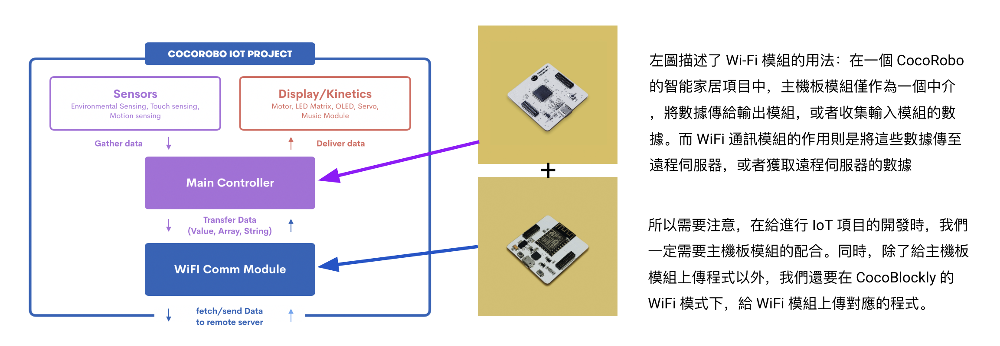

### 什麼是 WiFi 模式

給 WiFi 通訊模組進行編程時，我們需要在 CocoBlockly 的界面右下角「程式上傳區」中，點擊紅色框中的切換按鈕，切換爲 Wi-Fi 模式。

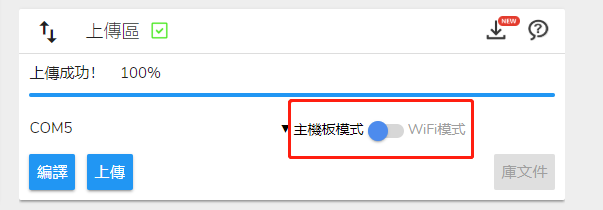
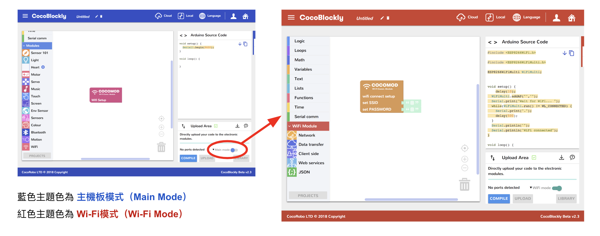

當我們製作一個與外接通訊的 IoT 項目時，需要給項目中的主機板模組和 WiFi 模組分別上傳程式。下圖示範了製作一個 IoT 項目所需要的程式開發流程：

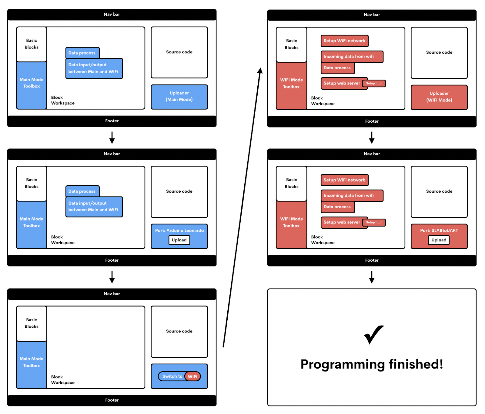

* 先在CocoBlockly主控模式編寫好一段程式，并單獨上傳至主機板模組；
* 再切換到CocoBlockly的WiFi模式，編寫好另一端程式，再單獨上傳至WiFi通訊模組；
* 兩個模組分別上傳好程式后，拼合在一起，給主機板模組或WiFi通訊模組中任意一個模組通電，即可完成主機板模組和WiFi通訊模組之間的通訊。

**注意：** 
1. 先編寫主機板程式還是先編寫WiFi模組的程式不做硬性要求，可根據實際情況自行決定順序，但必須是單獨給兩個模組上傳程式再拼合在一起
2. 切換模式時，因爲兩個模式工作空間的積木都會同時保存，所以當用戶再切換回去時，之前的編寫的積木程式不會丟失。

目前的 CocoBlockly Wi-Fi 模式支持以下兩種傳送模式：

1. 將數據傳送至遠端；
2. 從遠端獲取數據；

<!-- pagebreak -->

同時，用戶還可以選擇接入 CocoCloud，或者 IFTTT、Thingspeak 這些第三方服務，來完成左邊兩種操作模式。

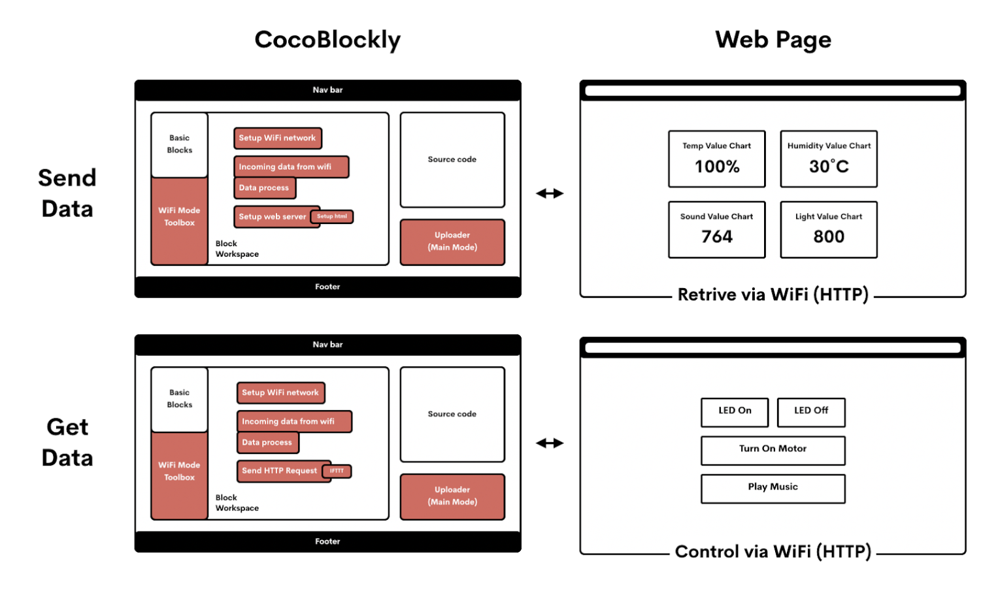

---
#### 主機板發給 WiFi 與 WiFi 接收主機板

##### 積木編程

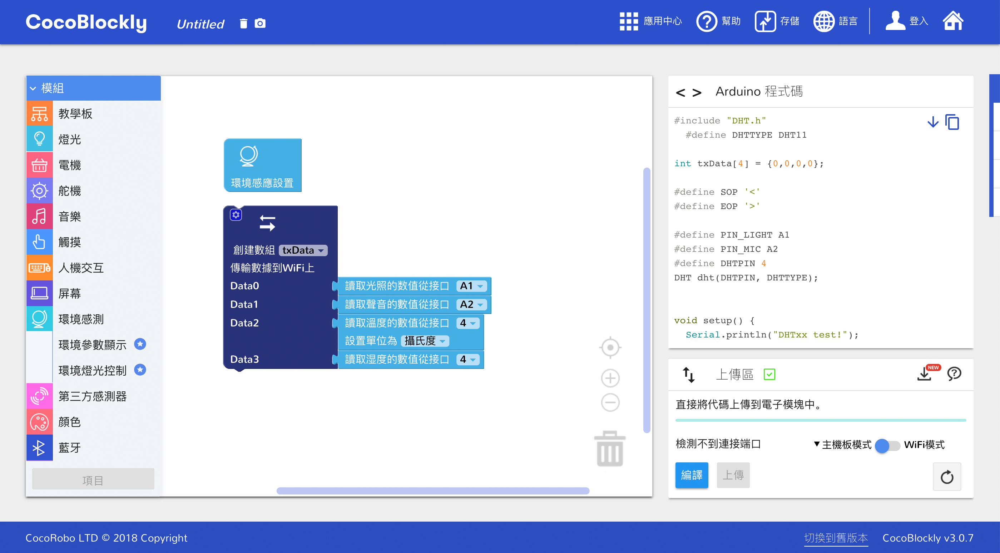
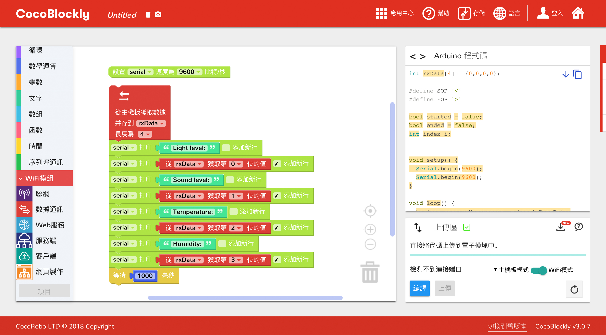

##### 最終效果

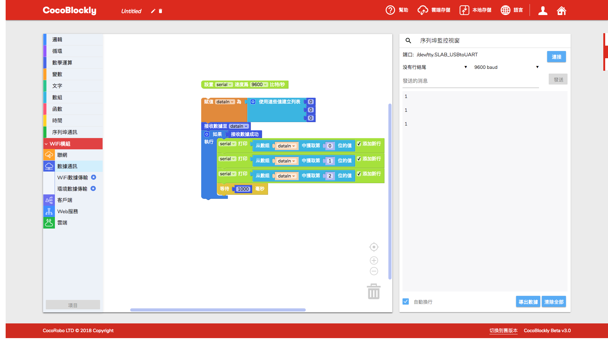

---

#### WiFi 發給主機板 與 主機板接收 WiFi

##### 積木編程

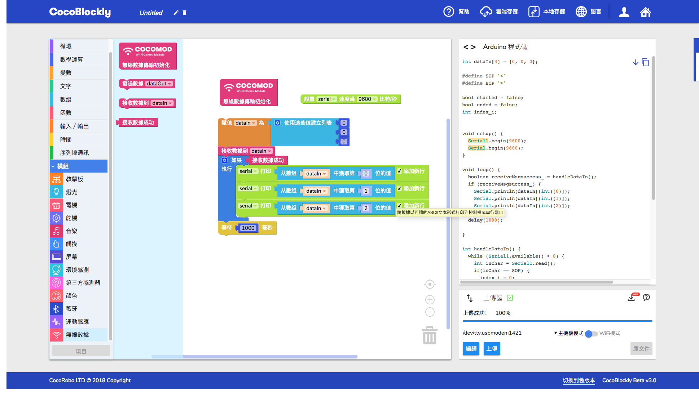
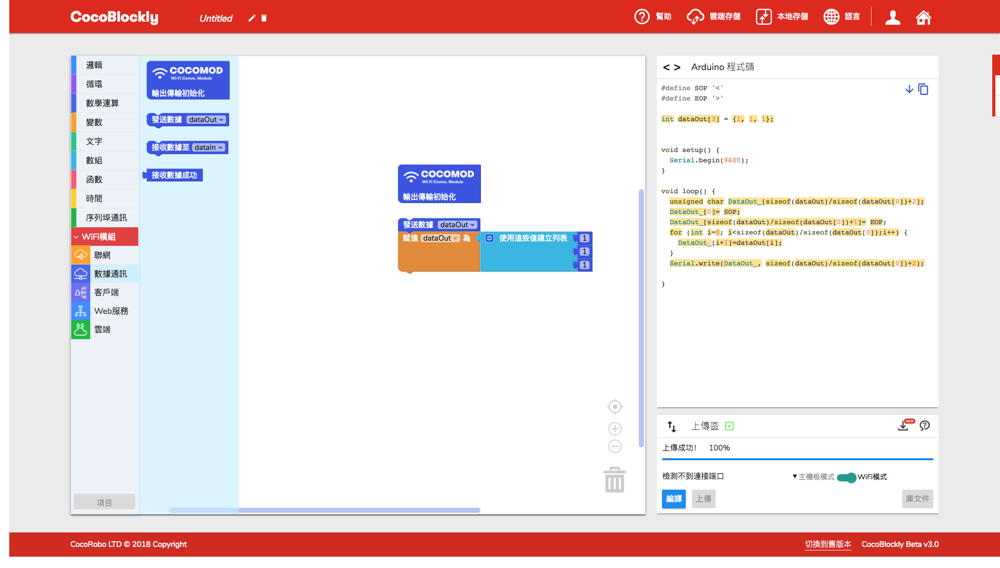

##### 最終效果

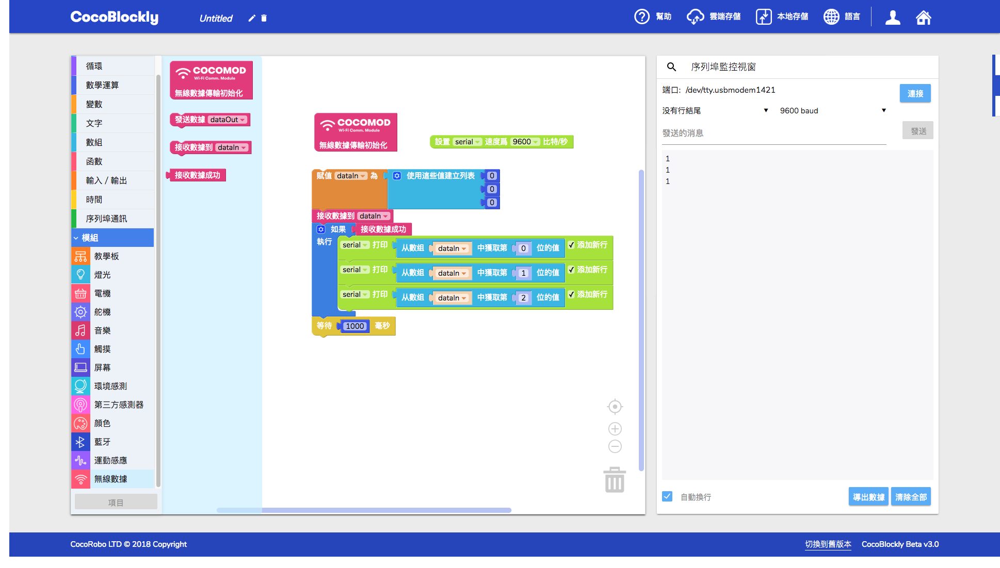

---

### WiFi 連接網絡並獲取基本信息

##### 積木編程

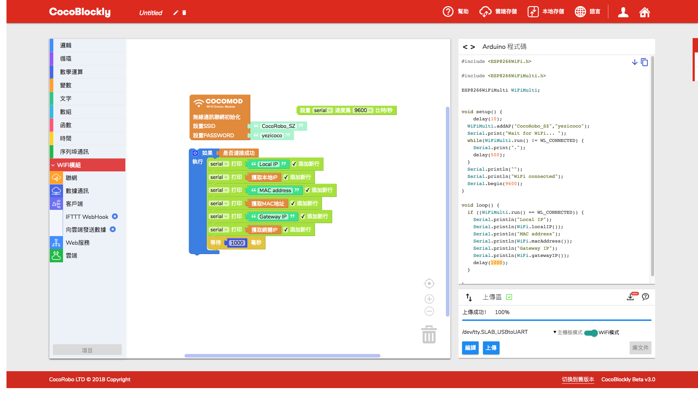

##### 最終效果

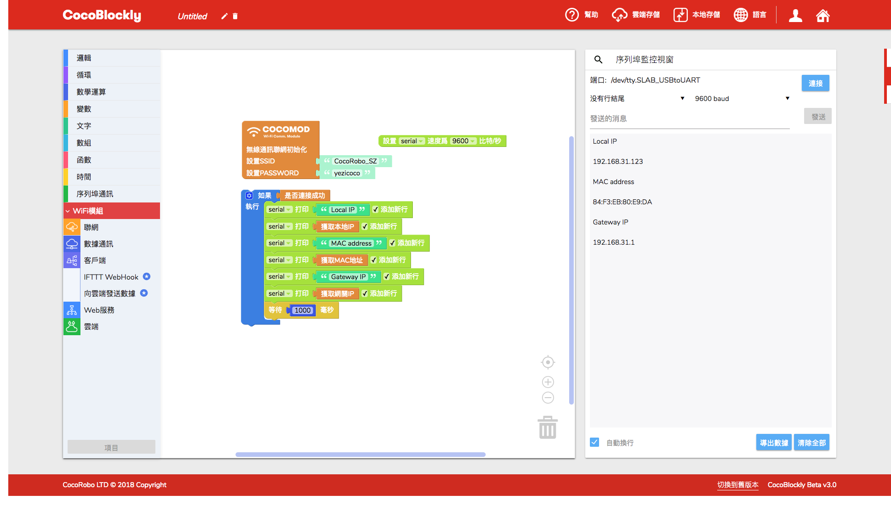

---

### WiFi 發送基本請求

##### 積木編程

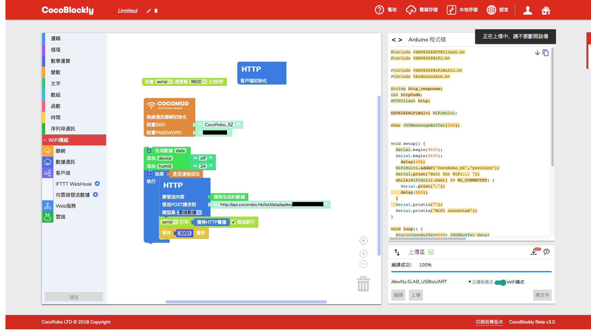

##### 最終效果

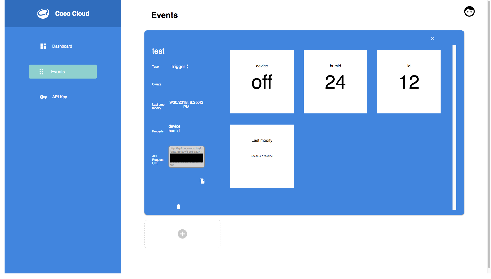
