# Experience the Features of AI

## Introduction

#### Teachable Machine

Enable the machine to be familiar with an occasion through plenty of pictures of the particular occasion shot by the camera, which is actually the process of machine learning in AI. Subsequently, the occasion can be identified in a webpage which can also store the feedback of the occasion in the Cloud. Then the data of the event can be gotten via a WiFi communication module, thus realizing the communication between webpage and module.

#### AI Emotion Recognition
  AI system can identify a person’s faces from the pictures captured by the front camera, judge the emotion of the person with a result of smiling face or crying face and store the result in the Cloud. Then the data of the event can be gotten via a WiFi communication module, thus realizing the communication between emotion recognition and module.

#### AI Speech Recognition

AI system can identify a person’s words from the recording captured by microphone and store them in the Cloud. Then the data of the event can be gotten via a WiFi communication module, thus realizing the communication between speech recognition and module.

## The Interface

AI Entry in CocoBlockly Interface
  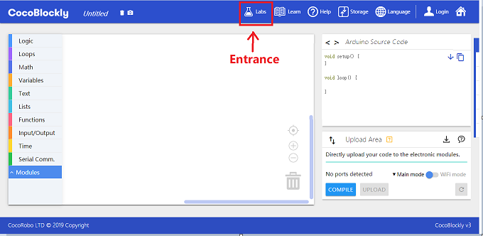

  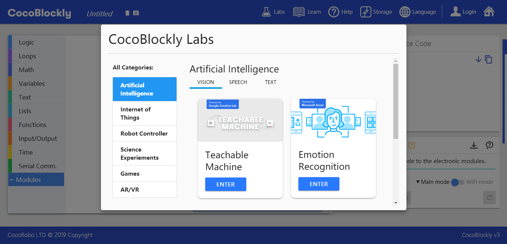

#### 1. Teachable Machine: You can expand the page by clicking the icon of "Teachable Machine"

You need to log into the account before entering the interface of “teachable machine”.

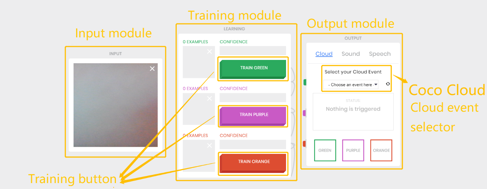

Teachable machine consists of three modules:

* Input: camera shooting area
* Train: model train area with three drill units of green, purple and orange
* Output: show the recognition result and trigger the result-corresponding event in the train

### Input

This part is used to capture pictures for model drill or to do model checking.

#### Instructions

* Input module needs to use the camera of the browser. If the following message is presented, the front camera cannot be started and you need to change to the link (https://cocorobo.hk/cocoblockly/)

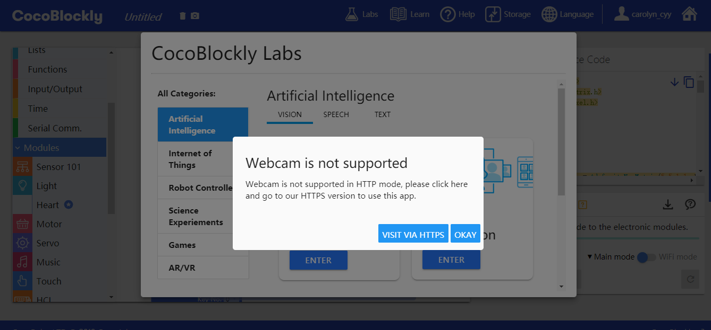

* Currently, the function can only be used in the Chrome browser.

* Stop/start Setup: “stop/start” will be shown when you place the cursor at the camera display area. Then you can stop or start using the camera.

* When you stop using the camera, the corresponding train event will also be stopped; the data and result will be cleared and grayed (not applicable).

### Train

There are three drill units in the model train area: TRAIN GREEN, TRAIN PURPLE and TRAIN ORANGE.

#### Instructions

1. After the camera is successfully started, click the “TRAIN” button with left mouse button and do not release. In this state, the machine starts automatically to capture pictures from corresponding module and do model drill.

2. After the train is finished, the module will check the recognition result of the captured pictures. The recognition unit will show the corresponding confidence and demonstrate it in the output module.
>Confidence: the extent to which the teachable machine is sure about its recognition result.

### Output

This part is used to show the recognition result and trigger the corresponding event in the train. There are three types of output in the part: Cloud, Sound and audio Speech.

#### Instructions

##### Cloud Event

This event sends the recognition result to Coco Cloud and Cloud event. When “Green event” is triggered, {detectA: “yes”， detectB:“no”,  detectC: “no”} will be sent to the Cloud, in which “yes” means triggered; “no” means not triggered; and
1. detectA: 「Green event」
2. detectB: 「Purple event」
3. detectC: 「Orange event」

#### 2. Emotion Recognition: You can Expand the Page by Clicking the Icon of "Emotion Recognition"

a. Switching button: You can click this button to start the front camera. If the following message is presented, the front camera cannot be started and you need to change to the link (https://cocorobo.hk/cocoblockly/).

b. Event choice: You can click to choose an event established in Coco Cloud (Please make sure that the CocoBlockly is logged into before choosing event).

c. Clicking button: Click the “ANALYZE FACE” or the front camera of the computer to capture pictures, show the pictures on the right and give the detection result. In case of Cloud event, the result will be sent to Coco Cloud in the form of {EM_data: "happy/sad/normal"}.

#### 3. Speech Recognition: You can Expand the Page by Clicking the Icon of "Speech Recognition"

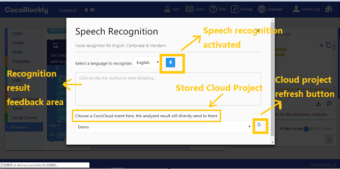

a. Event choice: You can click to choose an event established in Coco Cloud (Please make sure that the CocoBlockly is logged into before choosing event).

b. Clicking button: Click the microphone button and give the order in English. Then the system will recognize the order and give the detection result. In case of Cloud event, the result will be sent to Coco Cloud in the form of {EM_data: "「recognition result」"}.

c. If the computer cannot recognize or accurately recognize your words after You speak its microphone, please adjust the sensitivity of the microphone in the “speech setting” of a computer or use an external headset to connect to the microphone.

## Instructions

* If you want to get data from remote sites (including Coco Cloud, IFTTT and so on), you need to use the block of “every ? seconds” so as to prevent data-getting failure caused by too many requests. And the interval should not be too short.

  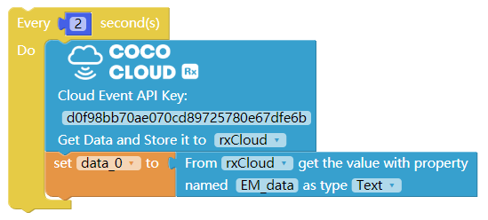
  

## A Case Study of Teachable Machine

#### Introductions

Use teachable machine to train different events. Trigger an event and send data to module so as to enable LED lights manifest pictures according to a person's gestures via Coco Cloud after the completion of the train.

#### Log into an Account

After logging into an account, go to Coco Cloud (https://cocorobo.hk/cloud/) from the user panel.

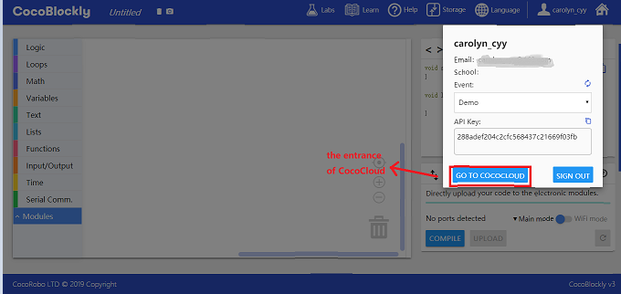

#### Create a Cloud Project

Go to the website of Coco Cloud, create a new event and name it "Coco Cloud".

  

 #### Cloud Project Demonstration

  

#### Main Controller Mode

Download the program: <a href="../xml/ai_project1/teachable_machine_main.xml" download>teachable_machine_main.xml</a>
**Please upload program for the main controller separately.**

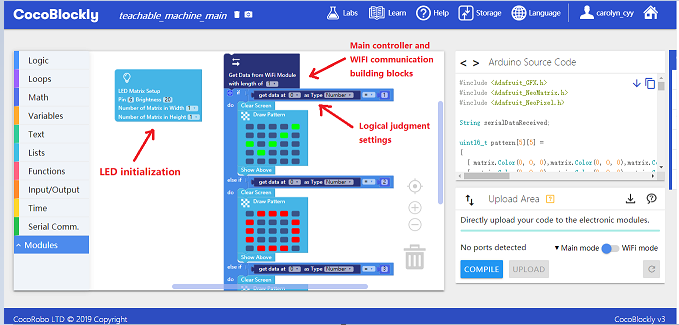

#### WiFi Mode

Download the program: <a href="../xml/ai_project2/teachable_machine_wifi.xml" download>teachable_machine_wifi.xml</a>
**Please upload program for the main controller separately. Please refer to [use WiFi communication module](/cocomod/wifi)**

> Note: Please change the WiFi name and password of the network block to those you want to connect.

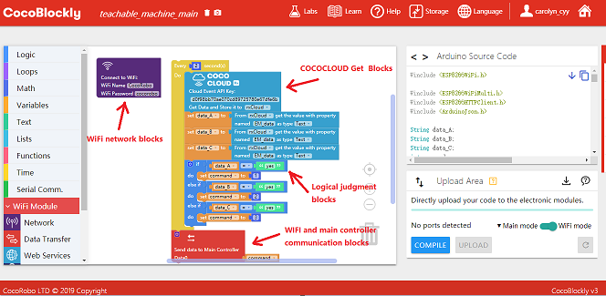

Change the API Key of the project.

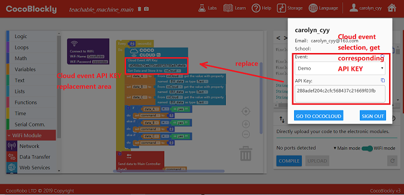

#### Assemble Modules

Put the main controller, the WiFi communication module and the LED matrix module together.

> Note: upload programs for the main controller and the WiFi communication module in their corresponding mode before putting them together.

  
  

#### Effect Demonstration

Start the "teachable machine", after the program is uploaded successfully. Please select the program of "teachable-machine" for the "teachable machine". As is shown in the following picture, the LED matrix module will manifest the picture detected by the machine.

Go to Coco Cloud to check the corresponding event. If it is sent successfully, the result will be manifested.

## A Case Study of Emotion Recognition

#### Introduction

Use “emotion recognition” to identify the motion manifested through a face. Then transmit the data to module via Coco Cloud and enable the LED matrix module show a expression according to the detection result.

#### Log into an Account

After logging into an account, go to Coco Cloud (https://cocorobo.hk/cloud/) from the user panel.

#### Create a Cloud Project
 Go to the website of Coco Cloud, create a new event and name it "camera".

  

 #### Cloud Project Demonstration

  

#### Main Controller Mode

Download the program: <a href="../xml/ai_project2/emotion_main.xml" download>emotion_main.xml</a>
**Please separately upload program for the main controller.**

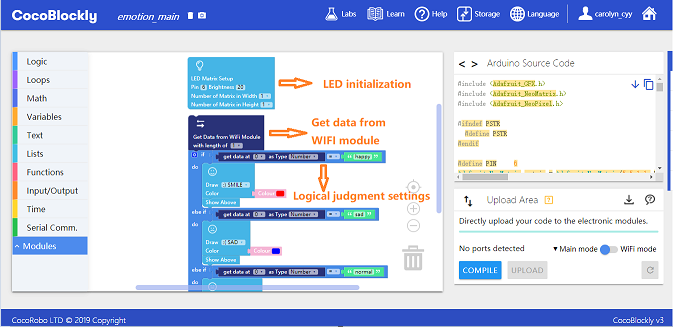

#### WiFi Mode

Download the program: <a href="../xml/ai_project2/emotion_wifi.xml" download>emotion_wifi.xml</a>
**Please upload program for the main controller separately. Please refer to [use WiFi communication module](/cocomod/wifi)**

> Note: Please change the WiFi name and password of the network block to those you want to connect.

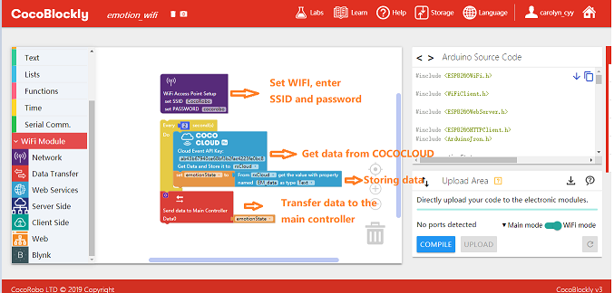

Change the API Key of the project.

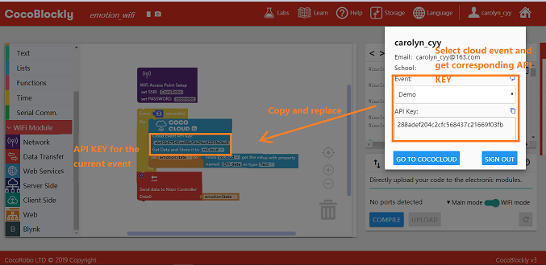

#### Assemble Modules

Put the main controller, the WiFi communication module and the LED matrix module together.

> Note: upload programs for the main controller and the WiFi communication module in their corresponding mode before putting them together.

  
  

#### Effect Demonstration

Start the "emotion recognition", after the program is uploaded successfully. Please select the program of "camera" for the "emotion recognition". As is shown below, the feedback information is "sad" after the picture is captured and stored.

Go to Coco Cloud to check the corresponding event. If it is sent successfully, the result will be manifested.

LED matrix demonstration

  
  

## A Case Study of Speech Recognition

#### Introduction

Use "speech recognition" to identify the English order. Transmit the data to module via Coco Cloud and then control the light accordingly.

#### Log into an Account
After logging into an account, go to Coco Cloud (https://cocorobo.hk/cloud/) from the user panel.

#### Create a Cloud Project
 Go to the website of Coco Cloud, create a new event and name it "speech".

  

 #### Cloud Project Demonstration

  

#### Main Controller Mode

Download the program: <a href="../xml/ai_project3/speech_main.xml" download>speech_main.xml</a>
**Please separately upload program for the main controller.**

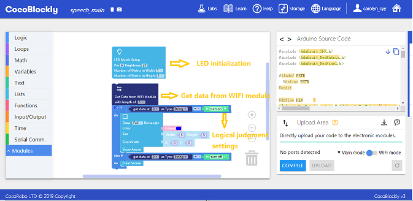

#### WiFi Mode

Download the program: <a href="../xml/ai_project3/speech_wifi.xml" download >speech_wifi.xml</a>
**Please upload program for the main controller separately. Please refer to [use WiFi communication module](/cocomod/wifi)**

> Note: Please change the WiFi name and password of the network block to those you want to connect.

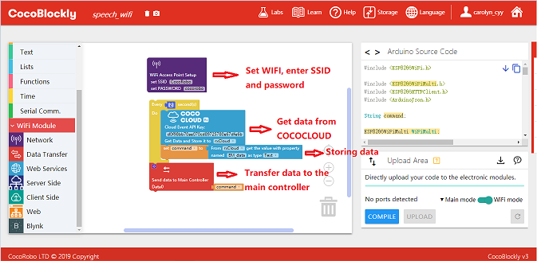

Change the API Key of the project.

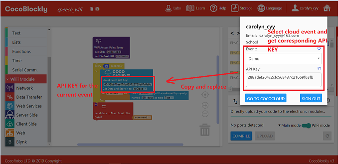

#### Assemble Modules

Put the main controller, the WiFi communication module and the LED matrix module together.

> Note: upload programs for the main controller and the WiFi communication module in their corresponding mode before putting them together.

#### Effect Demonstration
Start the "speech recognition", after the program is uploaded successfully. Please select the program of "speech" for the "speech recognition". As is shown below, click the microphone button and give the order "Turn On".

  

  Go to Coco Cloud to check the corresponding event. If it is sent successfully, the result "turn on" will be manifested.

  

  LED matrix demonstration

  

---
Updated in August 2019
