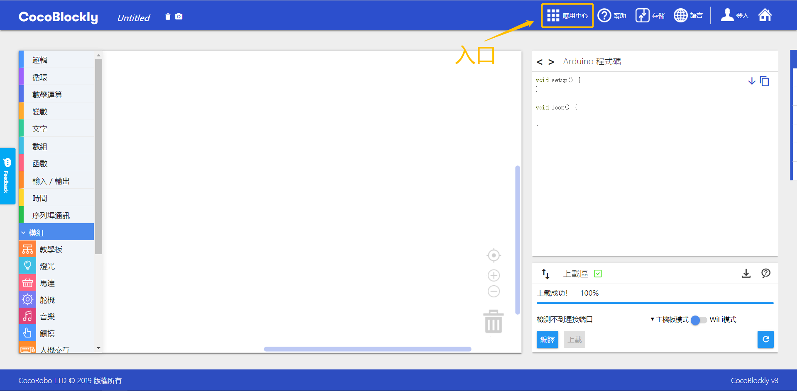
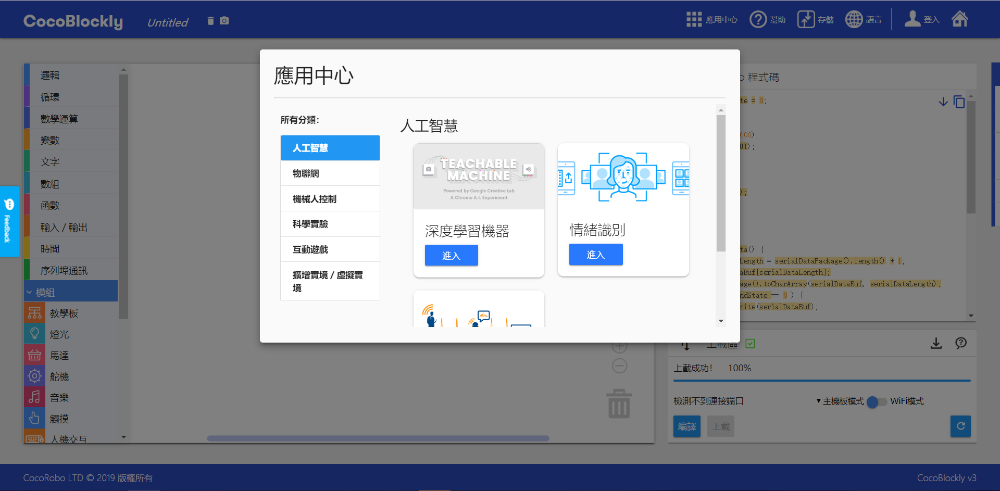
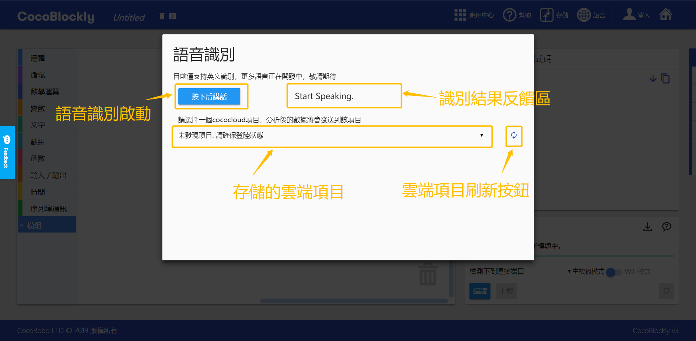
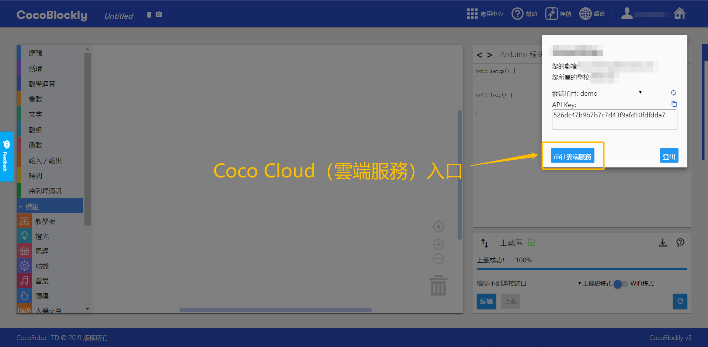

# 體驗 AI 特性

## 簡介

#### AI情緒識別
  通過前置攝像頭抓取圖片，AI系統自動識別使用者人臉照片，判斷照片人臉情緒，顯示內容是笑臉還是苦臉，並將反饋結果存儲到雲端，通過WiFi模組從雲端獲取對應事件的數據，實現情緒識別與模塊交互

#### AI語音識別

通過使用麥克風抓取使用者說話音頻，AI系統自動識別使用者說話內容，將內容存儲到雲端，通過WiFi模組從雲端獲取對應事件的數據，實現情緒識別與模塊交互

## 界面介紹

CocoBlockly界面AI使用接口
  

  

#### 1. 情緒識別 : 點擊左邊的攝像頭圖標即可展開

a.切換按鈕:點擊啓動電腦前置攝像頭（注意：如果提示如下信息，即無法啓動前置攝像頭，需要更換鏈接至(https://cocorobo.hk/cocoblockly/)

b.事件選擇：點擊可選擇CocoCloud內已創建事件（選擇事件之前需要保證CocoBlockly賬戶已登陸）
c.點擊按鈕:點擊電腦前置攝像頭抓取圖片，顯示在右側，並且反饋表情檢測結果

#### 2. 語音識別： 點擊右邊的麥克風圖標即可展開
   

a.事件選擇：點擊可選擇CocoCloud內已創建事件（選擇事件之前需要保證CocoBlockly賬戶登陸）

b.點擊按鈕:點擊語音識別按鈕，説出英文指令,系統識別英文指令，并且並且反饋識別結果

## 情緒識別項目

#### 登陸賬戶

登陸賬戶后，從用戶面板進入雲端服務（https://cocorobo.hk/cloud）

#### 创建Cloud云端项目
 进入CocoCloud网站，选择创建新的Event，設置項目名和類型(該項目類型為Trigger)

  

 #### cloud云端项目示意图
 
  

#### 主機板積木拼接

主機板積木代碼 <a href="../xml/emotion_main.xml" download>emotion_main.xml</a>，請單獨給主機板模組上傳程式

   

#### WiFi通訊積木拼接

WiFi通訊積木代碼 <a href="../xml/emotion_wifi.xml" download>emotion_wifi.xml</a> ，請單獨給WiFi通訊模組上傳程式，詳情請參照- [使用 WiFi 通訊模組](/cocomod/wifi)

選擇更換項目積木API_Key

#### 效果展示

抓取圖片後保存圖片，並且顯示反饋信息"sad" 

隨後前往CocoCloud 查看對應的event，如果發送成功，則會顯示結果 sad

LED狀態呈現

## 語音識別項目

#### 登陸賬戶
登陸賬戶后，從用戶面板進入雲端服務（https://cocorobo.hk/cloud）

#### 创建Cloud云端项目
 进入CocoCloud网站，选择创建新的Event，設置項目名和類型(該項目類型為Trigger)

  

 #### cloud云端项目示意图
 
  

#### 主機板積木拼接

主機板積木代碼 <a href="../xml/speech_main.xml" download>speech_main.xml</a> ，請單獨給主機板模組上傳程式

#### WiFi通訊積木拼接

WiFi通訊積木代碼 <a href="../xml/speech_wifi.xml"download >speech_wifi.xml</a>，請單獨給WiFi通訊模組上傳程式，詳情請參照- [使用 WiFi 通訊模組](/cocomod/wifi)

#### 效果展示
  點擊識別按鈕，説出指令"Turn on"

  

  隨後前往CocoCloud 查看對應的event，如果發送成功，則會顯示[turn on]

  

  LED模組呈現效果

  
