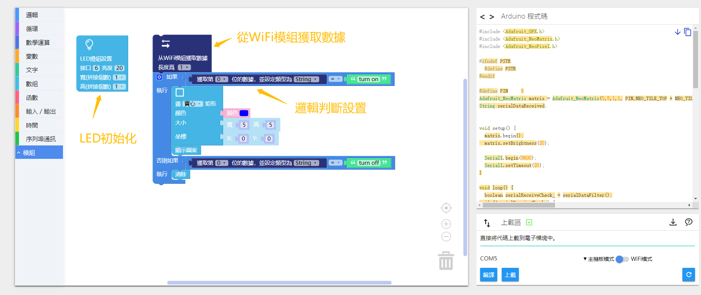
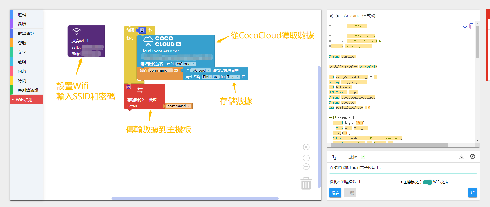

# 体验 AI 特性

## 简介

#### 深度学习机器

通过摄像头拍摄某个场景的很多照片，让机器熟悉这个场景，也就是人工智能中机器学习的过程，随后在网页中可以直接识别到这个场景，并将反馈结果存储到云端，通过 WiFi 通信模块从云端获取对应事件的数据，实现网页与模块交互

#### AI情绪识别
  通过前置摄像头抓取图片，AI系统自动识别使用者人脸照片，判断照片人脸情绪，显示内容是笑脸还是苦脸，并将反馈结果存储到云端，通过 WiFi 通信模块从云端获取对应事件的数据，实现情绪识别与模块交互

#### AI语音识别

通过使用麦克风抓取使用者说话的音频，AI系统自动识别使用者说话内容，将内容存储到云端，通过 WiFi 通信模块从云端获取对应事件的数据，实现语音识别与模块交互

## 界面介绍

CocoBlockly 界面 AI 使用接口
  

  

#### 1. 深度学习机器 ：点击「深度学习机器」图标即可展开

使用前需要先登录账户，，登录完成后再进入「深度学习机器」的界面

「深度学习机器」分为三个模块：

* 输入模块：摄像头拍摄区域
* 训练模块：模型训练区域，分为绿、紫、橙三个训练单元
* 输出模块：显示识别结果，并触发训练时对应效果的事件

### 输入模块

摄像头显示区域，用于截取模型训练使用图片，或进行模型检测

#### 使用说明

* 输入模块需要使用到浏览器摄像头，如果提示如下信息，即无法启动前置摄像头，需要更换链接至( https://cocorobo.cn/cocoblockly/ )

* 当前只支持 Chrome 浏览器使用该功能

* 暂停与启动设置：将鼠标置于摄像头显示区域，会显示「stop/start」字样，点击即可触发，暂停或重新启动该功能

* 暂停使用摄像头的时候，对应的训练事件也会暂停，训练数据和结果显示都会被清除，并置为灰色不可用

### 训练模块

训练模型的区域，共有三个训练单元，分别是绿色训练单元「TRAIN GREEN」、紫色训练单元「TRAIN PURPLE」、橙色训练单元「TRAIN ORANGE」

#### 使用说明

1. 摄像头启动成功后，鼠标左键按住「TRAIN」按钮不要松开，「TRAIN」按钮被按下的过程中机器会自动在对应单元上抓取样例图片，并进行模型训练。

2. 模型训练完毕后，机器会根据输入模块抓取到的实时图片进行单元识别检测，识别的单元会显示对应的自信度，并输出结果到输出模块。
>自信度：即深度学习机器对单元识别出来的结果的信心程度

### 输出模块

显示识别结果的区域，并触发训练时对应效果的事件，输出模块分为三种类型：Cloud 云端事件、音乐事件、语音播放

#### 使用说明

##### Cloud 云端事件

将识别到的结果发送到 Coco Cloud 上，选择云端事件，儅触发「绿色事件」时会向云端发送 {detectA: “yes“， detectB:“no”,  detectC: “no”}，“ yes ”即被触发，“ no ”即未被触发，其中
1. detectA：代表「绿色事件」
2. detectB：代表「紫色事件」
3. detectC：代表「橙色事件」

#### 2. 情绪识别 : 点击「情绪识别」图标即可展开

a.切换按钮:点击启动电脑前置摄像头（注意：如果提示如下信息，即无法启动前置摄像头，需要更换链接至( https://cocorobo.cn/cocoblockly/ )）

b.事件选择：点击可选择 Coco Cloud 内已创建事件（选择事件之前需要保证 CocoBlockly 账户已登录）

c.点击按钮:点击「人脸识别」按钮或直接点击电脑前置摄像头抓取图片，显示在右侧，并且反馈表情检测结果。若在云端事件中，结果会以  {EM_data: "happy/sad/normal"} 的形式发送数据至 Coco Cloud

#### 3. 语音识别 ： 点击「语音识别」图标即可展开

a.事件选择：点击可选择 Coco Cloud 内已创建事件（选择事件之前需要保证 CocoBlockly 账户登录）

b.点击按钮:点击「按下后讲话」按钮后，说出英文指令，系统识别英文指令，并且在按钮右侧反馈识别结果。若在云端事件中，结果会以  {EM_data: "「语音识别出来的内容」"} 的形式发送数据至 Coco Cloud

c.若对著电脑麦克风说话后，电脑无法识别或识别不够敏感，请前往电脑的「声音设置」中调整麦克风的灵敏度，或以外接耳麦德方式接入麦克风

## 使用说明

* 从远端网站（包括 Coco Cloud、IFTTT等）获取数据时，需要配合使用「每隔？秒」积木，防止多次请求导致数据获取失败，且时间间隔不宜太短

  
  

## 深度学习机器案例

#### 案例简介

使用 AI 项目中的「深度学习机器」来训练不同的事件，训练完成后，触发其中的一个事件并通过 Coco Cloud 将数据传到模块上，使 LED 灯根据人的手势显示对应的手势

#### 登录账户

登录账户后，从用户面板进入云端服务（ https://cocorobo.cn/cloud/ ）

#### 创建 Cloud 云端项目

 进入 Coco Cloud 网站，选择创建新的事件，设置项目名为「teachable-machine」

  

 #### Cloud 云端项目示意图

  

#### 主控模式

程序下载： <a href="../xml/ai_project1/teachable_machine_main.xml" download>teachable_machine_main.xml</a>
**请单独给主控模块上传程序**

#### WiFi 模式

程序下载： <a href="../xml/ai_project2/teachable_machine_wifi.xml" download>teachable_machine_wifi.xml</a>
**请单独给WiFi通信模块上传程序，详情请参照- [使用 WiFi 通信模块](/cocomod/wifi)**

> 注：编写程序时，请注意将联网积木中的 WiFi 名称和密码改成你自己要连接的

选择更换项目积木的 API Key

#### 模块组装

将主控模块、WiFi 通信模块以及 LED 灯屏模块拼接在一起

> 注：必须先对主控模块和 WiFi 通信模块分别上传对应模式下的积木程序后，再将这些模块拼接在一起

  
  

#### 效果展示

程序上传成功后，打开「深度学习机器」，注意此处要将「深度学习机器」的项目选择为「teachable-machine」。如下图效果，识别拍摄内容，LED 灯屏显示图案

前往 Coco Cloud 查看对应的事件，如果发送成功，则会显示结果

## 情绪识别案例

#### 案例简介

使用 AI 项目中的「情绪识别」来识别人脸的情绪，然后通过 Coco Cloud 将数据传到模块上，使 LED 灯屏模块可以显示和识别结果一样的表情

#### 登录账户

登录账户后，从用户面板进入云端服务（ https://cocorobo.cn/cloud/ ）

#### 创建 Cloud 云端项目
 进入 Coco Cloud 网站，选择创建新的事件，设置项目名为「camera」

  

 #### Cloud 云端项目示意图

  

#### 主控模式

程序下载： <a href="../xml/ai_project2/emotion_main.xml" download>emotion_main.xml</a>
**请单独给主控模块上传程序**

#### WiFi 模式

程序下载： <a href="../xml/ai_project2/emotion_wifi.xml" download>emotion_wifi.xml</a>
**请单独给WiFi通信模块上传程序，详情请参照- [使用 WiFi 通信模块](/cocomod/wifi)**

> 注：编写程序时，请注意将联网积木中的 WiFi 名称和密码改成你自己要连接的

选择更换项目积木的 API Key

#### 模块组装

将主控模块、WiFi 通信模块以及 LED 灯屏模块拼接在一起

> 注：必须先对主控模块和 WiFi 通信模块分别上传对应模式下的积木程序后，再将这些模块拼接在一起

  
  

#### 效果展示

程序上传成功后，打开「情绪识别」，注意此处要将「情绪识别」的项目选择为「camera」。如下图效果，抓取图片后保存图片，并且显示反馈信息"sad"

随后前往 Coco Cloud 查看对应的事件，如果发送成功，则会显示结果「sad」

LED 灯状态呈现

  
  

## 语音识别案例

#### 案例简介

使用 AI 项目中的「语音识别」来识别英文指令，然后通过 Coco Cloud 将数据传到模块上，控制 LED 灯的亮和灭

#### 登录账户
登录账户后，从用户面板进入云端服务（ https://cocorobo.cn/cloud ）

#### 创建 Cloud 云端项目
 进入 Coco Cloud 网站，选择创建新的事件，设置项目名为「speech」

  

 #### Cloud 云端项目示意图

  

#### 主控模式

程序下载：<a href="../xml/ai_project3/speech_main.xml" download>speech_main.xml</a>
**请单独给主控模块上传程序**

#### WiFi 模式

程序下载：<a href="../xml/ai_project3/speech_wifi.xml" download >speech_wifi.xml</a>
**请单独给WiFi通信模块上传程序，详情请参照- [使用 WiFi 通信模块](/cocomod/wifi)**

> 注：编写程序时，请注意将联网积木中的 WiFi 名称和密码改成你自己要连接的

选择更换项目积木的 API Key

#### 模块组装

将主控模块、WiFi 通信模块以及 LED 灯屏模块拼接在一起

> 注：必须先对主控模块和 WiFi 通信模块分别上传对应模式下的积木程序后，再将这些模块拼接在一起

#### 效果展示
程序上传成功后，打开「语音识别」，注意此处要将「语音识别」的项目选择为「speech」。如下图效果，点击识别按钮「按下后讲话」，说出指令"Turn On"

  

  随后前往 Coco Cloud 查看对应的事件，如果发送成功，则会显示「turn on」

  

  LED 灯屏模块呈现效果

  

---
更新时间：2019年8月
