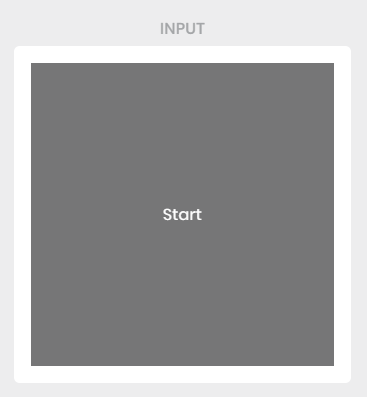
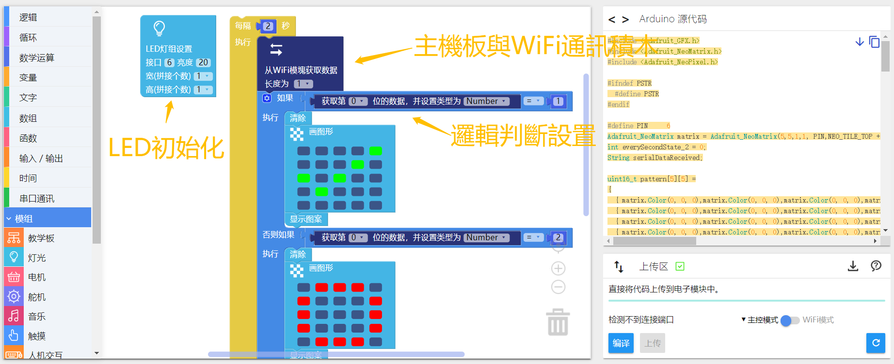
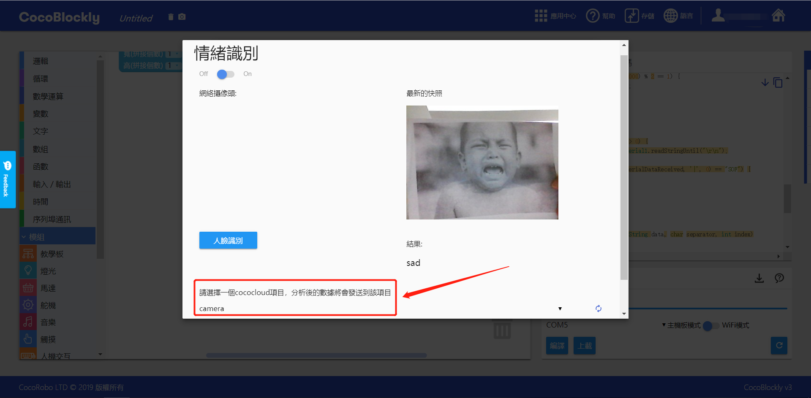
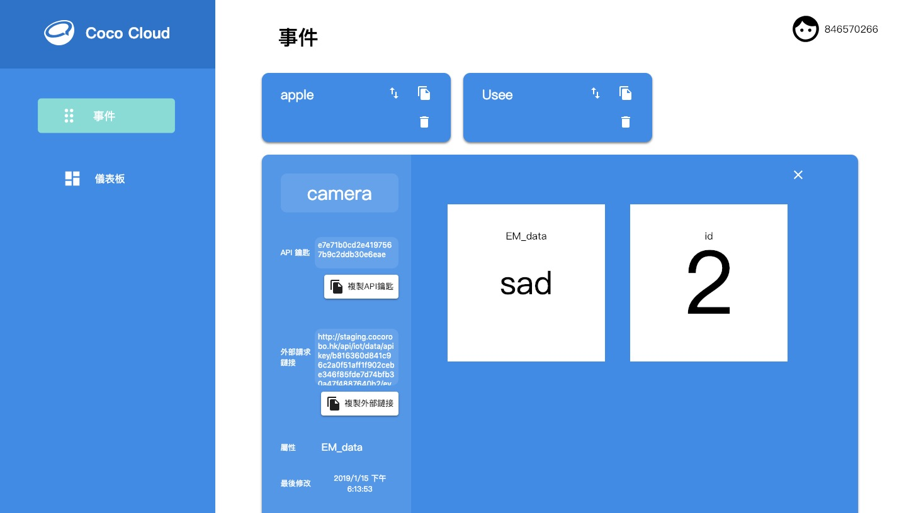

# 體驗 AI 特性

## 簡介

#### 深度學習機器

通過攝像頭拍攝某個場景的很多照片，讓機器熟悉這個場景，也就是人工智能中機器學習的過程，隨後在網頁中可以直接識別到這個場景，并將反饋結果存儲到雲端，通過 WiFi 通訊模組從雲端獲取對應事件的數據，實現網頁與模組交互

#### AI情緒識別
  通過前置攝像頭抓取圖片，AI系統自動識別使用者人臉照片，判斷照片人臉情緒，顯示內容是笑臉還是苦臉，並將反饋結果存儲到雲端，通過 WiFi 通訊模組從雲端獲取對應事件的數據，實現情緒識別與模組交互

#### AI語音識別

通過使用麥克風抓取使用者說話的音頻，AI系統自動識別使用者說話內容，將內容存儲到雲端，通過 WiFi 通訊模組從雲端獲取對應事件的數據，實現語音識別與模組交互

## 界面介紹

CocoBlockly 界面 AI 使用接口
  

  

#### 1. 深度學習機器 ：點擊「深度學習機器」圖標即可展開

使用前需要先登錄賬戶，，登錄完成后再進入「深度學習機器」的界面

「深度學習機器」分爲三個模塊：

* 輸入模塊：攝像頭拍攝區域
* 訓練模塊：模型訓練區域，分爲綠、紫、橙三個訓練單元
* 輸出模塊：顯示識別結果，並觸發訓練時對應效果的事件

### 輸入模塊

攝像頭顯示區域，用於截取模型訓練使用圖片，或進行模型檢測

#### 使用説明

* 輸入模塊需要使用到瀏覽器攝像頭，如果提示如下信息，即無法啓動前置攝像頭，需要更換鏈接至( https://cocorobo.hk/cocoblockly/ )

* 當前只支持 Chrome 瀏覽器使用該功能

* 暫停與啓動設置：將鼠標置於攝像頭顯示區域，會顯示「stop/start」字樣，點擊即可觸發，暫停或重新啓動該功能

* 暫停使用攝像頭的時候，對應的訓練事件也會暫停，訓練數據和結果顯示都會被清除，並置爲灰色不可用

### 訓練模塊

訓練模型的區域，共有三個訓練單元，分別是綠色訓練單元「TRAIN GREEN」、紫色訓練單元「TRAIN PURPLE」、橙色訓練單元「TRAIN ORANGE」

#### 使用説明

1. 攝像頭啓動成功后，鼠標左鍵按住「TRAIN」按鈕不要鬆開，「TRAIN」按鈕被按下的過程中機器會自動在對應單元上抓取樣例圖片，並進行模型訓練。

2. 模型訓練完畢后，機器會根據輸入模塊抓取到的實時圖片進行單元識別檢測，識別的單元會顯示對應的自信度，並輸出結果到輸出模塊。
>自信度：即深度學習機器對單元識別出來的結果的信心程度

### 輸出模塊

顯示識別結果的區域，並觸發訓練時對應效果的事件，輸出模塊分爲三種類型：Cloud 雲端事件、音樂事件、語音播放

#### 使用説明

##### Cloud 雲端事件

將識別到的結果發送到 Coco Cloud 上，選擇雲端事件，儅觸發「綠色事件」時會向雲端發送 {detectA: “yes“， detectB:“no”,  detectC: “no”}，“ yes ”即被觸發，“ no ”即未被觸發，其中
1. detectA：代表「綠色事件」
2. detectB：代表「紫色事件」
3. detectC：代表「橙色事件」

#### 2. 情緒識別 : 點擊「情緒識別」圖標即可展開

a.切換按鈕:點擊啓動電腦前置攝像頭（注意：如果提示如下信息，即無法啓動前置攝像頭，需要更換鏈接至( https://cocorobo.hk/cocoblockly/ )）

b.事件選擇：點擊可選擇 Coco Cloud 內已創建事件（選擇事件之前需要保證 CocoBlockly 賬戶已登錄）

c.點擊按鈕:點擊「人臉識別」按鈕或直接點擊電腦前置攝像頭抓取圖片，顯示在右側，並且反饋表情檢測結果。若在雲端事件中，結果會以  {EM_data: "happy/sad/normal"} 的形式發送數據至 Coco Cloud

#### 3. 語音識別 ： 點擊「語音識別」圖標即可展開

a.事件選擇：點擊可選擇 Coco Cloud 內已創建事件（選擇事件之前需要保證 CocoBlockly 賬戶登錄）

b.點擊按鈕:點擊「按下后講話」按鈕后，説出英文指令，系統識別英文指令，并且在按鈕右側反饋識別結果。若在雲端事件中，結果會以  {EM_data: "「語音識別出來的内容」"} 的形式發送數據至 Coco Cloud

## 使用説明

* 從遠端網站（包括 Coco Cloud、IFTTT等）獲取數據時，需要配合使用「每隔？秒」積木，防止多次請求導致數據獲取失敗，且時間間隔不宜太短

  
  

## 深度學習機器案例

#### 案例簡介

使用 AI 項目中的「深度學習機器」來訓練不同的事件，訓練完成后，觸發其中的一個事件並通過 Coco Cloud 將數據傳到模組上，使 LED 燈根據觸發的事件顯示對應的顔色

#### 登錄賬戶

登錄賬戶后，從用戶面板進入雲端服務（ https://cocorobo.hk/cloud/ ）

#### 創建 Cloud 雲端項目

 進入 Coco Cloud 網站，選擇創建新的事件，設置項目名為「teachable-machine」

  

 #### Cloud 雲端項目示意圖

  

#### 主機板模式

程式下載： <a href="../xml/ai_project1/teachable_machine_main.xml" download>teachable_machine_main.xml</a>
**請單獨給主機板模組上傳程式**

#### WiFi 模式

程式下載： <a href="../xml/ai_project2/teachable_machine_wifi.xml" download>teachable_machine_wifi.xml</a>
**請單獨給WiFi通訊模組上傳程式，詳情請參照- [使用 WiFi 通訊模組](/cocomod/wifi)**

> 注：編寫程式時，請注意將聯網積木中的 WiFi 名稱和密碼改成你自己要連接的

選擇更換項目積木的 API Key

#### 模組組裝

將主機板模組、WiFi 通訊模組以及 LED 燈屏模組拼接在一起

> 注：必須先對主機板模組和 WiFi 通訊模組分別上傳對應模式下的積木程式后，再將這些模組拼接在一起

  
  

#### 效果展示

程式上傳成功后，打开「深度學習機器」，注意此處要將「深度學習機器」的項目選擇為「teachable-machine」。如下圖效果，識別拍攝内容，LED 燈屏顯示圖案

前往 Coco Cloud 查看對應的事件，如果發送成功，則會顯示結果

## 情緒識別案例

#### 案例簡介

使用 AI 項目中的「情緒識別」來識別人臉的情緒，然後通過 Coco Cloud 將數據傳到模組上，使 LED 燈屏模組可以顯示和識別結果一樣的表情

#### 登錄賬戶

登錄賬戶后，從用戶面板進入雲端服務（ https://cocorobo.hk/cloud/ ）

#### 創建 Cloud 雲端項目
 進入 Coco Cloud 網站，選擇創建新的事件，設置項目名為「camera」

  

 #### Cloud 雲端項目示意圖

  

#### 主機板模式

程式下載： <a href="../xml/ai_project2/emotion_main.xml" download>emotion_main.xml</a>
**請單獨給主機板模組上傳程式**

#### WiFi 模式

程式下載： <a href="../xml/ai_project2/emotion_wifi.xml" download>emotion_wifi.xml</a>
**請單獨給WiFi通訊模組上傳程式，詳情請參照- [使用 WiFi 通訊模組](/cocomod/wifi)**

> 注：編寫程式時，請注意將聯網積木中的 WiFi 名稱和密碼改成你自己要連接的

選擇更換項目積木的 API Key

#### 模組組裝

將主機板模組、WiFi 通訊模組以及 LED 燈屏模組拼接在一起

> 注：必須先對主機板模組和 WiFi 通訊模組分別上傳對應模式下的積木程式后，再將這些模組拼接在一起

  
  

#### 效果展示

程式上傳成功后，打开「情緒識別」，注意此處要將「情緒識別」的項目選擇為「camera」。如下圖效果，抓取圖片後保存圖片，並且顯示反饋信息"sad"

隨後前往 Coco Cloud 查看對應的事件，如果發送成功，則會顯示結果「sad」

LED 燈狀態呈現

  
  

## 語音識別案例

#### 案例簡介

使用 AI 項目中的「語音識別」來識別英文指令，然後通過 Coco Cloud 將數據傳到模組上，控制 LED 燈的亮和滅

#### 登錄賬戶
登錄賬戶后，從用戶面板進入雲端服務（ https://cocorobo.hk/cloud ）

#### 創建 Cloud 雲端項目
 進入 Coco Cloud 網站，選擇創建新的事件，設置項目名為「speech」

  

 #### Cloud 雲端項目示意圖

  

#### 主機板模式

程式下載：<a href="../xml/ai_project3/speech_main.xml" download>speech_main.xml</a>
**請單獨給主機板模組上傳程式**

#### WiFi 模式

程式下載：<a href="../xml/ai_project3/speech_wifi.xml" download >speech_wifi.xml</a>
**請單獨給WiFi通訊模組上傳程式，詳情請參照- [使用 WiFi 通訊模組](/cocomod/wifi)**

> 注：編寫程式時，請注意將聯網積木中的 WiFi 名稱和密碼改成你自己要連接的

選擇更換項目積木的 API Key

#### 模組組裝

將主機板模組、WiFi 通訊模組以及 LED 燈屏模組拼接在一起

> 注：必須先對主機板模組和 WiFi 通訊模組分別上傳對應模式下的積木程式后，再將這些模組拼接在一起

#### 效果展示
程式上傳成功后，打开「語音識別」，注意此處要將「語音識別」的項目選擇為「speech」。如下圖效果，點擊識別按鈕「按下后講話」，説出指令"Turn On"

  

  隨後前往 Coco Cloud 查看對應的事件，如果發送成功，則會顯示「turn on」

  

  LED 燈屏模組呈現效果

  
