# 雲端存取檔案
---
## 簡介
除了在計算機本地存儲積木文件外，用戶還可以在CocoBlockly上創建其個人賬戶、從CocoRobo公司的雲端服務器上存儲和隨時隨地調用其所撰寫的編程積木檔案。教師或學生將能夠根據需要在不同終端上傳和下載其檔案。

---

## 使用說明
使用雲端存取檔案功能需要用戶先進行賬戶登陸
點擊頁面右上角的賬戶圖標

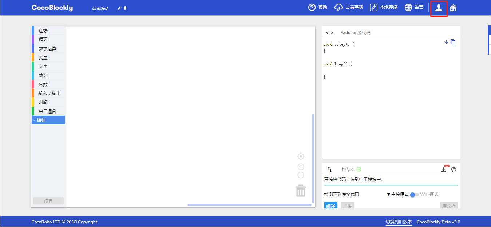

彈出登錄窗口，進行登入操作

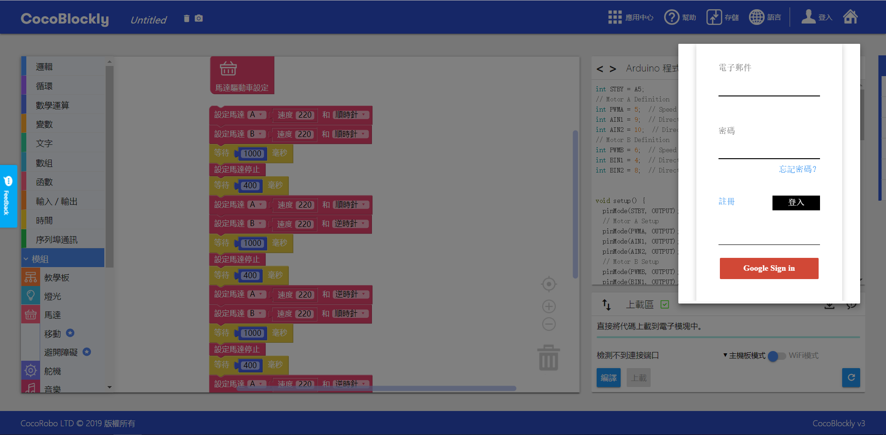

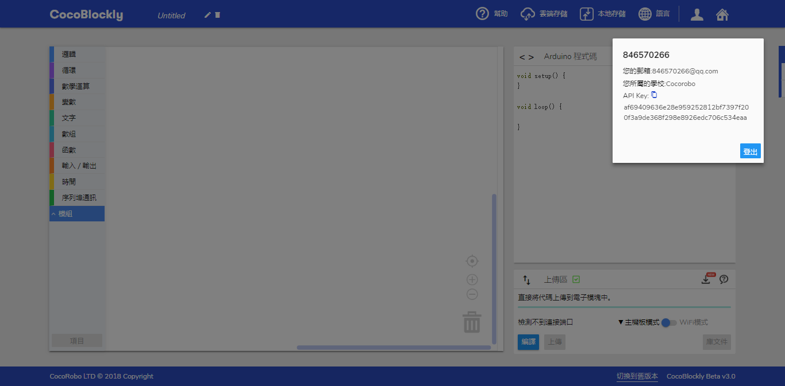

登錄成功後，點擊導航欄的**雲端存儲**

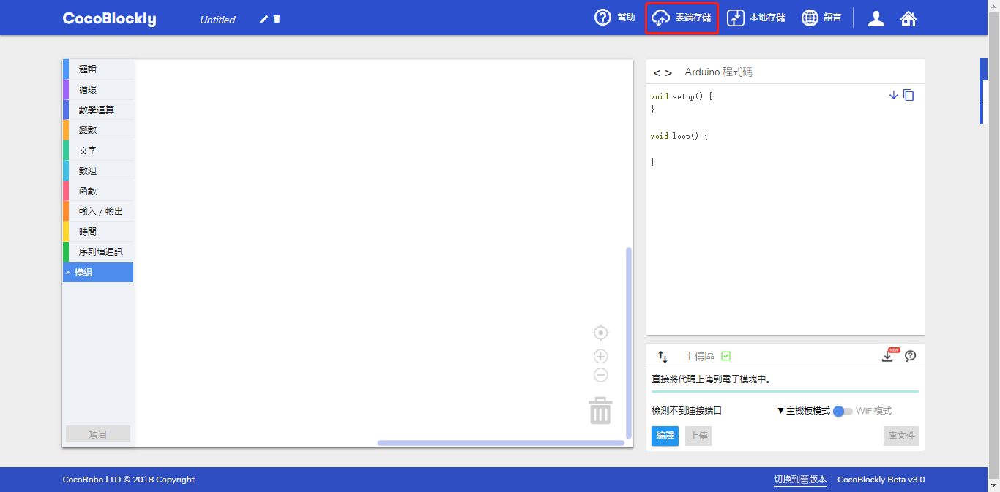

即會彈出雲端存儲界面

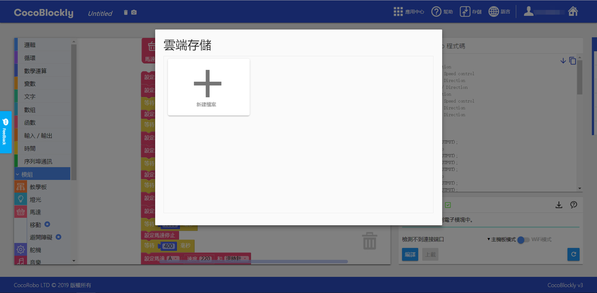

雲端存儲界面分爲三部分從上至下依次爲:*檔案命名區*，*檔案列表顯示區*，*檔案操作區*

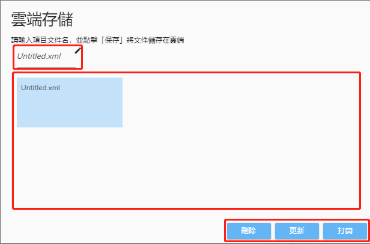

---
## 上傳檔案
在雲端存儲界面的檔案命名區對要保存的檔案進行命名

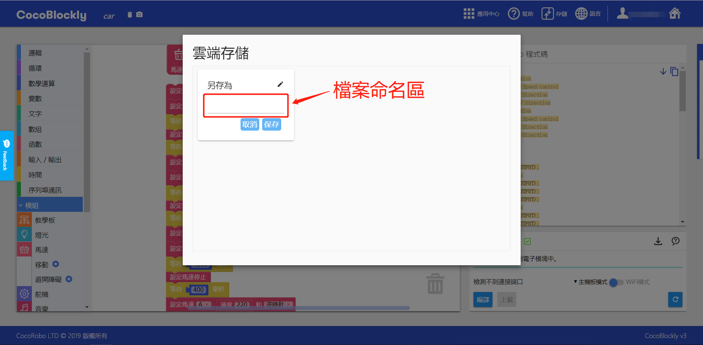

點擊保存按鈕，儅檔案成功上傳至雲端時，界面右上方會彈出提示，雲端存儲檔案顯示區會新增已保存文件

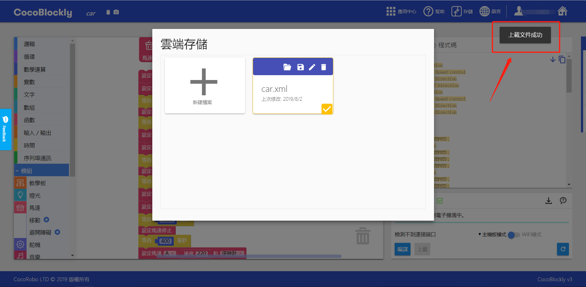

---
## 更新檔案

對已存在雲端的檔案進行更新，點擊**列表顯示區**要更新的檔案，檔案選中後會顯示爲藍色高亮，**檔案操作區**的按鈕會自動更換

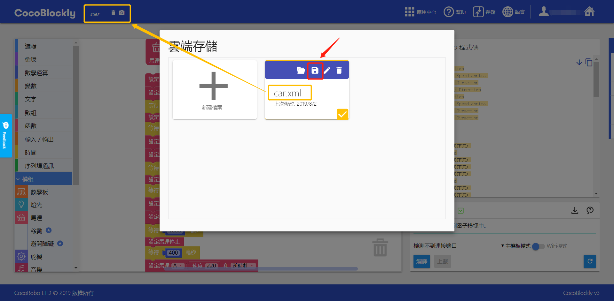

點擊更新按鈕，檔案會自動更新到對應的雲端存儲的檔案文件內。成功更新後，界面右上方會彈出提示。

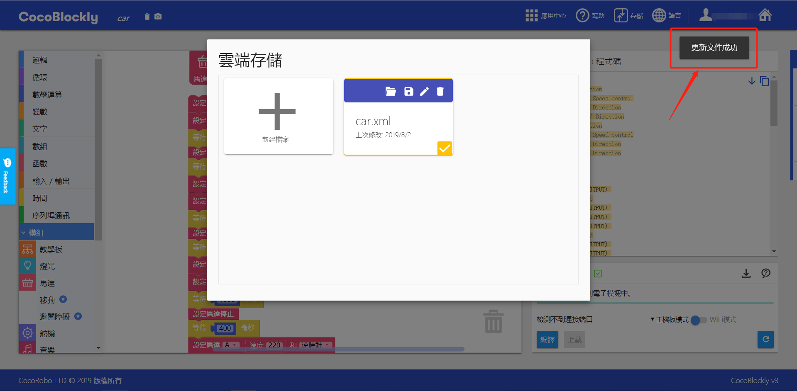

---
## 打開檔案

點擊**列表顯示區**要打開的檔案，檔案選中後會顯示爲藍色高亮，**檔案操作區**的按鈕會自動更換，點擊打開按鈕

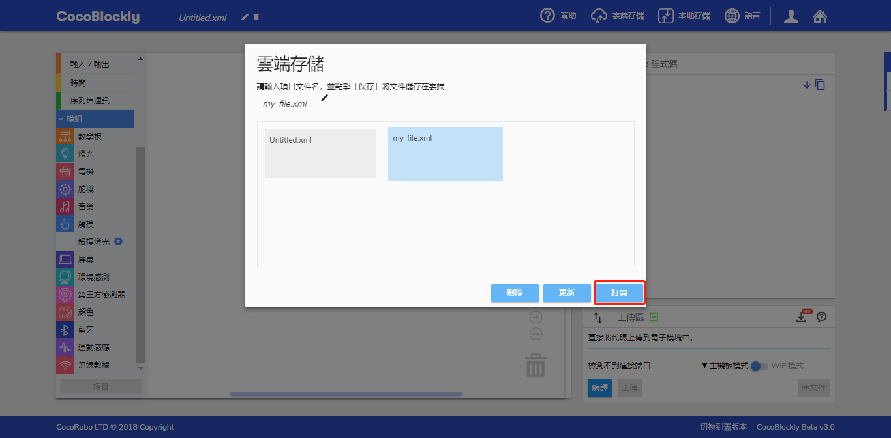

成功打開檔案後，雲端存儲界面會自動關閉，積木工作區會根據文件類型自動切換模式（主機板模式/WiFi模式），並且自動生成對應積木，界面右上角會彈出提示。

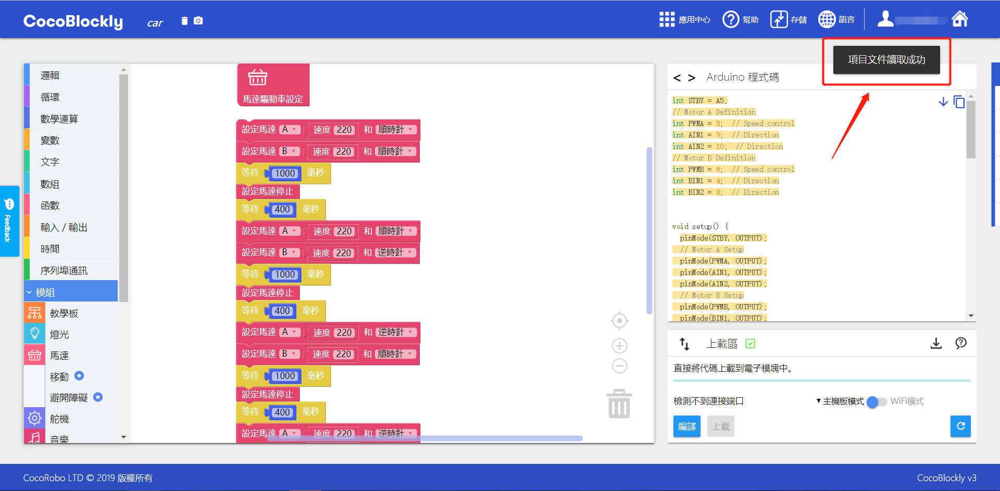

---
## 刪除檔案

點擊**列表顯示區**要刪除的檔案，檔案選中後會顯示爲藍色高亮，**檔案操作區**的按鈕會自動更換，點擊刪除按鈕

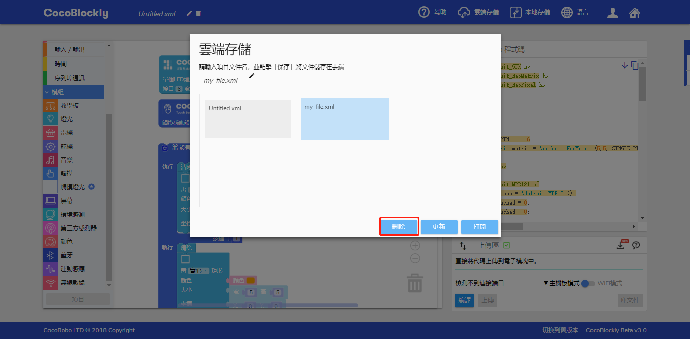

成功刪除檔案後，列表顯示區內已刪除文件會消失，界面右上角會彈出提示。

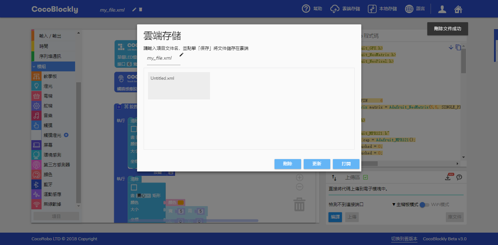

---
### 常見檔案打開錯誤：

CocoBlockly版本更新後，雲端存儲檔案版本與CocoBlockly版本不匹配。部分積木已被更改，且不能正常加載

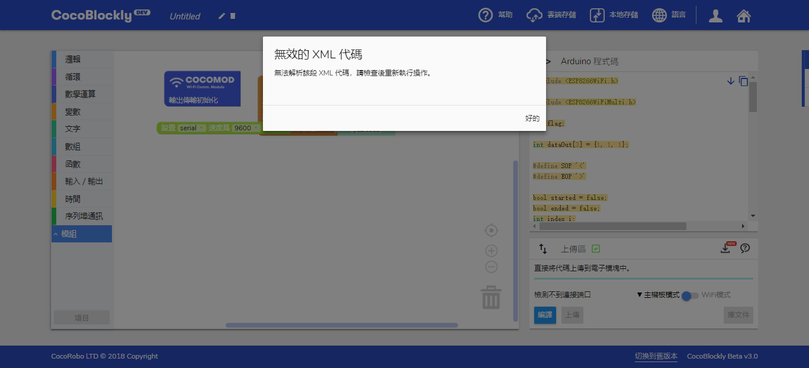

### 導入錯誤解決方案

 1. 點擊導航欄的*垃圾桶*圖標刪除工作區所有積木

 2. 刷新頁面即可
