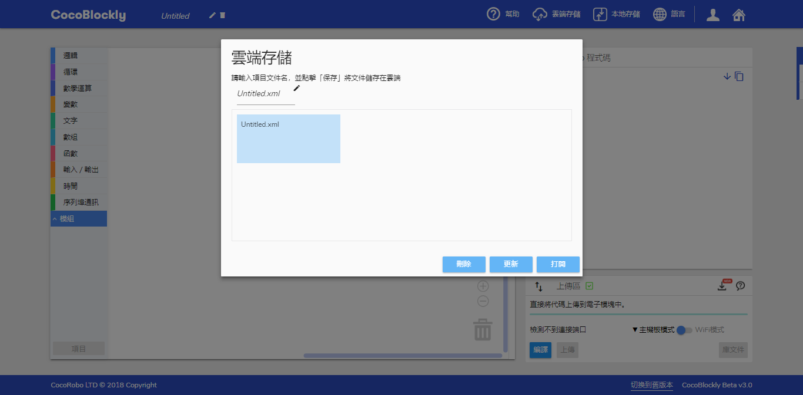
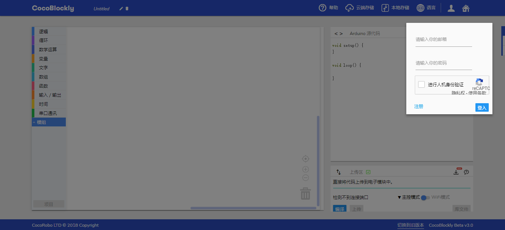
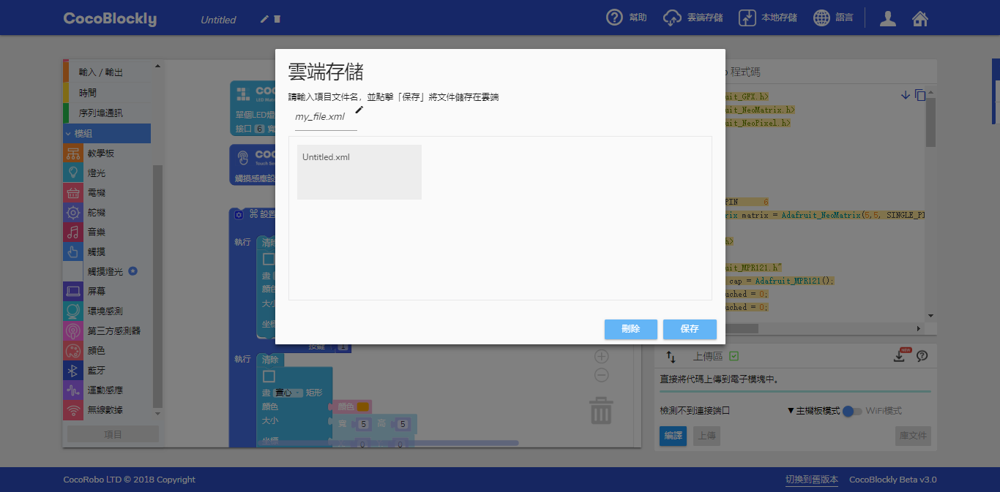
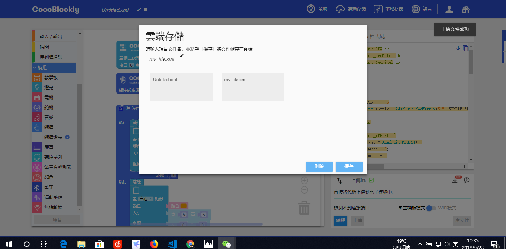

# 雲端存取檔案

	本部分內容仍在更新中，如有任何疑問，請聯繫 support-hk@cocorobo.cc，帶來的不便，請您諒解。

---
## 簡介

除了在計算機本地存儲積木文件外，用戶還可以在 CocoBlockly 上創建個人賬戶、從CocoRobo公司的雲端服務器上存儲，然後即可隨時隨地調用其所撰寫的編程積木檔案。教師或學生將能夠根據需要在不同終端上傳和下載其檔案。

---

## 使用說明
使用雲端存取檔案功能需要用戶先進行賬戶登錄，點擊頁面右上角的賬戶圖標

彈出登錄窗口，進行登入操作

登錄成功後，點擊導航欄的「存儲」->「雲端存儲」

即會彈出雲端存儲界面

---
## 上傳檔案

點擊「新建檔案」按鍵，在雲端新建一個檔案來存儲當前的項目

在雲端存儲界面的檔案命名區對要保存的檔案進行命名

點擊保存按鈕，儅檔案成功上傳至雲端時，界面右上方會彈出提示，雲端存儲檔案顯示區會新增已保存文件

---
## 更新檔案

對已存在雲端的檔案進行更新，打開雲端存儲的窗口，找到對應的檔案，直接點擊該檔案的「保存檔案」按鈕，檔案就會自動更新到對應的雲端存儲的檔案文件內

成功更新後，界面右上方會彈出提示。

---
## 打開檔案

打開雲端存儲的窗口，找到要打開的檔案，直接點擊該檔案的「打開檔案」按鈕，即可打開對應檔案

成功打開檔案後，雲端存儲界面會自動關閉，積木工作區會根據文件類型自動切換模式（主機板模式/WiFi模式），並且自動生成對應積木，界面右上角會彈出提示。

---
## 刪除檔案

打開雲端存儲的窗口，找到要刪除的檔案，直接點擊該檔案的「刪除檔案」按鈕，即可刪除對應檔案

成功刪除檔案後，列表顯示區內已刪除文件會消失，界面右上角會彈出提示。

---
## 編輯檔案信息

打開雲端存儲的窗口，找到要修改信息的檔案，直接點擊該檔案的「編輯檔案」按鈕，即可修改對應檔案的名稱

---

### 常見檔案打開錯誤

CocoBlockly 版本更新後，雲端存儲檔案版本與 CocoBlockly 版本不匹配。部分積木已被更改，且不能正常加載
<!--

-->
### 導入錯誤解決方案

 1. 點擊導航欄的*垃圾桶*圖標刪除工作區所有積木

 2. 刷新頁面即可
