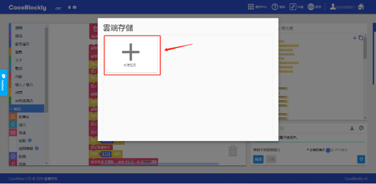

# Cloud Storage

	This part is still being updated. Please contact our staff at support-hk@cocorobo.cc if you have any questions. Please accept our apologies for any inconvenience this might cause.

---
## Introduction

Apart from storing files in the computer locally, you can create an account in CocoBlockly, store files in the Cloud server of CocoRobo and retrieve block program files at any time. Teachers and students can upload or download their files from different terminals on the basis of their own needs.

---

## Instructions
You need to click the account icon on the upper right corner and log into your account before using Cloud storage.

Fill the blanks when login window pops up.

After successful login, click "Storage" and "Cloud Storage".

Then the Cloud storage interface will pop up.

---
## Upload Files

Click "New file" to create a file for storing the present program.

You need to name the stored file in the name blank.

Click the "save" button to upload the file to the Cloud. Then "Upload successfully" will be shown at the upper right corner. And new file will appear in the Cloud storage file demonstration area.

---
## Update Files

To update a stored file, you need to open the Cloud storage window, find the file and click the "save" button. Then the file will be updated automatically to its corresponding Cloud folder.

"update successfully" will be shown on the upper right corner after successful update.

---
## Open Files

You can open a file by opening the Cloud storage window, finding the file and directly clicking the "open" button.

After successfully opening the file, the Cloud storage interface will close automatically; block area will, based on the type of the file, automatically switch mode (main controller mode or WiFi mode) and generate corresponding blocks. And a prompt will be displayed on the upper right corner.

---
## Delete Files

You can delete a file by opening the Cloud storage window, finding the file and directly clicking the "delete" button.

After successful deletion, the file will disappear from the list. And a prompt will be displayed on the upper right corner.

---
## Edit File Information

You can edit the information of a file by opening the Cloud storage window, finding the file and directly clicking the "edit" button.

---

### Common Mistakes of Opening Files

In case CocoBlockly is updated, the previously stored files will not be compatible with the new version. In addition, some blocks are changed and cannot be uploaded normally.
<!--

-->
### Solution to Importing Mistakes

 1. Delete the icon as shown in the picture to delete all blocks in the working area.

 2. Refresh the page.

 ---
 Updated in August 2019
