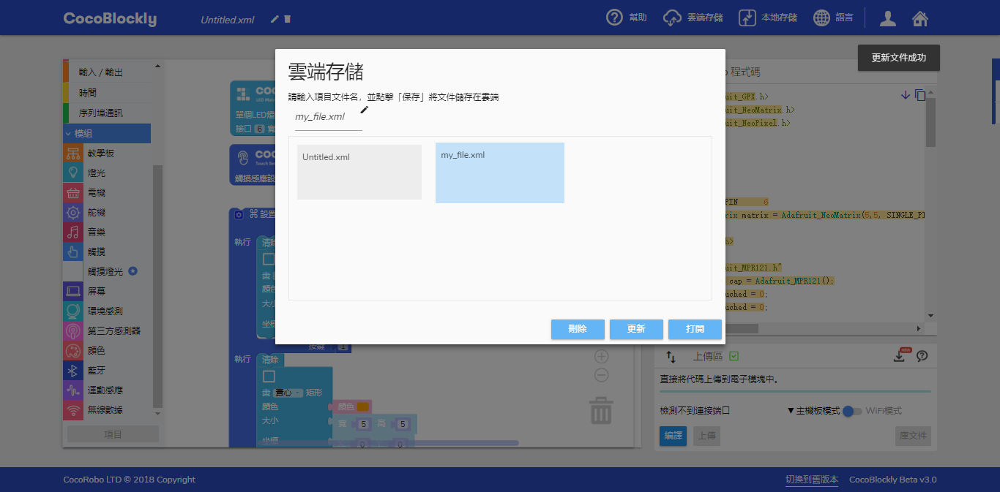

# 云端存取档案

	本部分内容仍在更新中，如有任何疑问，请联系 support@cocorobo.cc，带来的不便，请您谅解。

---
## 简介

除了在计算机本地存储积木文件外，用户还可以在 CocoBlockly 上创建个人账户、从CocoRobo公司的云端服务器上存储，然后即可随时随地调用其所撰写的编程积木档案。教师或学生将能够根据需要在不同终端上传和下载其档案。

---

## 使用说明
使用云端存取档案功能需要用户先进行账户登录，点击页面右上角的账户图标

弹出登录窗口，进行登入操作

登录成功后，点击导航栏的「存储」->「云端存储」

即会弹出云端存储界面

---
## 上传档案

点击「新建档案」按键，在云端新建一个档案来存储当前的项目

在云端存储界面的档案命名区对要保存的档案进行命名

点击保存按钮，儅档案成功上传至云端时，界面右上方会弹出提示，云端存储档案显示区会新增已保存文件

---
## 更新档案

对已存在云端的档案进行更新，打开云端存储的窗口，找到对应的档案，直接点击该档案的「保存档案」按钮，档案就会自动更新到对应的云端存储的档案文件内

成功更新后，界面右上方会弹出提示。

---
## 打开档案

打开云端存储的窗口，找到要打开的档案，直接点击该档案的「打开档案」按钮，即可打开对应档案

成功打开档案后，云端存储界面会自动关闭，积木工作区会根据文件类型自动切换模式（主控模式/WiFi模式），并且自动生成对应积木，界面右上角会弹出提示。

---
## 删除档案

打开云端存储的窗口，找到要删除的档案，直接点击该档案的「删除档案」按钮，即可删除对应档案

成功删除档案后，列表显示区内已删除文件会消失，界面右上角会弹出提示。

---
## 编辑档案信息

打开云端存储的窗口，找到要修改信息的档案，直接点击该档案的「编辑档案」按钮，即可修改对应档案的名称

---

### 常见档案打开错误

CocoBlockly 版本更新后，云端存储档案版本与 CocoBlockly 版本不匹配。部分积木已被更改，且不能正常加载
<!--

-->
### 导入错误解决方案

 1. 点击导航栏的*垃圾桶*图标删除工作区所有积木

 2. 刷新页面即可

 ---
 更新时间：2019年8月
