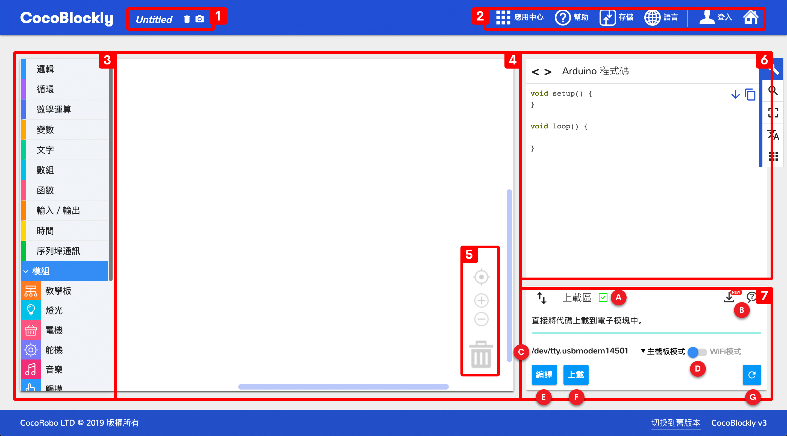
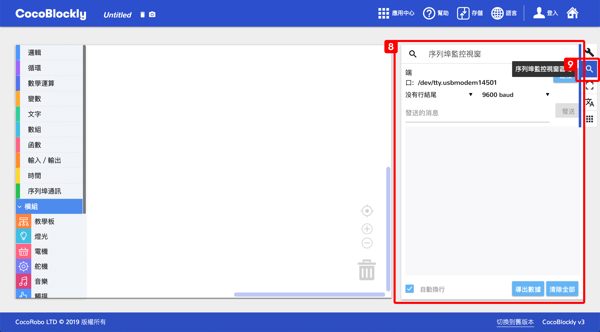
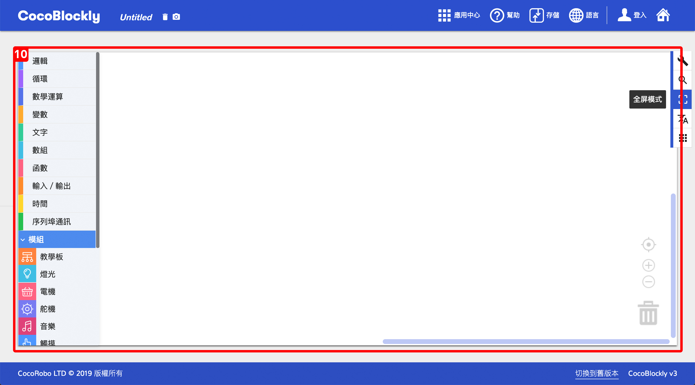
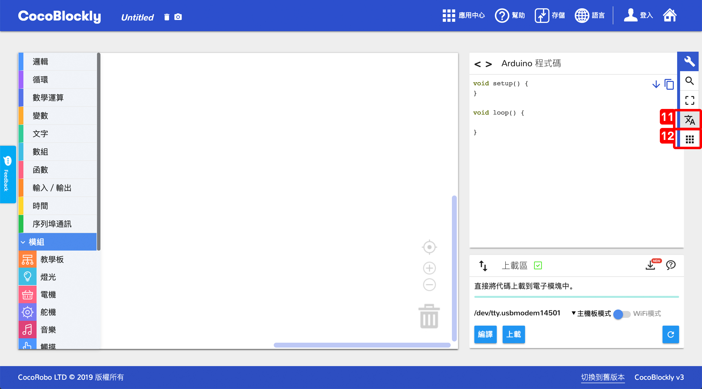

## CocoBlockly 界面介紹
---

1. **程式檔案名稱**：當前正在編輯的程式檔案的名稱，會成爲下載後的程式檔案名，右側兩個按鈕分別爲「刪除所有積木」和「將所有積木截屏並導出圖片」；
2. **通用工具列**：包含常用的一些功能，比如：導入/導出項目文件、在線幫助；
3. **積木功能欄**：所有積木都可以從這個功能欄中拖取，並分「基礎積木」和「模組積木」兩類；
4. **積木設計區**：將積木拖進該區域進行程式設計，點擊空白部分可以拖拽整個區域；
5. **積木設計區工具列**：包含：「視角重置」、「放大/縮小視角」、「刪除積木」功能；
6. **積木對應原始碼參考區**：「積木設計區」生成的原始碼（C語言），一般情況並不會用到；
7. **程式上傳區**：最重要的部分，我們將在此處將程式上傳至電子模組中；
	- A：上傳插件連接狀態，已連接將會顯示綠色的勾，未連接則顯示黃色的驚歎號，編程時，請確保此處的狀態爲已連接；
	- B：此處的兩個圖標按鈕，第一個點擊以後可以下載對應作業系統的 CocoBlockly Uploader，第二個點擊以後可以前往瞭解相關問題解答；
	- C：模組端口名稱，當連接好主機板模組或者 WiFi 通訊模組後，此處便會有名稱，Windows 下的名稱爲「COM」開頭，macOS 下的名稱爲「/dev/cu.」開頭；
	- D：CocoBlockly 模式切換，點擊此處後，將會切換編程模式，工具欄中的積木也會隨之變化；
	- E：編譯，將寫好的積木程式，發送至雲端編譯服務進行驗證，驗證是否正確，如果驗證通過，該區域將會顯示「編譯成功」，如果不通過，將會顯示「編譯失敗」；
	- F：上載，將寫好的積木程式編譯，編譯完以後將程式上傳至已經連接好的主機板模組或者 WiFi 通訊模組中；
	- G：重啓 Uploader，如遇到任何上傳問題，您可以嘗試點擊該按鈕將本機的 CocoBlockly Uploader 重啓再試；

8. **序列埠監控視窗**：點擊「側邊工具欄」中的「序列埠監控視窗區域」，可以切換到「序列埠監控視窗」；「序列埠監控視窗」可以配合「程式上傳區」對電子模組進行調試
9. **側邊工具欄**：包含：「Arduino 代碼區域 & 上傳區域」、「序列埠監控視窗區域」、「全屏模式」功能；

10. **全屏模式**：點擊「側邊工具欄」中的「全屏模式」，將放大整個「積木設計區」至全屏；

11. **語言切換**：點擊「側邊工具欄」中的「語言選擇」，可以切換至不同語言的界面； 
12. **應用中心**：點擊「側邊工具欄」中的「應用中心」，可以打開「應用中心」彈窗