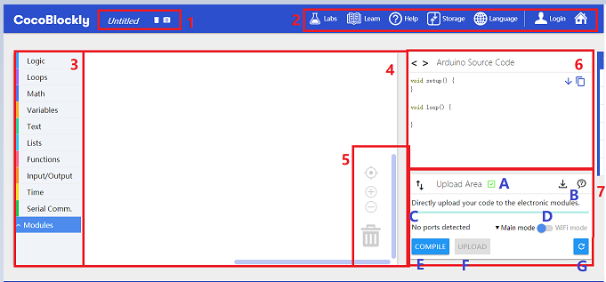
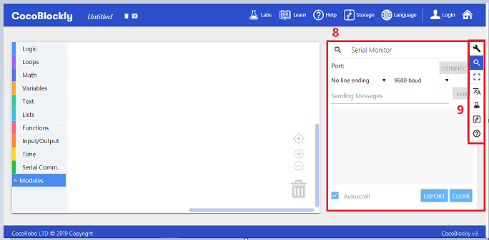
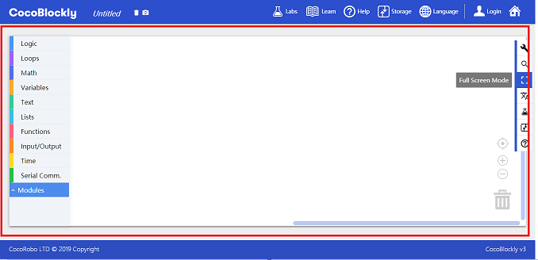
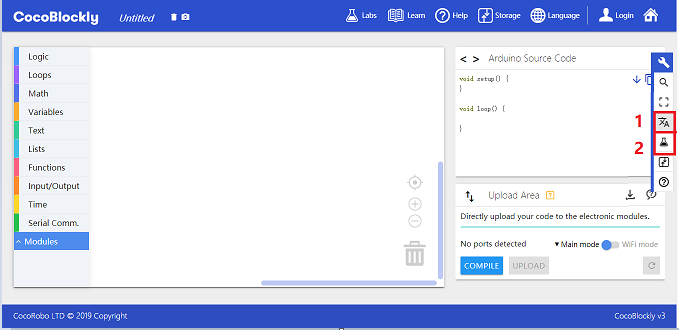

## CocoBlockly Interface
---

1. **Program Name**: The name of the currently written program will also be the name of downloaded program. The two buttons on the right are "delete all blocks" and "take a snapshot" respectively.
2. **General Tools**: Include some common functions such as import/export program, online assistance and so on.
3. **Block Function List**: All blocks can be dragged from this list, which is divided into "Basic Blocks" and "Module Blocks".
4. **Block Designing Area**: Drag blocks to this area for writing programs; the whole area can be dragged by clicking the blank area.
5. **Block Designing Area Tools**: Include the following functions: view adjustment, increase/decrease the block size and delete blocks.
6. **Block Source Code Reference Area**: This area shows the source code (C language) of block designing area. It is seldom used for the most part.
7. **Program Uploading Area**: This area is very important. Programs are sent to electronic modules in this area.
	- A: Uploader Connection: The box is checked with a green tick if the Uploader is connected; the box is checked with a yellow question mark if the Uploader is disconnected; Please make sure that the Uploader is connected while you are compiling a program.
	- B: There are two icon buttons here: One is for downloading the CocoBlockly Uploader; the other is the instruction for downloading and installing the Uploader.
	- C: Module port name: There is a name here when it is connected to the main controller or WiFi communication module. The name begins with "COM" in the Windows system and with "/dev/cu." in the macOS system.
	- D: CocoBlockly Mode Switch: You can switch programming mode by clicking here. And the blocks in the toolbar will also change accordingly.
	- E: Compile: Send the block program to Cloud for verification. If it is correct, "Compile successfully" will be shown here. Or "Compile failed" will be shown here.
	- F: Upload: Upload the successfully compiled programs to the well-connected main controller or WiFi communication module.
	- G: Relaunch Uploader: You can click here to relaunch CocoBlockly Uploader in case of uploading problems.

8. **Serial Monitor Window**: You can switch to serial monitor window by clicking the "Serial Monitor Area" in the sidebar. You can use "serial monitor window" together with "Upload Area" to test the electronic modules.
9. **Sidebar**: Include the functions of "Arduino Code Area & Upload Area", "Serial Monitor Area" and "Full Screen Mode".

10. **Full Screen Mode**: Click the "Full Screen Mode" in the sidebar to magnify the whole "block designing are" to full screen.

11. **Language**: Click the "Language" in the sidebar to switch to a different language.
12. **Application Center**: Click the "Application Center" in the sidebar to pop up the window of "Application Center".

---
Updated in August 2019
