# 編程界面入門

---

## CocoBlockly Uploader
爲了能夠讓 CocoBlockly 能夠從瀏覽器和主機板模組進行通訊，我們推出一款跨平臺的「上傳插件（Uploader）」，用戶只需要下載該插件，安裝即可對我們的電子模組進行上傳編程。
首先，請選擇對應的操作系統，下載 CocoBlockly Uploader 安裝包。

1. 安裝包下載

| 作業平臺                            | 下載     | 系統要求                   |
| ----------------------------------- | -------- | -------------------------- |
| CocoBlockly Uploader v3 for MacOS   | [下載地址](https://api.cocorobo.hk/releases/uploaderv2/download/mac) | 要求系統版本高於 macOS 10.10     |
| CocoBlockly Uploader v3 for Windows | [下載地址](https://api.cocorobo.hk/releases/uploaderv2/download/windows) | 要求系統版本高於 Windows 7 |

本安裝包對應的 CocoBlockly 使用鏈接爲：http://cocorobo.hk/cocoblockly/
<!-- pagebreak -->
2. 安裝指示
    - **Windows**
        - 雙擊安裝包，然後根據指示選擇目標的資料夾進行安裝

        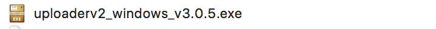

        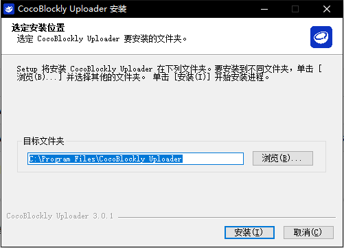

        - 在安裝的過程中，會依次彈出協助安裝 Arduino 驅動和 WiFi 模組驅動的界面，可以根據指示依次安裝（如果已經安裝過該驅動，可以選擇取消跳過）

        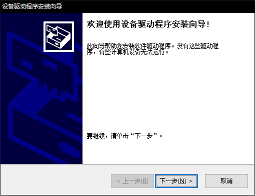
        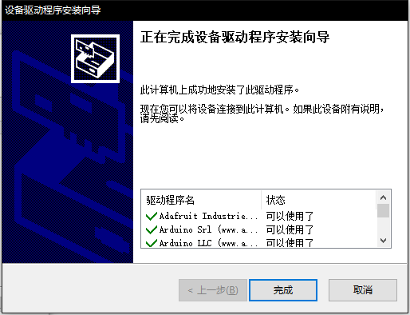
        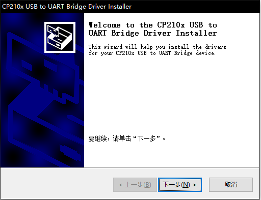
        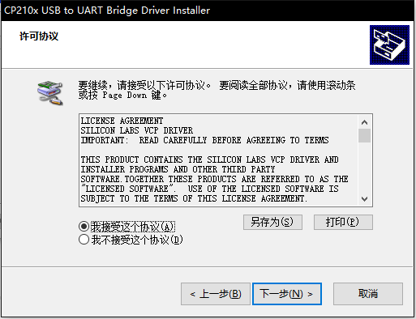
        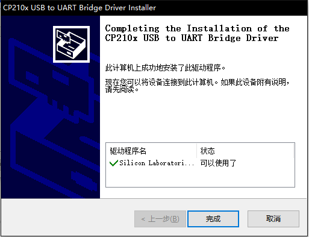

        - 最後，點擊「完成」結束 Uploader 安裝過程

        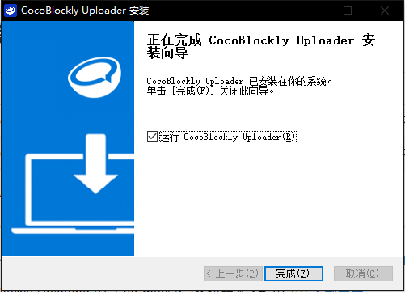

    - **MacOS**
        - 選擇下載得到的 **zip** 文檔，並解壓這個文檔，得到安裝包

        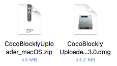

        - 右鍵點擊安裝包，選擇打開，彈出以下窗口後，點擊「打開」以打開安裝包

            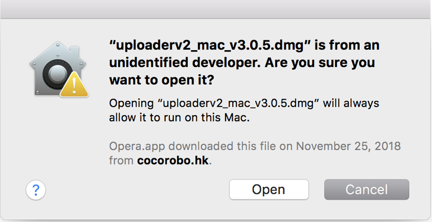

        - 在界面中，將「CocoBlockly Uploader」拖入右側的「Applications」資料夾中，隨後可能會需要輸入您的賬戶密碼，授權進行安裝

        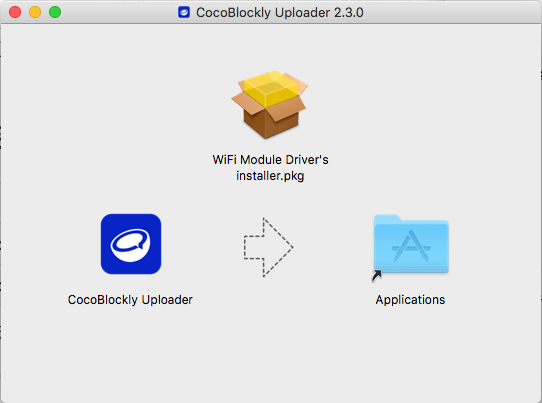
        
        - 如果需要安裝 WiFi 模組驅動
            - 雙擊「WiFi Module Driver's installer.pkg」
            - 點擊「繼續」
        
            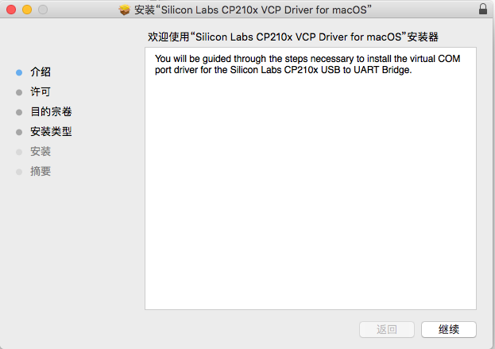
        
            - 點擊「繼續」
        
            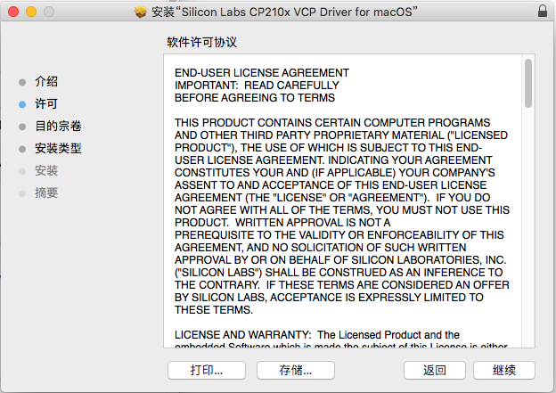
        
            - 點擊「安裝」，隨後可能會需要輸入您的賬戶密碼，授權進行安裝
        
            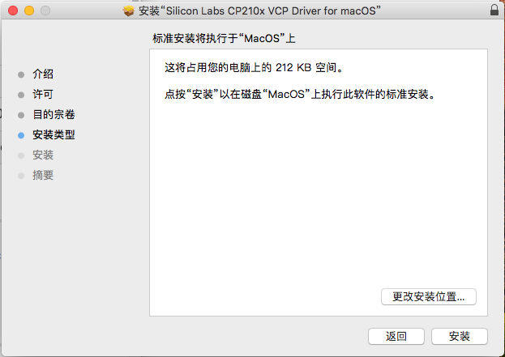
        
            - 點擊「關閉」，完成 WiFi 模組驅動的安裝
        
            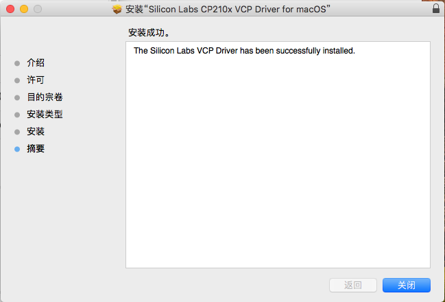
        
        - 安裝完成後，雙擊「Applications」進入應用程式資料夾，通過雙擊「CocoBlockly Uploader」的圖標，打開「CocoBlockly Uploader」
<!-- pagebreak -->

3. 可以前往以下網頁瞭解更多：https://cocorobolabs.gitbooks.io/cocoblockly/content/uploader-xia-zai-ji-an-zhuang.html

---

## CocoBlockly 界面及功能介紹

    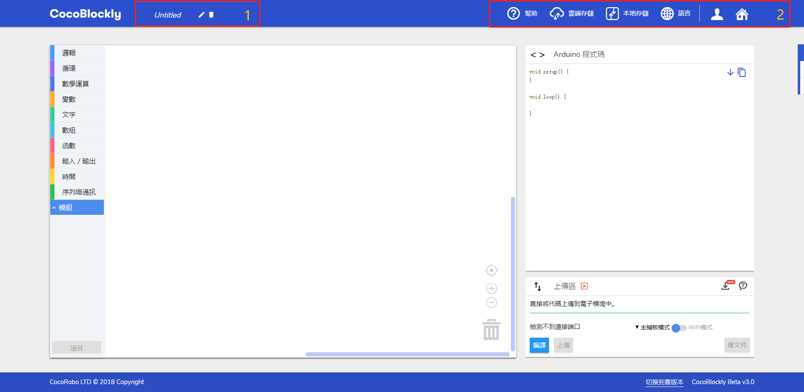

1. **程式檔案名稱**
當前正在編輯的程式檔案的名稱，會成爲下載後的程式檔案名
2. **通用工具列**
包含：「幫助」、「雲端存儲」、「本地存儲」、「語言」、「我的賬戶」、「返回首頁」6種功能

    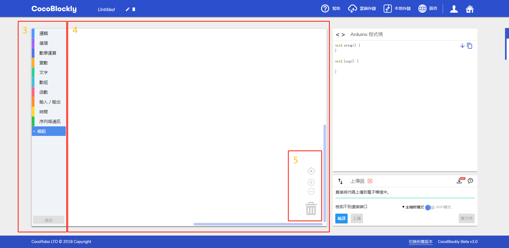

3. **積木功能欄**
所有積木都可以從這個功能欄中拖取，並分「基礎 Block」和「CocoMod™」兩類
4. **積木設計區**
將積木拖進該區域進行程式設計，點擊空白部分可以拖拽整個區域
5. **積木設計區工具列**
包含：「視角重置」、「放大/縮小視角」、「刪除積木」功能

    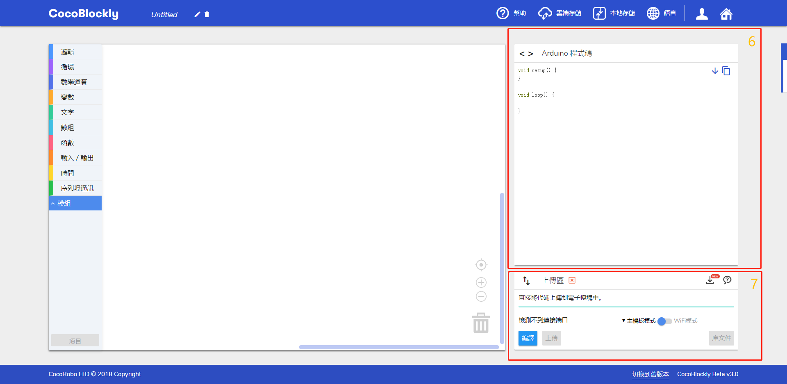

6. **積木對應原始碼參考區**
「積木設計區」生成的原始碼（C語言），一般情況並不會用到
7. **程式上傳區**
最重要的部分，我們將在此處將程式上傳至電子模組中

    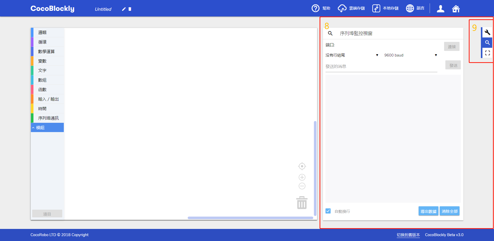

8. **序列埠監控視窗**
點擊「側邊工具欄」中的「序列埠監控視窗區域」，可以切換到「序列埠監控視窗」；「序列埠監控視窗」可以配合「程式上傳區」對電子模組進行調試
9. **側邊工具欄**
包含：「Arduino 代碼區域 & 上傳區域」、「序列埠監控視窗區域」、「全屏模式」功能

    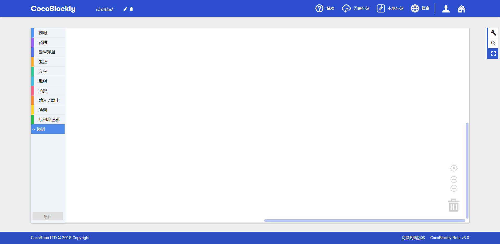

10.  **全屏模式**
點擊「側邊工具欄」中的「全屏模式」，最大化「積木設計區」

---

## 使用 Uploader 上傳程式
1. 打開程式「CocoBlockly Uploader」
2. 打開網頁：http://cocorobo.hk/cocoblockly/dev/
3. CocoBlockly 完成載入後，界面右上方會提示「插件已經成功連接！」

   

   同時，「程式上傳區」也會顯示連接成功

   

4. 將主機板模組通過 USB 線接入電腦，通過一小段時間，將會顯示主機板模組的端口名
   **注**：Windows 裏的端口名通常以 COM 開頭，MacOS 裏的通常以 /dev/tty.usb 開頭

   

5. 點擊「上傳（Upload）」開始將「積木對應原始碼參考區」中的 Arduino 原始碼上傳至主機板中，此時會經歷3個步驟：
    1. 編譯中（Compiling）

    

    2. 上傳中（Uploading）

    

    3. 上傳成功（Upload successfully）

    

6. 完成以上3個步驟，就意味著我們已經將程式上傳至主機板中
   **注**：與 Arduino IDE 的「Verify code」類似，我們提供「編譯（Compile）」這個選項，供大家測試編寫的程式是否能夠正確編譯
