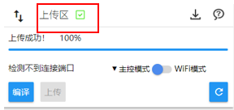
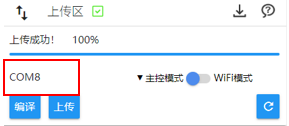
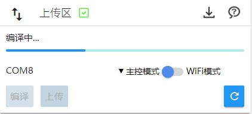
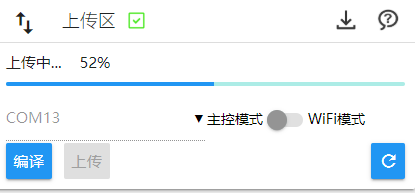
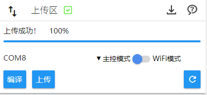
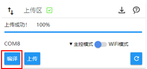

# 关于编程环境

---

## CocoBlockly Uploader

为了能够让 CocoBlockly 能够从浏览器和主控模块进行通信，我们推出一款跨平台的上传插件（Uploader），用户下载该插件并安装，随后即可访问 CocoBlockly，对我们的电子模块进行上传编程。

首先请下载对应操作系统的 CocoBlockly Uploader 安装包：

#### 安装包下载

| 操作系统                            | 下载     | 系统要求                   |  安装说明 |
| ----------------------------------- | -------- | -------------------------- |----|
| CocoBlockly Uploader v3 for MacOS   | [点此下载](http://cocorobo.cn/download) | 要求系统版本高于 macOS 10.10 | [查看](/getting-started/installation?id=macOS-%e5%ae%89%e8%a3%9d%e8%aa%aa%e6%98%8e) |
| CocoBlockly Uploader v3 for Windows | [点此下载](http://cocorobo.cn/download) | 要求系统版本高于 Windows 7 | [查看](/getting-started/installation?id=windows-%e5%ae%89%e8%a3%9d%e8%aa%aa%e6%98%8e) |

**详细的安装指引请参见 [此页面](/getting-started/installation)**

* 注：使用 CocoBlockly 编程时，务必确保本机的 CocoBlockly Uploader 打开了，否则将无法给电子模块上传程序；
* 浏览器兼容性
    * <b style="background-color:orangered; margin-right: 3px; padding: 2px 5px; color: #fff; font-size: 12px; border-radius: 4px;">推荐使用</b> Google Chrome，版本号需要大于 55
    * Opera，版本号需要大于 50
    * Firefox，版本号需要大于 55
    * Safari，版本号需要大于 12
    * 360 安全浏览器，版本号需要大于 9.5
    * 搜狗浏览器，版本号需要大于 8

---

#### 使用 Uploader 上传程序

1. 打开已安装好的插件「CocoBlockly Uploader」

2. 打开网页：http://cocorobo.cn/cocoblockly/dev/

3. CocoBlockly 完成载入后，界面右上方会提示「插件已经成功连接！」

  - 同时，「程序上传区」也会显示连接成功

4. 将主控模块通过 USB 线接入电脑，经过一小段时间后，将会显示主控模块的端口名。
  - **注1**：关于主控模块的资料，请查阅：[使用主控模块](/cocomod/main-controller)
  - **注2**：Windows 里的端口名通常以 COM 开头，MacOS 里的通常以 /dev/tty.usb 开头。

5. 点击「上载」开始将「积木对应原始码参考区」中的 Arduino 原始码上传至主控中，此时会经历3个步骤：

  - 编译中（Compiling）

  - 上传中（Uploading）

  - 上传成功（Upload successfully）

6. 完成以上3个步骤，就意味著我们已经将程序上传至主控中

  - **注**：与 Arduino IDE 的「Verify code」类似，我们提供「编译（Compile）」这个选项，供大家测试编写的程序是否能够正确编译

  

  ---
  更新时间：2019年8月
