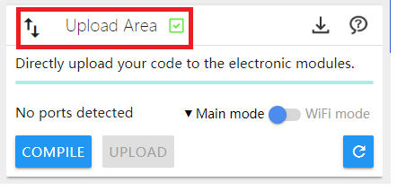
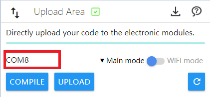
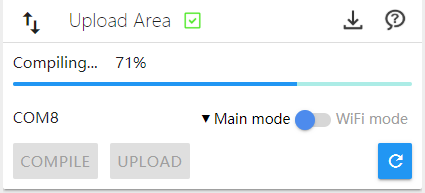
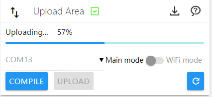
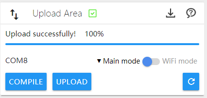
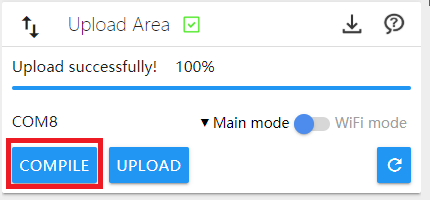

# Programming Environment

---

## CocoBlockly Uploader

CocoBlockly Uploader is a trans-platform uploading plugin which is targeted to enable communication between browser and the main controller. You can visit CocoBlockly and upload programs to electronic modules after downloading and installing the plugin.

Please download the CocoBlockly Uploader installation package of respective platforms.

#### Download Installation Packages

| Platforms                            | Download    | System Requirements                   |  Instructions |
| ----------------------------------- | -------- | -------------------------- |----|
| CocoBlockly Uploader v3 for MacOS   | [click here](https://api.cocorobo.hk/releases/uploaderv2/download/mac) | System version should be newer than macOS 10.10 | [Check](/getting-started/installation?id=macOS-%e5%ae%89%e8%a3%9d%e8%aa%aa%e6%98%8e) |
| CocoBlockly Uploader v3 for Windows | [click here](https://api.cocorobo.hk/releases/uploaderv2/download/windows) | System version should be newer than Windows 7 | [Check](/getting-started/installation?id=windows-%e5%ae%89%e8%a3%9d%e8%aa%aa%e6%98%8e) |

**For more information on installation, please refer to [CocoBlockly Uploader Installation Instructions](/getting-started/installation)**

* Note: Make sure that the CocoBlockly Uploader is started when you are using CocoBlockly to write programs. Or you cannot upload programs to the electronic modules.
* Browser Compatibility
    * <b style="background-color:orangered; margin-right: 3px; padding: 2px 5px; color: #fff; font-size: 12px; border-radius: 4px;">Recommend</b> Google Chrome, and the version number should be bigger than 55
    * Opera, and the version number should be bigger than 50
    * Firefox, and the version number should be bigger than 55
    * Safari, and the version number should be bigger than 12
    * 360 Browser, and the version number should be bigger than 9.5
    * Sogou Browser, and the version number should be bigger than 8

---

#### Upload Programs via Uploader

1. Open the plugin "CocoBlockly Uploader".

2. Open the webpage: http://cocorobo.hk/cocoblockly/dev/

3. After the plugin is successfully uploaded to CocoBlockly, "Plugin is connected successfully!" will be shown at the upper right of the interface.

  - At the same time, successful connection is also shown in the "Upload Area".

4. Connect the main controller to a computer via a USB data cable. The port name of the main controller will be shown after a short time.
  - **Note 1**: For more information on the main controller, please refer to [Apply Main Controller](/cocomod/main-controller)
  - **Note 2**：The port of Windows usually begins with "COM" while the port of MacOS usually begins with "/dev/tty.usb".

 

5. Click "Upload" and begin to upload the Arduino source code of the "Arduino Source Code" to the main controller. Three steps will be involved:

  - Compiling

  - Uploading

  - Upload successfully

6. The completion of the above three steps means that the program is successfully uploaded to the main controller.

  - **Note**: Similar to the "Verify code" of the Arduino IDE, the option of "Compile" is also provided here to test if the program is correctly written.

  

  ---
  Updated in August 2019
