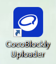
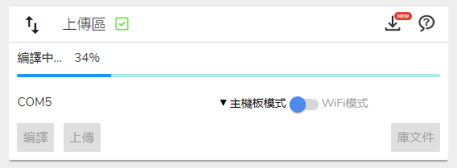
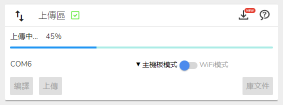

# 關於編程環境

---

## CocoBlockly Uploader

爲了能夠讓 CocoBlockly 能夠從瀏覽器和主機板模組進行通訊，我們推出一款跨平臺的上傳插件（Uploader），用戶下載該插件並安裝，隨後即可訪問 CocoBlockly，對我們的電子模組進行上傳編程。

首先請下載對應作業平臺的 CocoBlockly Uploader 安裝包：

#### 安裝包下載

| 作業平臺                            | 下載     | 系統要求                   |  安装说明 |
| ----------------------------------- | -------- | -------------------------- |----|
| CocoBlockly Uploader v3 for MacOS   | [點此下載](https://cocorobo.hk/downloads/uploaderv2_mac_v3.0.7.dmg) | 要求系統版本高於 macOS 10.10 | [查看](/getting-started/installation?id=macOS-%e5%ae%89%e8%a3%9d%e8%aa%aa%e6%98%8e) |
| CocoBlockly Uploader v3 for Windows | [點此下載](https://api.cocorobo.hk/releases/uploaderv2/download/windows) | 要求系統版本高於 Windows 7 | [查看](/getting-started/installation?id=windows-%e5%ae%89%e8%a3%9d%e8%aa%aa%e6%98%8e) |

**詳細的安裝指引請參見 [此頁面](/getting-started/installation)**

* 註：使用 CocoBlockly 編程時，務必確保本機的 CocoBlockly Uploader 打開了，否則將無法給電子模組上傳程式；
* 瀏覽器兼容性
    * <b style="background-color:orangered; margin-right: 3px; padding: 2px 5px; color: #fff; font-size: 12px; border-radius: 4px;">推薦使用</b> Google Chrome，版本號需要大於 55
    * Opera，版本號需要大於 50
    * Firefox，版本號需要大於 55
    * Safari，版本號需要大於 12
    * 360 安全瀏覽器，版本號需要大於 9.5
    * 搜狗瀏覽器，版本號需要大於 8

---

#### 使用 Uploader 上傳程式

1. 打開已安裝好的插件「CocoBlockly Uploader」

2. 打開網頁：http://cocorobo.hk/cocoblockly/dev/

3. CocoBlockly 完成載入後，界面右上方會提示「插件已經成功連接！」

  - 同時，「程式上傳區」也會顯示連接成功

4. 將主機板模組通過 USB 線接入電腦，經過一小段時間后，將會顯示主機板模組的端口名。
  - **注1**：關於主機板模組的資料，請查閲：[使用主機板模組](/cocomod/main-controller)
  - **注2**：Windows 裏的端口名通常以 COM 開頭，MacOS 裏的通常以 /dev/tty.usb 開頭。

5. 點擊「上載」開始將「積木對應原始碼參考區」中的 Arduino 原始碼上傳至主機板中，此時會經歷3個步驟：

  - 編譯中（Compiling）

  - 上傳中（Uploading）

  - 上傳成功（Upload successfully）

6. 完成以上3個步驟，就意味著我們已經將程式上傳至主機板中

  - **注**：與 Arduino IDE 的「Verify code」類似，我們提供「編譯（Compile）」這個選項，供大家測試編寫的程式是否能夠正確編譯

  

  ---
  更新時間：2019年8月
