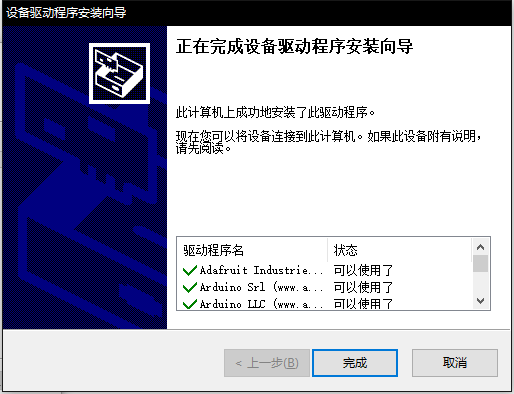

## CocoBlockly Uploader 安裝指引

 

##### Windows 安裝說明

1. 雙擊安裝包，然後根據指示選擇目標的資料夾進行安裝：

2. 在安裝的過程中，會依次彈出協助安裝 Arduino 驅動和 WiFi 模組驅動的界面，可以根據指示依次安裝（如果已經安裝過該驅動，可以選擇取消跳過）：

3. 最後，點擊「完成」結束 Uploader 安裝過程

--- 

##### macOS 安裝說明

1. **右鍵點擊安裝包**，選擇打開，彈出以下窗口後，點擊「打開」以打開安裝包

2. 在界面中，將「CocoBlockly Uploader」拖入右側的「Applications」資料夾中，隨後可能會需要輸入您的賬戶密碼，授權進行安裝

3. 安裝 WiFi 模組驅動

    - 雙擊「WiFi Module Driver's installer.pkg」；
    - 點擊「繼續」，並按照指示步驟完成安裝

4. 點擊「安裝」，隨後可能會需要輸入您的賬戶密碼，授權進行安裝

5. 點擊「關閉」，完成 WiFi 模組驅動的安裝

6. 安裝完成後，便可以在應用列表中打開 CocoBlockly Uploader。