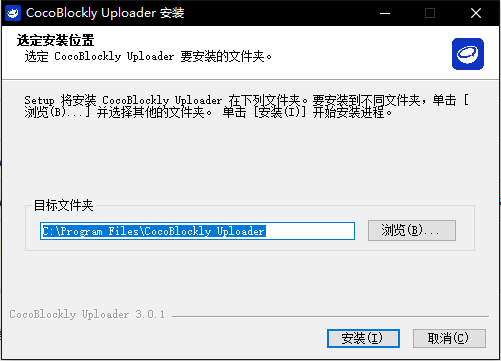
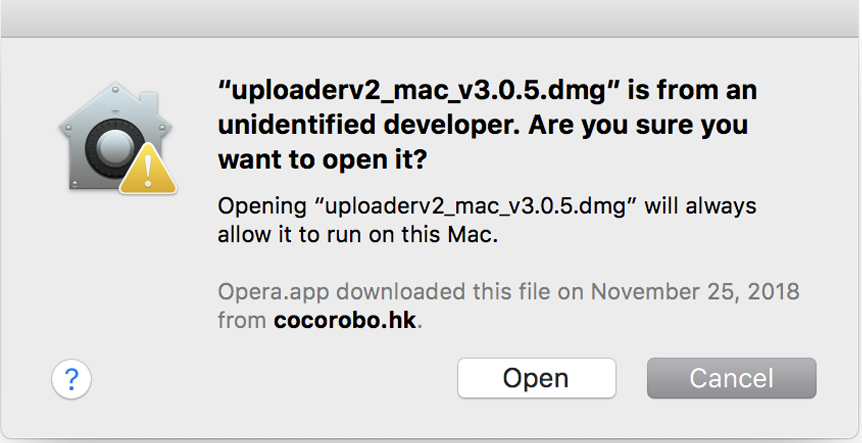
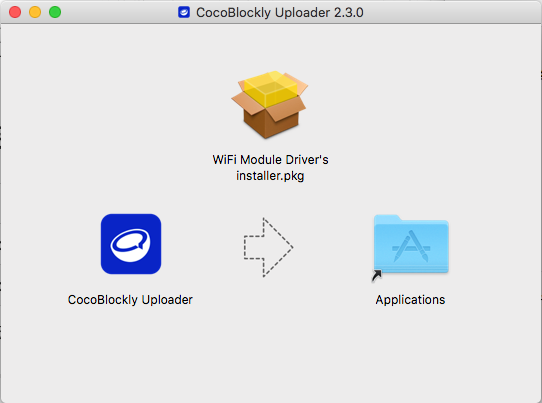
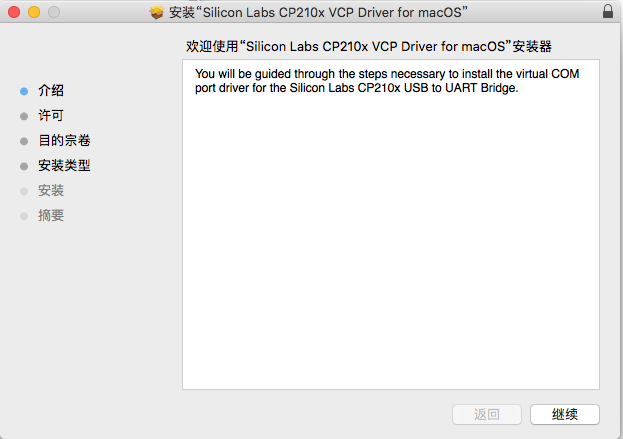
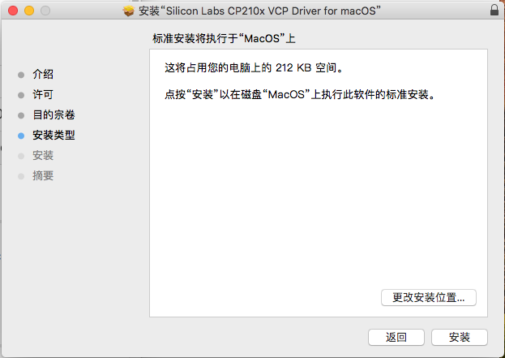
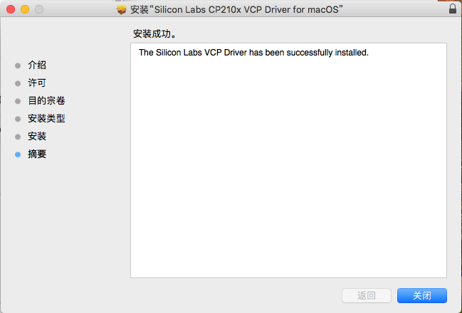

## CocoBlockly Uploader 安装指引

 

##### Windows 安装说明

1. 双击安装包，然后根据指示选择目标的资料夹进行安装：

2. 在安装的过程中，会依次弹出协助安装 Arduino 驱动和 WiFi 模块驱动的界面，可以根据指示依次安装（如果已经安装过该驱动，可以选择取消跳过）：

3. 最后，点击「完成」结束 Uploader 安装过程

---

##### macOS 安装说明

1. **右键点击安装包**，选择打开，弹出以下窗口后，点击「打开」以打开安装包

2. 在界面中，将「CocoBlockly Uploader」拖入右侧的「Applications」资料夹中，随后可能会需要输入您的账户密码，授权进行安装

3. 安装 WiFi 模块驱动

    - 双击「WiFi Module Driver's installer.pkg」；
    - 点击「继续」，并按照指示步骤完成安装

4. 点击「安装」，随后可能会需要输入您的账户密码，授权进行安装

5. 点击「关闭」，完成 WiFi 模块驱动的安装

6. 安装完成后，便可以在应用列表中打开 CocoBlockly Uploader。

---
更新时间：2019年8月
