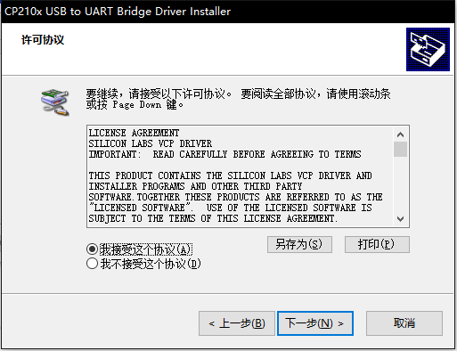
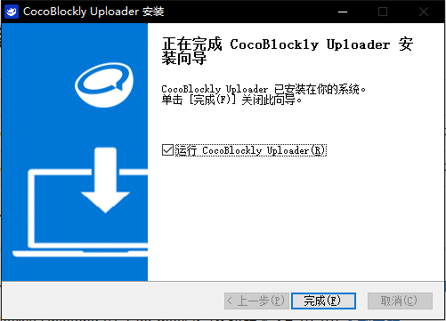

## CocoBlockly Uploader Installation Instructions

 

##### Windows Installation Instructions

1. Double click the installation package and choose a folder to begin the installation.

2. In the process of installation, the Arduino driver interface and WiFi communication module driver interface will pop up in turn. You can install them accordingly (you can skip them if you have already done the installation).

3. At last, click "Finish" to finish the installation of Uploader.

---

##### macOS Installation Instructions

1. **Right Click the Installation Package**, click "Open" to Install the package.

2. Drag the "CocoBlockly Uploader" to the folder "Applications" on the right. Then you may have to enter your password to authorize the installation.

3. Install WiFi Communication Module Driver

    - Double click "WiFi Module Driver's installer.pkg"
    - Click "Continue" and install the driver as instructed.

4. Click "Install". Then you may have to enter your password to authorize the installation.

5. Click "Close" to finish the installation of WiFi module driver.

6. After successful installation, you can open the CocoBlockly Uploader in application list.

---
Updated in August 2019
